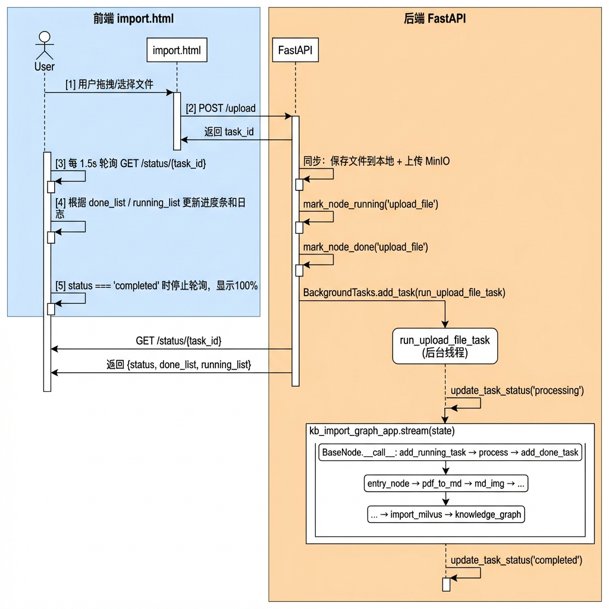
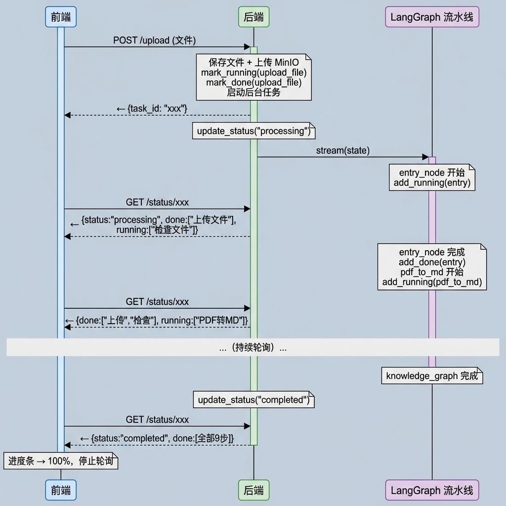

# 知识图谱构建节点（第二天）& 对接导入前端

> 本文档分为两部分：**上半部分**讲解知识图谱构建节点中 Neo4j 图数据库写入的完整实现（`Neo4jGraphWriter`），包括双标签设计、Cypher 模板、单事务批量写入等；**下半部分**讲解如何将整个导入流程对接到前端页面，实现文件上传、实时进度展示和任务状态轮询。

---

## 1. 任务目标

### 1.1 本章目标

通过本章学习，你将掌握：

1. **Neo4j 图写入封装**：将实体与关系写入 Neo4j 的 `Neo4jGraphWriter` 类设计
2. **双标签方案**：理解 `Entity` 基类标签 + 动态原生类型标签的设计优势
3. **Cypher 模板设计**：掌握 MERGE、SET、参数化查询的正确用法
4. **单事务批量写入**：在一个事务中完成 Chunk + Entity + Relation 的全部操作
5. **并发线程安全**：掌握 Semaphore 控制 LLM 并发、Lock 保护 PyTorch 模型的设计
6. **分阶段耗时统计**：学会为 LLM / Milvus / Neo4j 各阶段独立计时，定位性能瓶颈
7. **前后端对接**：理解 FastAPI 后台任务 + 前端轮询的实时进度方案
8. **任务追踪机制**：掌握 `BaseNode` 中 running/done 状态管理的完整链路

### 1.2 涉及文件

```
knowledge/
├── processor/import_process/
│   ├── nodes/
│   │   └── kg_graph_node.py              # Neo4jGraphWriter（本章上半部分重点）
│   ├── base.py                           # BaseNode 基类（任务追踪改造）
│   ├── main_graph.py                     # LangGraph 流水线编排
│   └── state.py                          # ImportGraphState 状态定义
│
├── services/
│   ├── file_import_service.py            # 文件导入服务（后台任务入口）
│   └── task_service.py                   # 任务状态服务
│
├── utils/
│   ├── task_utils.py                     # 任务追踪工具（running/done 管理）
│   └── neo4j_util.py                     # Neo4j 连接管理
│
├── core/
│   ├── deps.py                           # FastAPI 依赖注入
│   └── paths.py                          # 路径配置
│
├── schema/
│   ├── upload_schema.py                  # 上传响应模型
│   └── task_schema.py                    # 任务状态响应模型
│
├── front/
│   └── import.html                       # 前端导入页面
│
└── import_file_router.py                 # FastAPI 路由定义
```

---

## 2. Neo4j 图写入（上半部分）

### 2.1 为什么需要独立的 Neo4jGraphWriter？

在第一天中，我们将 Milvus 写入逻辑封装到了 `MilvusEntityWriter` 类中。今天按照相同的设计原则，将 Neo4j 的所有写入逻辑封装到 `Neo4jGraphWriter` 类中：

```
KnowLedgeGraphNode（流程编排）
    ├── _MilvusEntityWriter（Milvus 实体向量写入）
    └── Neo4jGraphWriter（Neo4j 图结构写入）  ← 本章重点
```

这样做的好处是：`KnowLedgeGraphNode` 只负责调度，两个 Writer 各自管理自己的存储细节，职责清晰，便于独立测试和维护。

### 2.2 双标签方案设计

#### 2.2.1 旧方案：types 数组存属性

```cypher
MERGE (n:Entity {name: $name, item_name: $item_name})
ON CREATE SET n.types = [$label]
ON MATCH SET  n.types = n.types + $label
```

这种方案的问题在于：按类型查询时需要数组扫描，无法利用 Neo4j 原生标签索引。

#### 2.2.2 新方案：双标签（Entity + 动态原生标签）

```cypher
MERGE (n:Entity {name: $name, item_name: $item_name})
SET n:`Device`
```

`Entity` 作为所有实体的**收敛锚点**（保证 MERGE 寻址一致），`Device`/`Step`/`Warning` 等作为**语义分类标签**。查询时可以直接用原生标签作为索引入口：

```cypher
-- 直接利用标签索引，性能远优于数组扫描
MATCH (n:Device {item_name: "万用表"})
                  
```

### 2.3 Cypher 模板设计

#### 2.3.1 清理旧数据

```python
CYPHER_CLEAR_ITEM = """
    MATCH (n {item_name: $item_name}) DETACH DELETE n
"""
```

`DETACH DELETE` 会同时删除节点及其所有关系，保证幂等性。

#### 2.3.2 创建 Chunk 节点

```python
CYPHER_MERGE_CHUNK = """
    MERGE (c:Chunk {id: $chunk_id, item_name: $item_name})
"""
```

每个文本切片在图中对应一个 `Chunk` 节点，实体通过 `MENTIONED_IN` 关系关联到所属 Chunk。

#### 2.3.3 创建实体节点（双标签）

```python
CYPHER_MERGE_ENTITY_TEMPLATE = """
    MERGE (n:Entity {{name: $name, item_name: $item_name}})
    ON CREATE SET
        n.source_chunk_id = $chunk_id,
        n.description     = $description
    ON MATCH SET
        n.description = CASE
            WHEN $description <> "" THEN $description
            ELSE coalesce(n.description, "")
        END
    SET n:`{label}`
"""
```

> **注意双花括号**：`{{name: $name}}` 中的 `{{` 和 `}}` 是 Python `.format()` 的转义写法，最终生成 `{name: $name}`。而 `{label}` 是 `.format(label=...)` 的插值占位符。

#### 2.3.4 关联实体到 Chunk

```python
CYPHER_LINK_ENTITY_TO_CHUNK = """
    MATCH (n:Entity {name: $name, item_name: $item_name})
    MATCH (c:Chunk  {id: $chunk_id, item_name: $item_name})
    MERGE (n)-[:MENTIONED_IN]->(c)
"""
```

#### 2.3.5 创建实体间关系

```python
CYPHER_MERGE_RELATION_TEMPLATE = """
    MATCH (h:Entity {{name: $head, item_name: $item_name}})
    MATCH (t:Entity {{name: $tail, item_name: $item_name}})
    MERGE (h)-[:{rel_type}]->(t)
"""
```

关系类型同样通过 `.format(rel_type=...)` 注入，写入前已经过白名单校验。

### 2.4 Neo4jGraphWriter 实现

#### 2.4.1 类结构

```python
class Neo4jGraphWriter:
    def __init__(self, database: str = ""):
        self.database = database
        self.logger = logging.getLogger(self.__class__.__name__)
```

构造参数只需要 `database` 名称。Neo4j driver 由外部传入（而非内部创建），这样方便测试和复用。

#### 2.4.2 clear 方法：幂等清理

```python
def clear(self, driver, item_name: str) -> None:
    if not driver:
        raise Neo4jError("Neo4j 驱动获取失败")

    try:
        with self._session(driver) as session:
            session.execute_write(
                lambda tx, name: tx.run(CYPHER_CLEAR_ITEM, item_name=name),
                item_name,
            )
        self.logger.info(f"Neo4j 旧数据已清理: {item_name}")
    except Exception as e:
        raise Neo4jError(f"Neo4j 清理失败: {e}")
```

> **关于 `execute_write`**：Neo4j 的 `session.execute_write` 接收一个函数，函数的第一个参数是事务对象 `tx`，后续参数通过 `execute_write` 的额外参数传入。这里用 lambda 表达式简洁地实现了"在写事务中执行清理语句"。

#### 2.4.3 insert 方法：批量写入

```python
def insert(self, driver, entities, relations, chunk_id, item_name):
    if not entities:
        raise ValueError("参数校验失败，实体列表为空")
    if not driver:
        raise Neo4jError("Neo4j 驱动获取失败")

    try:
        with self._session(driver) as session:
            session.execute_write(
                self._write_graph_tx, entities, relations, chunk_id, item_name,
            )
        self.logger.info(f"Neo4j 写入: {len(entities)} 实体, {len(relations)} 关系")
    except Exception as e:
        raise Neo4jError(f"Neo4j 写入失败: {e}")
```

所有写入操作在**单个事务**内完成，要么全部成功，要么全部回滚。

#### 2.4.4 _write_graph_tx 方法：事务内的具体写入逻辑

```python
def _write_graph_tx(self, tx, entities, relations, chunk_id, item_name):
    # 1. 创建 Chunk 节点
    tx.run(CYPHER_MERGE_CHUNK, chunk_id=chunk_id, item_name=item_name)

    # 2. 创建实体节点 + 关联到 Chunk
    for entity in entities:
        name = entity.get("name")
        raw_label = entity.get("label")
        description = entity.get("description", "")

        # 动态格式化 Cypher，将安全标签注入
        cypher_query = CYPHER_MERGE_ENTITY_TEMPLATE.format(label=raw_label)
        tx.run(cypher_query, name=name, description=description,
               chunk_id=chunk_id, item_name=item_name)

        # 关联实体到 Chunk
        tx.run(CYPHER_LINK_ENTITY_TO_CHUNK,
               name=name, chunk_id=chunk_id, item_name=item_name)

    # 3. 创建实体间关系
    for rel in relations:
        head = rel.get("head")
        tail = rel.get("tail")
        rel_type = rel.get("type")

        cypher = CYPHER_MERGE_RELATION_TEMPLATE.format(rel_type=rel_type)
        tx.run(cypher, head=head, tail=tail, item_name=item_name)
```

> **执行顺序很重要**：先创建 Chunk，再创建 Entity（因为后续要关联到 Chunk），最后创建实体间关系（因为需要两端实体都已存在）。

### 2.5 在主节点中集成 Neo4jGraphWriter

#### 2.5.1 初始化

```python
class KnowLedgeGraphNode(BaseNode):
    def __init__(self, config=None):
        super().__init__(config)
        self._milvus_writer = _MilvusEntityWriter(self.config.entity_name_collection)
        self._neo4j_writer = Neo4jGraphWriter(database=self.config.neo4j_database)
```

#### 2.5.2 幂等清理调用

```python
def _clean_exist_double_data(self, milvus_client, neo4j_driver, item_name):
    # 委托给各自的 Writer
    self._neo4j_writer.clear(neo4j_driver, item_name)
    self._milvus_writer.clear(milvus_client, item_name)
```

#### 2.5.3 单切片处理中的写入调用

```python
def _process_single_chunk(self, chunk_id, item_name, content, milvus_client, neo4j_driver):
    # 1. LLM 提取
    llm_response = self._extract_graph_with_retry(content)

    # 2. 解析清洗
    graph_result = self._parse_and_clean(llm_response)
    final_entities = graph_result.get('entities')
    final_relations = graph_result.get('relations')

    # 3. 双写：Milvus + Neo4j
    self._milvus_writer.insert(milvus_client, final_entities, chunk_id, content, item_name)
    self._neo4j_writer.insert(neo4j_driver, final_entities, final_relations, chunk_id, item_name)

    return len(final_entities), len(final_relations)
```

### 2.6 Neo4j 写入效果

写入完成后，在 Neo4j Browser 中可以看到如下图结构：

```
(:Chunk {id:"chunk_001"})
    ← [:MENTIONED_IN] ─ (:Entity:Operation {name:"电池安装"})
    ← [:MENTIONED_IN] ─ (:Entity:Step {name:"步骤1-断开表笔"})
    ← [:MENTIONED_IN] ─ (:Entity:Tool {name:"螺丝刀"})
    ...

(:Entity:Operation {name:"电池安装"})
    ─ [:HAS_STEP] → (:Entity:Step {name:"步骤1-断开表笔"})
    ─ [:HAS_WARNING] → (:Entity:Warning {name:"警告-防触电"})

(:Entity:Step {name:"步骤1-断开表笔"})
    ─ [:NEXT_STEP] → (:Entity:Step {name:"步骤2-拧开螺母"})
    ─ [:USES_TOOL] → (:Entity:Tool {name:"螺丝刀"})
```

每个节点同时拥有 `Entity` 基类标签和具体类型标签（如 `Operation`、`Step`、`Tool`），在 Neo4j Browser 中会以不同颜色区分显示。

---

## 3. 对接导入前端（下半部分）

### 3.1 整体架构

前后端交互采用**后台任务 + 轮询**的异步方案，避免长时间请求阻塞：



### 3.2 后端实现

#### 3.2.1 路由定义（import_file_router.py）

```python
def _regist_router(app: FastAPI):
    @app.post("/upload", response_model=UploadResponse)
    async def upload_file_endpoint(
            background_tasks: BackgroundTasks,
            file: UploadFile = File(...),
            service: FileImportService = Depends(get_file_import_service)
    ) -> UploadResponse:
        # 1. 同步处理：保存文件 + 上传 MinIO
        task_id, file_dir, import_file_path = service.process_file_upload(file)

        # 2. 异步处理：把 LangGraph 流水线放到后台线程执行
        background_tasks.add_task(
            service.run_upload_file_task, task_id, file_dir, import_file_path
        )

        return UploadResponse(message="File uploaded successfully", task_id=task_id)

    @app.get("/status/{task_id}", response_model=TaskStatusResponse)
    async def status_endpoint(
            task_id: str,
            task_service: TaskService = Depends(get_task_service)
    ) -> TaskStatusResponse:
        task_info = task_service.get_task_info(task_id)
        return TaskStatusResponse(**task_info)
```

> **为什么用 BackgroundTasks？** 导入流程需要几十秒甚至几分钟（LLM 调用、向量化、Neo4j 写入），如果同步处理，HTTP 请求会超时。`BackgroundTasks` 把耗时操作放到后台线程，`/upload` 接口立即返回 `task_id`，前端拿到 `task_id` 后开始轮询。

#### 3.2.2 文件导入服务（file_import_service.py）

```python
class FileImportService:
    def run_upload_file_task(self, task_id, file_dir, import_file_path):
        try:
            # 1. 标记任务开始处理
            self._task_service.update_task_status(task_id, "processing")

            # 2. 构建 LangGraph 初始状态
            global_graph_init_status: ImportGraphState = {
                "task_id": task_id,
                "file_dir": file_dir,
                "import_file_path": import_file_path
            }

            # 3. 流式执行整个导入流水线
            for event in kb_import__graph_app.stream(global_graph_init_status):
                for key, value in event.items():
                    print(f"[{task_id}] Completed Node: {key}")

            # 4. 标记任务完成
            self._task_service.update_task_status(task_id, "completed")

        except Exception as e:
            self._task_service.update_task_status(task_id, "failed")
            print(f"[{task_id}] Error: {e}")
```

> **关键点**：`task_id` 被注入到 `ImportGraphState` 中，这样每个节点在 `BaseNode.__call__` 中就能通过 `state.get("task_id")` 拿到它，进行任务追踪。

#### 3.2.3 任务追踪机制（BaseNode + task_utils）

这是前端能实时看到进度的核心链路。`BaseNode.__call__` 在每个节点执行前后自动标记状态：

```python
class BaseNode(ABC):
    def __call__(self, state):
        task_id = state.get("task_id", "")

        # 节点开始 → 加入 running_list
        if task_id:
            add_running_task(task_id, self.name)

        # 执行节点逻辑
        result = self.process(state)

        # 节点完成 → 从 running_list 移除，加入 done_list
        if task_id:
            add_done_task(task_id, self.name)

        return result
```

`task_utils.py` 中的内存字典存储了每个任务的状态：

```python
_tasks_running_list: Dict[str, List[str]] = defaultdict(list)  # 正在运行的节点
_tasks_done_list: Dict[str, List[str]] = defaultdict(list)      # 已完成的节点
_tasks_status: Dict[str, str] = {}                               # 任务总体状态
```

> **注意事项**：`self.name` 必须和 `_NODE_NAME_TO_CN` 映射表中的 key 一致，否则前端会显示英文原名而非中文。这也是之前 bug 的根因——`add_running_task` 用 `self.name` 注册，但 `add_done_task` 之前是在 `stream` 循环中用 graph 注册名调用，两边名字不一致导致 running_list 中的条目无法被正确移除。

#### 3.2.4 节点名称中文映射（task_utils.py）

```python
_NODE_NAME_TO_CN: Dict[str, str] = {
    "upload_file": "上传文件",
    "entry": "检查文件",
    "pdf_to_md_node": "PDF转Markdown",
    "md_img_node": "Markdown图片处理",
    "document_split_node": "文档切分",
    "item_name_recognition": "主体名称识别",
    "beg_embedding_chunks_node": "向量生成",
    "import_milvus_node": "导入向量数据库",
    "knowledge_graph_node": "导入知识图谱",
    "__end__": "处理完成"
}
```

返回给前端时会自动带上序号：

```python
def get_done_task_list(task_id: str) -> List[str]:
    return [f"[{i+1}] {_to_cn(n)}" for i, n in enumerate(_tasks_done_list.get(task_id, []))]

def get_running_task_list(task_id: str) -> List[str]:
    done_count = len(_tasks_done_list.get(task_id, []))
    return [f"[{done_count+i+1}] {_to_cn(n)}" for i, n in enumerate(_tasks_running_list.get(task_id, []))]
```

#### 3.2.5 依赖注入（deps.py）

```python
from functools import lru_cache

@lru_cache
def get_task_service():
    return TaskService()

@lru_cache
def get_file_import_service():
    base_dir = get_local_base_dir()
    return FileImportService(base_dir=base_dir, task_service=get_task_service())
```

`@lru_cache` 保证整个应用生命周期内只创建一个 `TaskService` 和一个 `FileImportService` 实例，避免重复创建和状态不一致。

### 3.3 前端实现（import.html）

#### 3.3.1 上传流程

```javascript
async function uploadFile(file) {
    // 1. 计算总步骤数（PDF 9 步，MD 8 步）
    const isPDF = file.name.toLowerCase().endsWith('.pdf');
    const totalNodes = isPDF ? 9 : 8;

    // 2. 发送文件到后端
    const formData = new FormData();
    formData.append('file', file);
    const response = await fetch(`${API_BASE}/upload`, {
        method: 'POST', body: formData
    });
    const result = await response.json();
    const taskId = result.task_id;

    // 3. 开始轮询任务状态
    pollStatus(taskId, itemEl, totalNodes);
}
```

#### 3.3.2 轮询逻辑

```javascript
function pollStatus(taskId, itemEl, totalNodes) {
    const interval = setInterval(async () => {
        const res = await fetch(`${API_BASE}/status/${taskId}`);
        const data = await res.json();

        // 1. 渲染日志并计算进度百分比
        const percentage = renderLogsAndCalculateProgress(
            itemEl, data.done_list, data.running_list, totalNodes
        );

        // 2. 根据状态决定下一步
        if (data.status === 'completed') {
            updateProgressUI(progressWrapper, 100);
            clearInterval(interval);  // 停止轮询
        } else if (data.status === 'processing') {
            updateProgressUI(progressWrapper, percentage);
        } else if (data.status === 'failed') {
            clearInterval(interval);
        }
    }, 1500);  // 每 1.5 秒轮询一次
}
```

> **为什么是 1.5 秒？** 太频繁会增加服务器压力，太慢用户体验不好。1.5 秒是一个平衡点——大部分节点执行时间在 2-10 秒，1.5 秒的轮询间隔能让用户感觉到"实时更新"。

#### 3.3.3 进度计算逻辑

```javascript
function renderLogsAndCalculateProgress(itemEl, doneList, runningList, totalNodes) {
    const done = Array.isArray(doneList) ? doneList : [];
    const running = Array.isArray(runningList) ? runningList : [];

    // 基础进度 = 已完成数 / 总步骤数
    let currentPercentage = (done.length / totalNodes) * 100;

    // 有节点在运行时，加半步进度（让用户看到"在动"）
    if (running.length > 0) {
        currentPercentage += (0.5 / totalNodes) * 100;
    }

    // 未最终完成前，最高显示 95%（防止提前满格）
    if (currentPercentage >= 100) {
        currentPercentage = 95;
    }

    return currentPercentage;
}
```

### 3.4 前后端交互时序

完整的一次文件导入，前后端交互时序如下：



### 3.5 常见问题与排查

#### 3.5.1 进度条不动

**症状**：任务在后台正常跑，但前端进度条卡在初始位置不变。

**原因**：后端设置的状态字符串和前端判断不一致。前端判断 `data.status === 'processing'` 才会更新进度条，但后端如果写了 `update_task_status(task_id, "process")`（少了 `ing`），就不匹配。

**修复**：确保后端使用 `"processing"` 而非 `"process"`，建议使用常量 `TASK_STATUS_PROCESSING`。

#### 3.5.2 任务完成但 running_list 不清空

**症状**：前端显示"已完成 9，进行中 5"。

**原因**：`add_running_task` 和 `add_done_task` 使用的节点名不一致。如果 `add_running_task` 用 `self.name`（如 `"knowledge_graph_node"`），而 `add_done_task` 在 `stream` 循环中用 graph 注册名（如 `"knowledge_graph"`），`remove` 操作就找不到对应项。

**修复**：将 `add_done_task` 移到 `BaseNode.__call__` 中，和 `add_running_task` 配对使用同一个 `self.name`。

#### 3.5.3 多线程并发下参数传错

**症状**：并发版本提取的实体数远少于串行版本。

**原因**：`_process_chunks_concurrently` 中 `pool.submit` 的参数顺序和 `_process_single_chunk` 签名不一致，导致 content 传到了 chunk_id 的位置。

**修复**：严格对齐 `pool.submit` 的参数顺序和目标函数签名。

---

## 4. 并发相关：耗时统计与线程安全

### 4.1 耗时统计：定位性能瓶颈

并发处理时，如果不知道每个阶段花了多久，优化就无从下手。在 `_process_single_chunk` 中为每个阶段加上计时：

```python
def _process_single_chunk(self, chunk_id, item_name, content, milvus_client, neo4j_driver):
    chunk_start = time.time()
    thread_name = threading.current_thread().name

    # 1. LLM 提取（最慢的阶段，通常 5-15 秒）
    llm_start = time.time()
    llm_response = self._extract_graph_with_retry(content)
    llm_cost = time.time() - llm_start

    # 2. 解析清洗（毫秒级，忽略不计）
    graph_result = self._parse_and_clean(llm_response)
    final_entities = graph_result.get('entities')
    final_relations = graph_result.get('relations')

    # 3. Milvus 写入（含向量化，通常 1-5 秒）
    milvus_start = time.time()
    self._milvus_writer.insert(milvus_client, final_entities, chunk_id, content, item_name,
                               self._embedding_lock)
    milvus_cost = time.time() - milvus_start

    # 4. Neo4j 写入（通常 0.1-0.5 秒）
    neo4j_start = time.time()
    self._neo4j_writer.insert(neo4j_driver, final_entities, final_relations, chunk_id, item_name)
    neo4j_cost = time.time() - neo4j_start

    total_cost = time.time() - chunk_start

    self.logger.info(
        f"[{thread_name}] chunk={chunk_id} | "
        f"实体={len(final_entities)} 关系={len(final_relations)} | "
        f"LLM={llm_cost:.2f}s Milvus={milvus_cost:.2f}s Neo4j={neo4j_cost:.2f}s | "
        f"总计={total_cost:.2f}s"
    )

    return len(final_entities), len(final_relations)
```

输出日志示例（4 个切片并发）：

```
[ThreadPoolExecutor-0_0] chunk=chunk_test_001 | 实体=13 关系=14 | LLM=9.74s Milvus=3.24s Neo4j=0.17s | 总计=13.14s
[ThreadPoolExecutor-0_1] chunk=chunk_test_002 | 实体=12 关系=13 | LLM=8.91s Milvus=2.87s Neo4j=0.12s | 总计=11.92s
[ThreadPoolExecutor-0_2] chunk=chunk_test_003 | 实体=13 关系=15 | LLM=10.23s Milvus=3.01s Neo4j=0.15s | 总计=13.40s
[ThreadPoolExecutor-0_3] chunk=chunk_test_004 | 实体=11 关系=12 | LLM=9.45s Milvus=2.95s Neo4j=0.11s | 总计=12.52s
```

从日志可以清晰看出：LLM 调用占总耗时的 70-80%，是主要瓶颈；Milvus 向量化写入占 20-25%；Neo4j 写入最快，只占 1-2%。

同时在主流程中加入总耗时统计：

```python
def process(self, state):
    ...
    start_time = time.time()
    self._process_chunks_concurrently(stats, validated_chunks, milvus_client, neo4j_driver)
    elapsed_time = time.time() - start_time
    self.logger.info(f"⏱️ 图谱提取总耗时: {elapsed_time:.2f} 秒")
    ...
```

### 4.2 LLM 并发控制：Semaphore（信号量）

#### 4.2.1 问题

线程池开了 4 个 worker，如果 4 个线程同时调用 LLM API，可能触发 API 限流（Rate Limit），导致部分请求失败或响应被截断。

#### 4.2.2 方案：信号量限流

`Semaphore(2)` 表示同一时刻最多允许 2 个线程进入 LLM 调用区域，其余线程在外面排队等待：

```python
class KnowLedgeGraphNode(BaseNode):
    def __init__(self, config=None):
        super().__init__(config)
        ...
        self._llm_semaphore = threading.Semaphore(2)  # 最多 2 个并发 LLM 调用
```

在 LLM 提取方法中使用：

```python
def _extract_graph_with_retry(self, content: str) -> str:
    with self._llm_semaphore:  # ← 获取信号量后才能进入
        llm_client = get_llm_client()
        ...
        for attempt in range(1, MAX_COUNT + 1):
            try:
                llm_response = llm_client.invoke([...])
                result = getattr(llm_response, 'content', '').strip()
                if result:
                    return result
            except Exception as e:
                ...
        return ""
```

#### 4.2.3 Semaphore vs Lock 的区别

```
Semaphore(2)  →  同时允许 2 个线程进入（像有 2 个坑位的厕所）
Lock()        →  同时只允许 1 个线程进入（像只有 1 个坑位的厕所）
Semaphore(1)  →  等价于 Lock()
```

选择 `Semaphore(2)` 而非 `Lock()` 的原因：LLM API 是远程服务，适当的并发（2个）能提升吞吐量，而不像本地模型那样必须串行。

### 4.3 Embedding 并发控制：Lock（互斥锁）

#### 4.3.1 问题

BGE-M3 向量模型通过 `get_beg_m3_embedding_model()` 获取的是一个**单例**。当多个线程同时调用 `bge_ef_model.encode_documents()` 时，PyTorch 底层的张量状态会被并发修改，导致崩溃：

```
Cannot copy out of meta tensor; no data!
```

完整的崩溃链路：

```
4 个线程同时到达 encode_documents()
    ↓
PyTorch 模型是有状态的（内部的 Tensor Buffer、计算图）
    ↓
多线程同时写入同一块显存/内存
    ↓
张量数据错乱 → meta tensor 异常
    ↓
程序崩溃
```

这和 LLM API 不同——LLM 是远程 HTTP 调用，服务端会隔离每个请求；而 Embedding 模型是**本地加载到内存中的 PyTorch 模型**，多线程共享同一份模型权重，并发推理会导致内部状态冲突。

#### 4.3.2 方案：互斥锁

```python
class KnowLedgeGraphNode(BaseNode):
    def __init__(self, config=None):
        super().__init__(config)
        ...
        self._embedding_lock = threading.Lock()  # 向量化专属互斥锁
```

锁通过参数传递给 `_MilvusEntityWriter.insert`，在向量化调用处加锁：

```python
class _MilvusEntityWriter:
    def insert(self, milvus_client, entities, chunk_id, content, item_name, embedding_lock):
        ...
        # 5. 嵌入向量化（加锁保护）
        try:
            with embedding_lock:  # ← 同一时刻只有 1 个线程在做向量化
                embedded_result = bge_ef_model.encode_documents(entities_names)
        except Exception as e:
            raise MilvusError(f"实体嵌入失败: {e}")
        ...
```

#### 4.3.3 为什么锁定义在 Node 上而不是 Writer 内部？

`_MilvusEntityWriter` 可能被多个不同的 Node 实例共用（虽然当前不是），如果锁定义在 Writer 内部，每个 Writer 实例各有一把锁，就起不到跨实例互斥的效果。锁定义在 `KnowLedgeGraphNode` 上，通过参数传入，保证同一个 Node 的所有线程共享同一把锁。

### 4.4 并发控制总览

将两种并发控制放在一起看，整个并发处理的"交通管制"如下：

```
ThreadPoolExecutor (max_workers=4)
│
├─ Thread-0 ─┐
├─ Thread-1 ─┤
├─ Thread-2 ─┤    _llm_semaphore = Semaphore(2)
├─ Thread-3 ─┘    同时最多 2 个线程调用 LLM API
│                  ┌─────────────┐
│                  │  LLM 调用    │ ← 允许 2 并发
│                  └─────────────┘
│
│                  _embedding_lock = Lock()
│                  同时只有 1 个线程做向量化
│                  ┌─────────────┐
│                  │  Embedding   │ ← 严格串行
│                  └─────────────┘
│
│                  Neo4j / Milvus 写入
│                  ┌─────────────┐
│                  │  存储写入    │ ← 无限制，客户端自身线程安全
│                  └─────────────┘
```

为什么不直接把 `max_workers` 降到 1？因为 LLM 调用和向量化是流水线关系——Thread-0 在做向量化时，Thread-1 可以同时做 LLM 调用，两者不冲突。如果改成单线程，所有操作都串行了，总耗时会翻倍。并发控制的目标是**让能并行的部分并行，让必须串行的部分串行**。

---

## 5. 总结

### 5.1 本章功能概览

| 功能模块 | 说明 |
|----------|------|
| **Neo4jGraphWriter** | 独立类封装 Neo4j 写入，提供 clear 和 insert 两个公开方法 |
| **双标签方案** | Entity 基类 + 动态原生标签，兼顾 MERGE 收敛和查询性能 |
| **单事务批量写入** | Chunk + Entity + Relation 在一个事务内完成，保证原子性 |
| **BaseNode 任务追踪** | running/done 状态在节点基类中自动管理，前端无需感知细节 |
| **后台任务 + 轮询** | FastAPI BackgroundTasks 异步执行，前端 1.5s 轮询进度 |
| **节点序号与中文名** | 返回带序号的中文节点名，前端展示更直观 |
| **LLM 信号量限流** | Semaphore(2) 控制 LLM API 并发数，防止触发限流 |
| **Embedding 互斥锁** | Lock() 保护 PyTorch 单例模型，防止多线程并发推理崩溃 |
| **分阶段耗时统计** | LLM / Milvus / Neo4j 各阶段独立计时，精准定位性能瓶颈 |

### 5.2 设计要点

1. **职责分离与对称设计**
   - `_MilvusEntityWriter` 负责 Milvus 存储
   - `Neo4jGraphWriter` 负责 Neo4j 存储
   - 两者接口风格一致（都有 `clear` 和 `insert`），便于理解和维护

2. **双标签优于属性数组**
   - 原生标签是 Neo4j 的一等公民，自带索引
   - 可视化工具自动按标签着色，调试更方便
   - 白名单双重校验保证安全

3. **任务追踪闭环**
   - `add_running_task` 和 `add_done_task` 必须配对使用相同的 `name`
   - 最佳实践是放在 `BaseNode.__call__` 中自动管理，而非分散在多处手动调用

4. **前后端状态字符串必须一致**
   - 建议后端定义常量（`TASK_STATUS_PROCESSING`），前后端都引用同一份约定
   - 避免 `"process"` vs `"processing"` 这类拼写差异导致的隐性 bug

5. **并发调用的参数对齐**
   - `pool.submit(func, arg1, arg2, ...)` 的参数顺序必须严格匹配 `func` 的签名
   - 建议使用关键字参数或命名元组来降低出错概率

6. **分层并发控制**
   - LLM API 是远程服务，用 `Semaphore(N)` 允许适度并发
   - 本地 PyTorch 模型是有状态的单例，用 `Lock()` 严格互斥
   - 存储客户端（Neo4j Driver、Milvus Client）自身线程安全，无需额外加锁
   - 不要因为某一环需要串行就放弃整体并发——流水线中不冲突的阶段仍可并行
