# 答案生成节点 & 历史会话管理 & 对接查询前端

> 本文档分为三部分：**第一部分**讲解答案生成节点的完整实现，包括提示词组装、字符预算控制、流式/非流式 LLM 调用；**第二部分**讲解历史会话管理机制，包括 MongoDB 读写设计、多轮对话上下文传递、item_names 回填；**第三部分**讲解对接查询前端，实现非流式同步查询和流式 SSE 实时推送两种模式。代码采用渐进式构建——从骨架开始，逐步加入三部分代码，最终形成完整实现。

---

## 1. 任务目标

### 1.1 本章目标

通过本章学习，你将掌握：

1. **答案生成节点**：提示词工程、字符预算控制、流式/非流式 LLM 调用与降级处理
2. **历史对话管理**：MongoDB 历史记录读写、多轮对话上下文传递、item_names 回填
3. **SSE 流式推送**：长连接建立、消息推送、连接断开的完整生命周期
4. **前后端交互**：非流式（同步等待）和流式（POST + SSE 双请求）两种模式
5. **任务追踪**：BaseNode 中 running/done 状态自动管理 + SSE 进度推送
6. **架构分层**：Router → Service → Processor，与导入侧对称
7. **session_id vs task_id**：会话标识与任务标识的分离设计

### 1.2 涉及文件

```
knowledge/
├── processor/query_process/
│   ├── nodes/
│   │   ├── item_name_confirm_node.py   # 商品确认节点（历史读取 + 回填）
│   │   └── answer_output.py            # 答案输出节点
│   ├── base.py                         # BaseNode 基类（任务追踪 + 进度推送）
│   ├── main_graph.py                   # LangGraph 流水线编排
│   └── state.py                        # QueryGraphState 状态定义
├── services/
│   └── query_service.py                # 查询业务服务
├── utils/
│   ├── task_utils.py                   # 任务追踪工具（纯状态管理）
│   ├── sse_utils.py                    # SSE 工具（队列 + 生成器）
│   └── mongo_history_utils.py          # MongoDB 历史记录工具
├── core/
│   └── deps.py                         # FastAPI 依赖注入
├── schema/
│   └── query_schema.py                 # 查询相关 Schema 定义
├── front/
│   └── chat.html                       # 前端聊天页面
└── api/
    └── query_router.py                 # FastAPI 路由定义
```

---

## 2. 答案生成节点（第一部分）

### 2.1 为什么答案生成是最复杂的节点？

答案生成节点需要整合整个查询流程的所有结果：

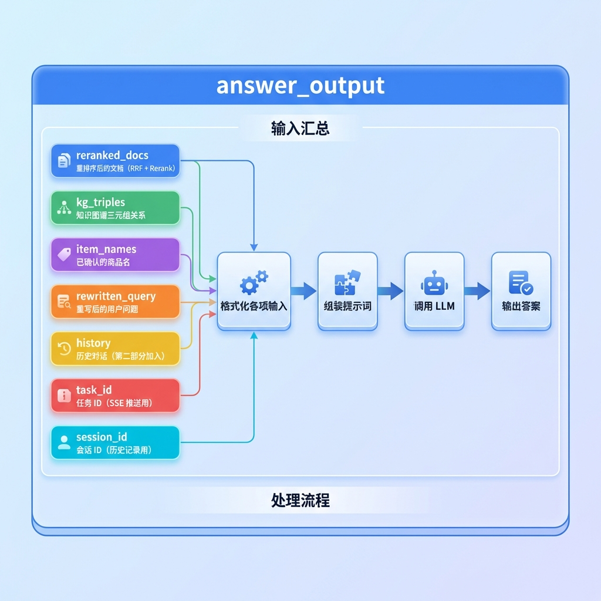

### 2.2 节点在流程中的位置

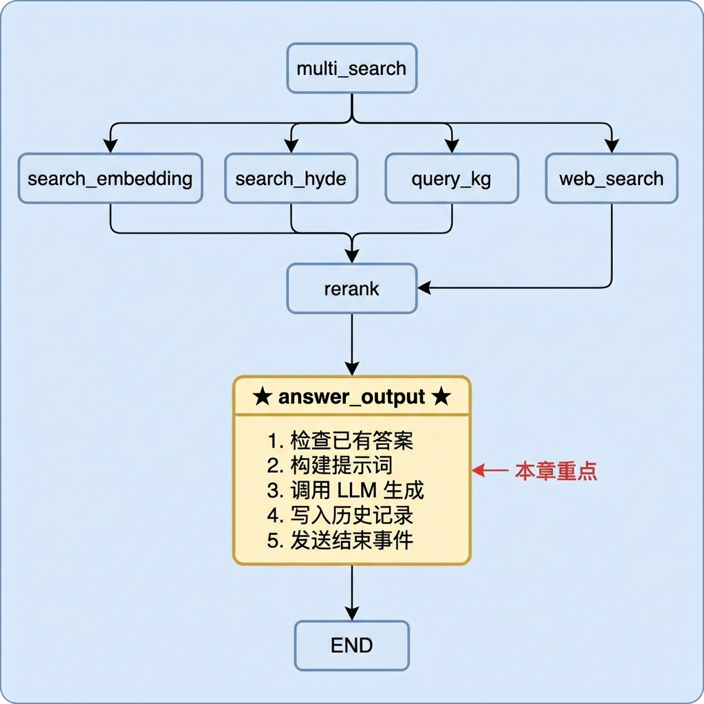

### 2.3 节点输入输出

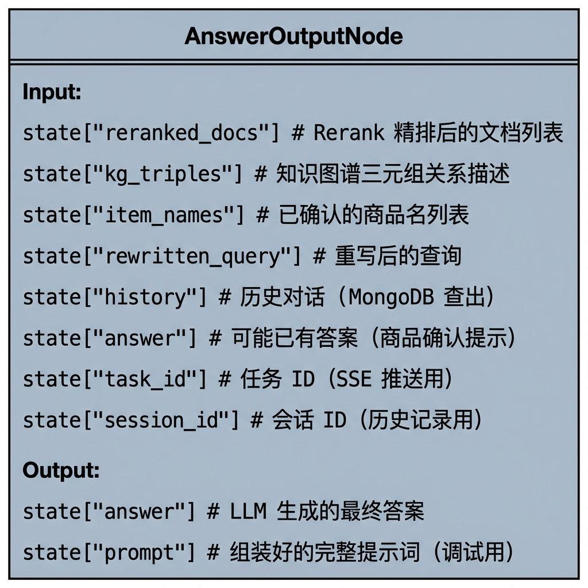

### 2.4 提示词工程

#### 2.4.1 提示词模板结构

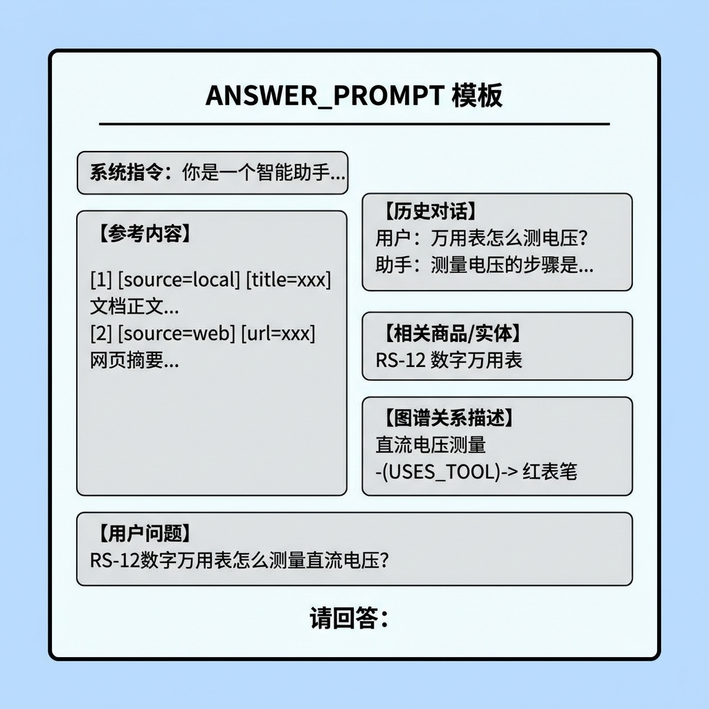

每个区块为 LLM 提供不同维度的信息：参考内容是核心证据，历史对话提供多轮上下文，图谱关系补充结构化知识，商品名限定回答范围，用户问题明确回答目标。

#### 2.4.2 字符预算控制

LLM 有输入长度限制，需要控制提示词总长度：

```python
char_budget = self.config.max_context_chars  # 默认 12000

# 依次分配，优先级递减，前一个消耗后剩余预算传给下一个
context_str, char_budget = self._format_reranked_docs(docs, char_budget)   # 文档优先
history_str, char_budget = self._format_chat_history(history, char_budget)  # 历史次之
graph_str, char_budget = self._format_kg_triples(triples, char_budget)     # 图谱最后
```

| 优先级 | 区块 | 理由 |
|--------|------|------|
| 最高 | 检索文档 | 核心参考内容，直接决定答案质量 |
| 次之 | 历史对话 | 理解多轮对话上下文 |
| 最低 | 图谱关系 | 补充结构化信息，非必需 |

> **`used_chars += len(doc_entry) + 2` 中的 +2**：最后拼接时用 `"\n\n".join()`，每两篇文档之间插入两个换行符，预算计算时要把这 2 个字符也算进去。

#### 2.4.3 格式化结果示例

**检索文档：**

```
[1] [source=local] [chunk_id=chunk_001] [title=操作指导] [score=5.0600]
测量直流电压时，将旋钮转到DCV档位，红表笔接VΩmA孔，黑表笔接COM孔。

[2] [source=web] [url=https://example.com] [title=电压测量指南] [score=3.9600]
注意：测量前请确认档位与量程，避免误接导致损坏或触电。
```

> **元信息标签传给 LLM 的作用**：帮 LLM 判断文档可信度（高分 > 低分，local>web），以及在答案中标注引用来源。

**图谱三元组：**

```
[RS-12 数字万用表] 直流电压测量 -(USES_TOOL)-> 红表笔
[RS-12 数字万用表] 直流电压测量 -(HAS_STEP)-> 选择DCV档位
```

> **图谱三元组与检索文档的区别**：检索文档是原文段落（长文本），图谱三元组是结构化关系（短文本）。两者互补——文档提供详细描述，三元组提供关键关系链。

### 2.5 实现流程图

```
Step 1: 检查已有答案 → 有则直接处理，无则进入生成流程
          │
Step 2: 格式化检索文档 + 历史对话 + 图谱三元组（带字符预算）
          │
Step 3: 填充 ANSWER_PROMPT 模板
          │
Step 4: 调用 LLM（流式 stream / 非流式 invoke）
          │
Step 5: 写入历史记录（MongoDB）
          │
Step 6: 流式模式发送 FINAL 事件
```

### 2.6 代码构建：第一步——骨架

先搭一个只有主流程和非流式生成的骨架，不包含历史写入和流式推送：

```python
"""答案输出节点 —— 骨架版本（第一步）"""

from typing import List, Dict, Any, Tuple
from knowledge.processor.query_process.base import BaseNode
from knowledge.processor.query_process.state import QueryGraphState
from knowledge.prompts.query.query_prompt import ANSWER_PROMPT
from knowledge.utils.llm_client_util import get_llm_client


class AnswerOutputNode(BaseNode):
    name = "answer_output"

    def process(self, state: QueryGraphState) -> QueryGraphState:
        # 1. 已有答案 → 直接返回
        if state.get("answer"):
            return state

        # 2. 构建提示词 → 调用 LLM 生成答案
        prompt = self._build_prompt(state)
        state["prompt"] = prompt
        state["answer"] = self._invoke_generate(prompt)

        return state

    def _build_prompt(self, state: QueryGraphState) -> str:
        char_budget = self.config.max_context_chars

        # 1. 获取问题和商品名
        question = state.get("rewritten_query") or state.get("original_query", "")
        item_names = state["item_names"]

        # 2. 格式化上下文文档
        context_str, char_budget = self._format_reranked_docs(
            state.get("reranked_docs") or [], char_budget
        )

        # 3. 格式化图谱关系
        graph_str, char_budget = self._format_kg_triples(
            state.get("kg_triples") or [], char_budget
        )

        # 4. 组装提示词
        return ANSWER_PROMPT.format(
            context=context_str or "无参考内容",
            history="无历史对话",              # 第二部分加入
            item_names=", ".join(item_names),
            graph_relation_description=graph_str or "无图谱关系",
            question=question,
        )

    def _format_reranked_docs(self, reranked_docs: List[Dict], char_budget: int) -> Tuple[str, int]:
        formatted_lines = []
        used_chars = 0

        for idx, doc in enumerate(reranked_docs, 1):
            content = doc.get("content", "").strip()
            if not content:
                continue

            meta_tags = [f"[{idx}]"]
            for field, template in [
                ("source", "[source={}]"), ("chunk_id", "[chunk_id={}]"),
                ("url", "[url={}]"), ("title", "[title={}]"),
            ]:
                field_value = str(doc.get(field, "")).strip()
                if field_value:
                    meta_tags.append(template.format(field_value))

            relevance_score = doc.get("score")
            if relevance_score is not None:
                meta_tags.append(f"[score={float(relevance_score):.4f}]")

            doc_entry = " ".join(meta_tags) + "\n" + content

            if used_chars + len(doc_entry) > char_budget:
                break

            formatted_lines.append(doc_entry)
            used_chars += len(doc_entry) + 2

        return "\n\n".join(formatted_lines), char_budget - used_chars

    @staticmethod
    def _format_kg_triples(kg_triples: List, char_budget: int) -> Tuple[str, int]:
        formatted_lines = []
        used_chars = 0
        for triple in kg_triples:
            triple_text = (str(triple) if triple is not None else "").strip()
            if not triple_text:
                continue
            if used_chars + len(triple_text) > char_budget:
                break
            formatted_lines.append(triple_text)
            used_chars += len(triple_text) + 1
        return "\n".join(formatted_lines), char_budget - used_chars

    def _invoke_generate(self, prompt: str) -> str:
        self.log_step("generate", "生成答案")
        llm_client = get_llm_client()
        if llm_client is None:
            raise ValueError("LLM 客户端初始化失败")
        try:
            response = llm_client.invoke(prompt)
            return response.content
        except Exception as e:
            self.logger.error(f"生成回答出错: {e}")
            return "抱歉，生成回答时出现错误。"
```

> **此时可以运行测试**：用 mock_state 验证提示词组装和非流式生成。

> **已有答案的场景**：商品确认节点可能生成澄清提示（如"请问您是指 A 还是 B？"），答案生成节点发现 `state["answer"]` 已存在就直接返回，无需调用 LLM。

> **降级处理**：LLM 调用失败返回友好错误信息，异常被 `BaseNode.__call__` 捕获并包装，不会中断整个查询流程。

### 2.7 代码构建：第二步——加入流式生成 + task_id

在骨架基础上加入流式生成、已有答案的非流式结果存储、SSE FINAL 事件推送。**新增内容标注 ★**：

```python
"""答案输出节点 —— 加入流式生成（第二步）"""

from typing import List, Dict, Any, Tuple
from knowledge.processor.query_process.base import BaseNode
from knowledge.processor.query_process.state import QueryGraphState
from knowledge.prompts.query.query_prompt import ANSWER_PROMPT
from knowledge.utils.sse_utils import push_sse_event, SSEEvent        # ★ 新增
from knowledge.utils.task_utils import set_task_result                 # ★ 新增
from knowledge.utils.llm_client_util import get_llm_client


class AnswerOutputNode(BaseNode):
    name = "answer_output"

    def process(self, state: QueryGraphState) -> QueryGraphState:
        task_id = state.get("task_id")                                 # ★ 新增
        is_stream = state.get("is_stream")                             # ★ 新增

        # 1. 已有答案 → 直接处理
        if state.get("answer"):
            self._push_existing_answer(state)                          # ★ 改动
        else:
            # 2. 构建提示词 → 调用 LLM 生成答案
            prompt = self._build_prompt(state)
            state["prompt"] = prompt
            self._generate_answer(state, prompt)                       # ★ 改动

        # 3. TODO: 第三步加入历史记录写入

        # 4. ★ 流式模式发送结束事件
        if is_stream:
            push_sse_event(task_id, SSEEvent.FINAL,
                            {"answer": state.get("answer", "")})

        return state

    # ★ 新增
    def _push_existing_answer(self, state: QueryGraphState):
        """非流式模式：存入任务结果；流式模式：让 FINAL 统一推送。"""
        if not state.get("is_stream"):
            set_task_result(state["task_id"], "answer", state["answer"])

    def _build_prompt(self, state: QueryGraphState) -> str:
        """（与第一步相同，此处省略）"""
        pass

    # ★ 新增：替代原来的直接调用 _invoke_generate
    def _generate_answer(self, state: QueryGraphState, prompt: str):
        self.log_step("generate", "生成答案")
        llm_client = get_llm_client()
        if llm_client is None:
            raise ValueError("LLM 客户端初始化失败")

        task_id = state["task_id"]

        if state.get("is_stream"):
            state["answer"] = self._stream_generate(llm_client, prompt, task_id)
        else:
            state["answer"] = self._invoke_generate(llm_client, prompt)
            set_task_result(task_id, "answer", state["answer"])

    # ★ 新增
    def _stream_generate(self, llm_client, prompt: str, task_id: str) -> str:
        """流式生成，逐 chunk 推送 delta 事件。"""
        accumulated_answer = ""
        try:
            for chunk in llm_client.stream(prompt):
                delta_text = getattr(chunk, "content", "") or ""
                if delta_text:
                    accumulated_answer += delta_text
                    push_sse_event(task_id, "delta", {"delta": delta_text})
        except Exception as e:
            self.logger.error(f"流式生成出错: {e}")
        return accumulated_answer

    def _invoke_generate(self, llm_client, prompt: str) -> str:
        """（与第一步相同）"""
        try:
            response = llm_client.invoke(prompt)
            return response.content
        except Exception as e:
            self.logger.error(f"生成回答出错: {e}")
            return "抱歉，生成回答时出现错误。"
```

> **为什么流式模式已有答案不推 DELTA？** 如果这里推了 DELTA，后面又推 FINAL（也带 answer），前端会渲染两次相同内容。让 FINAL 统一负责更干净。

---

## 3. 历史会话管理（第二部分）

### 3.1 为什么需要历史会话

多轮对话场景下，用户经常使用代词或省略主语：

```
第一轮：用户问"RS-12 万用表怎么测电压？"  → 助手回答...
第二轮：用户问"那电阻呢？"                → "那"指的是 RS-12 万用表
第三轮：用户问"它的电池怎么换？"           → "它"指的是 RS-12 万用表
```

如果没有历史对话，LLM 无法理解"那"和"它"的指代对象。

### 3.2 历史对话在 pipeline 中的双用途

```
item_name_confirm_node
  │
  │  chat_history = get_recent_messages(session_id)
  │  ├── 用途1: 传给 LLM，做指代消解（"它" → "RS-12 万用表"）
  │  └── state["history"] = chat_history  ← 写入 state
  │
  v
  多路检索 → RRF → Rerank
  │
  v
answer_output
  │
  │  state.get("history")  ← 从 state 取出
  │  └── 用途2: 填入提示词【历史对话】区块，LLM 生成更连贯的答案
  │
  v
  LLM 生成答案
```

### 3.3 MongoDB 历史记录结构

```json
{
    "_id": ObjectId("69bbf91aaca1715a656e1590"),
    "session_id": "sess-2i16xujs1npmmxdcqhw",
    "role": "user",
    "text": "如何使用万用表测量电压",
    "rewritten_query": "如何使用万用表测量电压",
    "item_names": [],
    "ts": 1773926682.007168
}
```

| 字段 | 说明 |
|------|------|
| `session_id` | 会话 ID，同一浏览器标签页共享 |
| `role` | `user` 或 `assistant` |
| `text` | 消息内容 |
| `rewritten_query` | 重写后的查询（方便回溯） |
| `item_names` | 关联的商品名（可为空列表） |
| `ts` | 时间戳 |

### 3.4 历史记录读取：item_name_confirm_node 改造

```python
def process(self, state: QueryGraphState) -> QueryGraphState:
    session_id = state["session_id"]
    original_query = state["original_query"]

    # ★ 新增：从 MongoDB 查历史对话
    from knowledge.utils.mongo_history_utils import get_recent_messages, update_message_item_names
    chat_history = get_recent_messages(session_id, limit=10)
     #  构造历史对话文本
    history_text = ""
    for msg in chat_history:
    	role = msg.get("role")
        content = msg.get("text", "")
        history_text += f"{role}: {content}\n"
    

    # 2. 调用 LLM 提取商品名（★ 传入历史对话用于指代消解）
    clean_llm_result = self._item_name_extractor.extract_item_name(
        original_query, chat_history
    )
    item_names = clean_llm_result.get("item_names")
    rewritten_query = clean_llm_result.get("rewritten_query")

    # 3. 向量对齐
    if item_names:
        confirmed, options = self._item_name_aligner.match_align_filter(item_names)
    else:
        confirmed, options = [], []

    # 4. 决定 state
    self._decide(state, confirmed, options, rewritten_query)

    # ★ 新增：回填历史记录中空的 item_names
    if confirmed:
        ids_to_update = [
            str(msg["_id"]) for msg in chat_history if not msg.get("item_names")
        ]
        if ids_to_update:
            try:
                update_message_item_names(ids_to_update, confirmed)
            except Exception as e:
                self.logger.warning(f"回填历史 item_names 失败: {e}")

    # ★ 新增：将历史对话写入 state，供下游 answer_output 使用
    state["history"] = chat_history

    return state


```

### 3.5 item_names 回填机制

```
用户第一轮："万用表怎么测电压？"
  MongoDB: {role:"user", item_names:[]}      ← 空
  MongoDB: {role:"assistant", item_names:[]} ← 空

用户第二轮确认："RS-12 数字万用表"
  confirmed = ["RS-12 数字万用表"]
  回填 → 把上面2条记录的 item_names 更新为 ["RS-12 数字万用表"]
```

`update_message_item_names` 的查询条件覆盖三种"空"：

```python
{"$or": [
    {"item_names": {"$exists": False}},  # 字段不存在（旧数据没存这个字段）
    {"item_names": []},                    # 空列表
    {"item_names": None}                   # null 值
]}
```

> **`$or` 不多余**：虽然 Python 层已筛过空 `item_names`，但从查询到更新之间有时间差，`$or` 是数据库层面的二次防御，防止并发场景下误覆盖。

### 3.6 历史对话完整流转时序

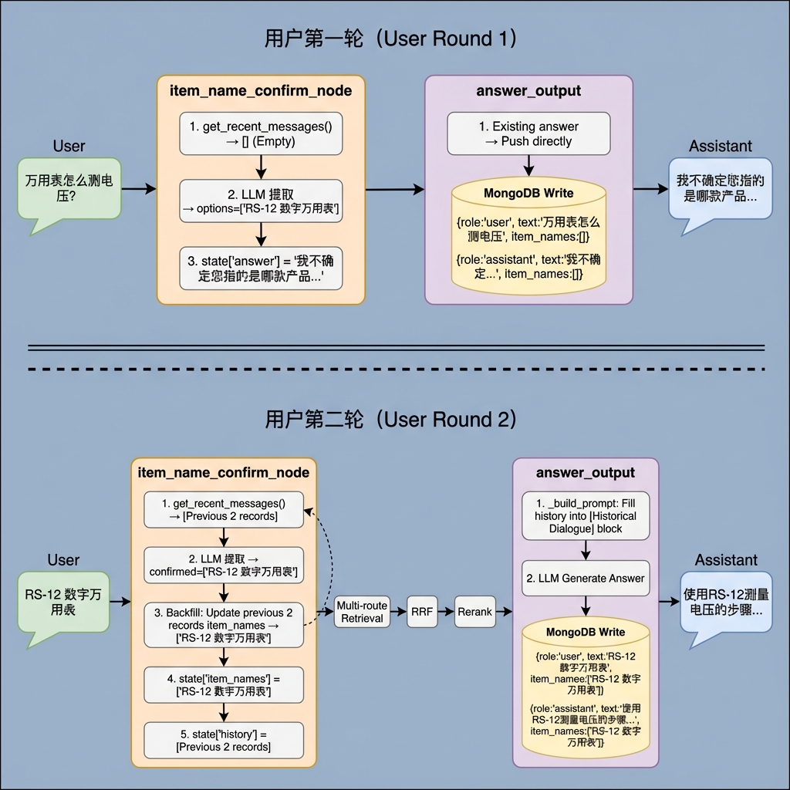

### 3.7 代码构建：第三步——加入历史对话格式化 + 历史记录写入

在第二步基础上，加入 `_format_chat_history`、`_write_history`，以及 `_build_prompt` 中对历史对话的引用。**以下为第三步完整代码，新增标注 ★**：

```python
"""答案输出节点 —— 完整版本（第三步）"""

from typing import List, Dict, Any, Tuple
from knowledge.processor.query_process.base import BaseNode
from knowledge.processor.query_process.state import QueryGraphState
from knowledge.prompts.query.query_prompt import ANSWER_PROMPT
from knowledge.utils.sse_utils import push_sse_event, SSEEvent
from knowledge.utils.task_utils import set_task_result
from knowledge.utils.llm_client_util import get_llm_client
from knowledge.utils.mongo_history_utils import save_chat_message        # ★ 新增


class AnswerOutputNode(BaseNode):
    name = "answer_output"

    def process(self, state: QueryGraphState) -> QueryGraphState:
        task_id = state.get("task_id")
        is_stream = state.get("is_stream")

        # 1. 已有答案 → 直接处理
        if state.get("answer"):
            self._push_existing_answer(state)
        else:
            # 2. 构建提示词 → 调用 LLM 生成答案
            prompt = self._build_prompt(state)
            state["prompt"] = prompt
            self._generate_answer(state, prompt)

        # 3. ★ 写入历史记录（用户问题 + 助手回答）
        self._write_history(state)

        # 4. 流式模式发送结束事件
        if is_stream:
            push_sse_event(task_id, SSEEvent.FINAL,
                            {"answer": state.get("answer", "")})

        return state

    def _push_existing_answer(self, state: QueryGraphState):
        if not state.get("is_stream"):
            set_task_result(state["task_id"], "answer", state["answer"])

    def _build_prompt(self, state: QueryGraphState) -> str:
        char_budget = self.config.max_context_chars

        question = state.get("rewritten_query") or state.get("original_query", "")
        item_names = state["item_names"]

        context_str, char_budget = self._format_reranked_docs(
            state.get("reranked_docs") or [], char_budget
        )

        # ★ 第三步加入
        history_str, char_budget = self._format_chat_history(
            state.get("history") or [], char_budget
        )

        graph_str, char_budget = self._format_kg_triples(
            state.get("kg_triples") or [], char_budget
        )

        return ANSWER_PROMPT.format(
            context=context_str or "无参考内容",
            history=history_str or "无历史对话",                        # ★ 改动
            item_names=", ".join(item_names),
            graph_relation_description=graph_str or "无图谱关系",
            question=question,
        )

    def _format_reranked_docs(self, reranked_docs: List[Dict], char_budget: int) -> Tuple[str, int]:
        formatted_lines = []
        used_chars = 0
        for idx, doc in enumerate(reranked_docs, 1):
            content = doc.get("content", "").strip()
            if not content:
                continue
            meta_tags = [f"[{idx}]"]
            for field, template in [
                ("source", "[source={}]"), ("chunk_id", "[chunk_id={}]"),
                ("url", "[url={}]"), ("title", "[title={}]"),
            ]:
                field_value = str(doc.get(field, "")).strip()
                if field_value:
                    meta_tags.append(template.format(field_value))
            relevance_score = doc.get("score")
            if relevance_score is not None:
                meta_tags.append(f"[score={float(relevance_score):.4f}]")
            doc_entry = " ".join(meta_tags) + "\n" + content
            if used_chars + len(doc_entry) > char_budget:
                break
            formatted_lines.append(doc_entry)
            used_chars += len(doc_entry) + 2
        return "\n\n".join(formatted_lines), char_budget - used_chars

    # ★ 新增方法
    @staticmethod
    def _format_chat_history(chat_history: List[Dict], char_budget: int) -> Tuple[str, int]:
        formatted_lines = []
        used_chars = 0
        for message in chat_history:
            for role_label, field_key in [("用户", "user"), ("助手", "assistant")]:
                message_text = message.get(field_key)
                if not message_text:
                    continue
                formatted_line = f"{role_label}: {message_text}"
                used_chars += len(formatted_line) + 1
                if used_chars > char_budget:
                    return "\n".join(formatted_lines), char_budget - used_chars
                formatted_lines.append(formatted_line)
        return "\n".join(formatted_lines), char_budget - used_chars

    @staticmethod
    def _format_kg_triples(kg_triples: List, char_budget: int) -> Tuple[str, int]:
        formatted_lines = []
        used_chars = 0
        for triple in kg_triples:
            triple_text = (str(triple) if triple is not None else "").strip()
            if not triple_text:
                continue
            if used_chars + len(triple_text) > char_budget:
                break
            formatted_lines.append(triple_text)
            used_chars += len(triple_text) + 1
        return "\n".join(formatted_lines), char_budget - used_chars

    def _generate_answer(self, state: QueryGraphState, prompt: str):
        self.log_step("generate", "生成答案")
        llm_client = get_llm_client()
        if llm_client is None:
            raise ValueError("LLM 客户端初始化失败")
        task_id = state["task_id"]
        if state.get("is_stream"):
            state["answer"] = self._stream_generate(llm_client, prompt, task_id)
        else:
            state["answer"] = self._invoke_generate(llm_client, prompt)
            set_task_result(task_id, "answer", state["answer"])

    def _stream_generate(self, llm_client, prompt: str, task_id: str) -> str:
        accumulated_answer = ""
        try:
            for chunk in llm_client.stream(prompt):
                delta_text = getattr(chunk, "content", "") or ""
                if delta_text:
                    accumulated_answer += delta_text
                    push_sse_event(task_id, "delta", {"delta": delta_text})
        except Exception as e:
            self.logger.error(f"流式生成出错: {e}")
        return accumulated_answer

    def _invoke_generate(self, llm_client, prompt: str) -> str:
        try:
            response = llm_client.invoke(prompt)
            return response.content
        except Exception as e:
            self.logger.error(f"生成回答出错: {e}")
            return "抱歉，生成回答时出现错误。"

    # ★ 新增方法
    def _write_history(self, state: QueryGraphState):
        session_id = state["session_id"]
        rewritten_query = state.get("rewritten_query", "") or state.get("original_query", "")
        item_names = state.get("item_names") or []
        try:
            save_chat_message(
                session_id=session_id, role="user",
                text=state["original_query"],
                rewritten_query=rewritten_query, item_names=item_names,
            )
            if state.get("answer"):
                save_chat_message(
                    session_id=session_id, role="assistant",
                    text=state["answer"],
                    rewritten_query=rewritten_query, item_names=item_names,
                )
        except Exception as e:
            self.logger.warning(f"写入历史记录失败: {e}")
```

> **为什么统一在 answer_output 写入？** `item_name_confirm_node` 专注于商品确认（只读 MongoDB + 回填），`answer_output` 作为 pipeline 最终出口统一写入新记录，职责更清晰。

---

## 4. 对接查询前端（第三部分）

### 4.1 整体架构

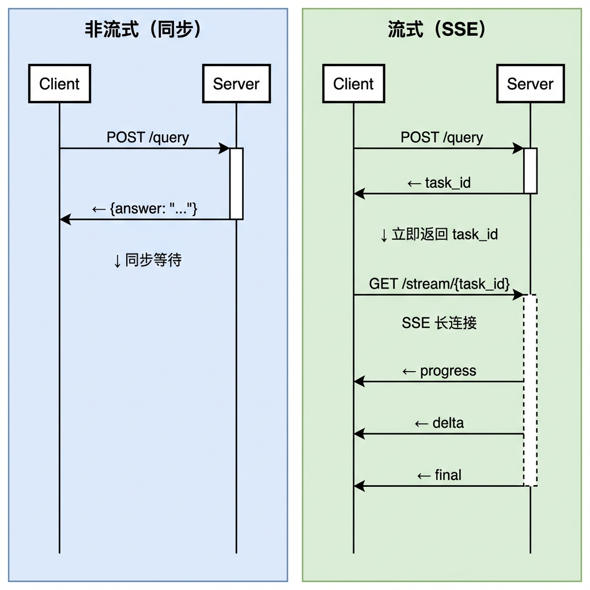

> **导入侧用轮询，查询侧用 SSE，为什么不统一？** 导入流程耗时几十秒到几分钟，轮询间隔 1.5 秒足够；查询流程需要 LLM 逐字输出（几十毫秒一个 token），轮询无法满足实时性要求，必须用 SSE 长连接。

### 4.2 session_id vs task_id

```
session_id：标识一个会话（多轮对话共享，存历史记录用）
  - 前端页面加载时生成一次，存 localStorage
  - 同一浏览器标签页的所有对话共用

task_id：标识一次提问（任务状态、SSE 队列、进度追踪用）
  - 每次提问后端生成新的 task_id
  - 避免同一 session 下多次查询的状态互相覆盖
```

如果不分离，同一个 session 下连续两次提问，第二次的 `_tasks_running_list` 和 `_tasks_done_list` 会覆盖第一次的数据，导致进度混乱。

### 4.3 架构分层（与导入侧对称）

```
导入侧                                    查询侧
──────────────────────                    ──────────────────────
import_router.py                          query_router.py
  ├── POST /upload                          ├── POST /query
  └── GET /status/{task_id}                 ├── GET /stream/{task_id}
                                            ├── GET /history/{session_id}
                                            └── DELETE /history/{session_id}

upload_schema.py                          query_schema.py
  └── UploadResponse                        ├── QueryRequest
                                            ├── QueryResponse
                                            └── StreamSubmitResponse

import_file_service.py                    query_service.py
  ├── process_upload_file()                 ├── submit_query()
  └── run_import_graph()                    ├── run_query_graph()
                                            └── get_answer()

deps.py                                   deps.py（扩展）
  ├── get_task_service()                    └── get_query_service()
  └── get_import_file_service()
```

### 4.4 SSE 流式推送机制

#### 4.4.0 什么是 SSE

**SSE (Server-Sent Events)** 是一种服务器向客户端推送数据的技术。

```
┌─────────────────────────────────────────────────────────────────┐
│                      普通 HTTP 请求                               │
├─────────────────────────────────────────────────────────────────┤
│  客户端 ─────请求──────> 服务器                                   │
│         <─────响应──────      │                                 │
│                              │  一次请求，一次响应                │
│                              │  服务器无法主动推送                 │
└─────────────────────────────────────────────────────────────────┘

┌─────────────────────────────────────────────────────────────────┐
│                         SSE (本方案)                             │
├─────────────────────────────────────────────────────────────────┤
│  客户端 ─────建立连接─────> 服务器                                 │
│         <─────推送消息1──────      │                              │
│         <─────推送消息2──────      │  长连接，服务器持续推送        │
│         <─────推送消息3──────      │                              │
│                              │                                 │
└─────────────────────────────────────────────────────────────────┘
```

**为什么用 SSE？**

| 对比项     | 轮询               | WebSocket | SSE            |
| ---------- | ------------------ | --------- | -------------- |
| 实现复杂度 | 简单               | 复杂      | **简单**       |
| 服务器推送 | ❌ 需客户端反复请求 | ✅         | ✅              |
| 单向推送   | ❌                  | 双向      | ✅ **够用**     |
| 自动重连   | ❌                  | ❌         | ✅ **原生支持** |

> **一句话**：我们只需要服务器向客户端推送进度和答案，SSE 最简单、浏览器原生支持、自动重连。

#### 4.4.1 SSE 事件类型

```python
class SSEEvent:
    READY = "ready"         # 连接建立
    PROGRESS = "progress"   # 任务节点进度
    DELTA = "delta"         # LLM 流式输出增量
    FINAL = "final"         # 最终完整答案
 
```

#### 4.4.2 SSE 消息格式

```
event: ready
data: {}

event: progress
data: {"status":"processing","done_list":["确认问题产品"],"running_list":["切片搜索"]}

event: delta
data: {"delta":"根据"}

event: delta
data: {"delta":"参考内容"}

event: final
data: {"answer":"根据参考内容，万用表测量电压的步骤..."}

event: progress
data: {"status":"completed","done_list":["确认问题产品","切片搜索",...],"running_list":[]}
```

#### 4.4.3 核心机制：Queue 解耦生产者和消费者


> **为什么 sse_generator 用 `run_in_executor`？** `stream_queue.get` 是阻塞操作，直接在 async 函数中调用会卡死整个 FastAPI 事件循环。`run_in_executor` 把阻塞操作扔到线程池。

> queue.Queue.get() 是一个同步阻塞方法。如果在异步代码中直接调用，会阻塞整个事件循环。
>
>  使用 run_in_executor 把这个阻塞操作放到线程池中执行，避免阻塞事件循环，同时保持异步代码的流畅性。
>
> **为什么设 1 秒超时？** 不设超时则 `get` 无限等待，客户端断开了也检测不到。1 秒超时后回到循环顶部检查 `is_disconnected()`，及时退出。

#### 4.4.4 任务追踪：三层职责分离

| 模块 | 职责 | 依赖 |
|------|------|------|
| `task_utils.py` | 纯状态管理（增删查） | 无外部依赖 |
| `sse_utils.py` | 纯 SSE 队列和推送 | 无外部依赖 |
| `BaseNode` | 编排两者：状态更新 + 判断是否推送 | 依赖 task_utils + sse_utils |

`task_utils` 不知道 SSE 的存在，导入侧完全不受影响。

> **每次推送全量快照而非增量**：`done_list` 和 `running_list` 每次都完整推送，前端直接覆盖渲染。即使中间某条 progress 丢了，下一条也能正确显示。

#### 4.4.5 双保险机制

| 事件 | 触发时机 | 前端行为 |
|------|---------|---------|
| `final` | answer_output 正常推送 | 渲染完整答案 + 关闭连接 + 启用按钮 |
| `progress(completed)` | query_service.finally 兜底推送 | 仅启用按钮（不关连接、不渲染答案） |

正常情况下 `final` 先到，前端关闭连接，后面的 `progress(completed)` 到了也收不到。异常情况下 `final` 丢了，`progress(completed)` 兜底启用按钮，用户不会卡死。

> **`finally` 里的 `progress(completed)` 为什么不多余？** `BaseNode._push_progress` 推送的最后一条 progress 的 status 还是 `"processing"`（因为 `update_task_status(COMPLETED)` 在 `query_app.invoke()` 之后才执行）。只有 `finally` 里这次推送的 status 才是 `"completed"`。

### 4.5 前后端交互完整时序

#### 4.5.1 非流式模式


#### 4.5.2 流式模式

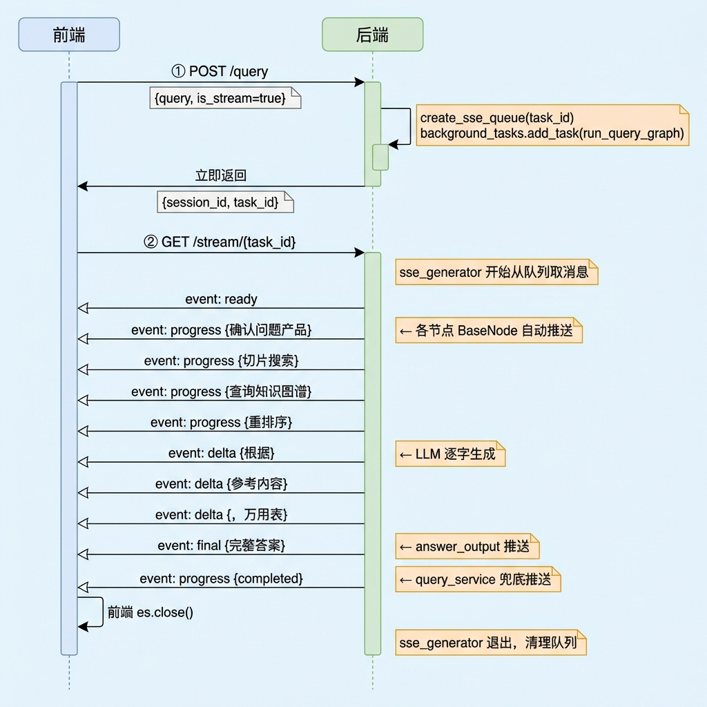

> **为什么需要两次请求？** POST `/query` 是触发任务，GET `/stream/{task_id}` 是建立 SSE 长连接。分开是因为 POST 要立即返回 task_id，前端拿到 task_id 后才能建立 SSE 连接。

> **SSE 队列为什么在 `submit_query`（主线程）创建？** 如果放在 `run_query_graph`（后台线程），队列创建时机不确定，前端请求 `/stream` 时队列可能还不存在。

### 4.6 前端关键代码

**Session ID 管理**：页面加载时生成一次，所有消息复用：

```javascript
let sessionId = localStorage.getItem('kb_session_id');
if (!sessionId) {
    sessionId = 'sess-' + Math.random().toString(36).slice(2) + Date.now().toString(36);
    localStorage.setItem('kb_session_id', sessionId);
}
```

**流式模式 SSE 事件处理**：

```javascript
const { task_id } = data;
const es = new EventSource(`${API_BASE}/stream/${task_id}`);

// progress 事件：更新进度条 + 兜底启用按钮
es.addEventListener('progress', (e) => {
    const d = JSON.parse(e.data || '{}');
    renderProgress(botMsgEl, d.done_list, d.running_list, d.status);
    if (d && d.status === 'completed') {
        sendBtn.disabled = false;  // 兜底
    }
});

// delta 事件：逐字渲染答案
es.addEventListener('delta', (e) => {
    const d = JSON.parse(e.data || '{}');
    if (d.delta) {
        rawAnswerText += d.delta;
        renderAnswerWithImages(answerEl, rawAnswerText, []);
        scrollToBottom();
    }
});

// final 事件：渲染完整答案 + 关闭连接（正常出口）
es.addEventListener('final', (e) => {
    const d = JSON.parse(e.data || '{}');
    renderAnswerWithImages(answerEl, d.answer || rawAnswerText, d.image_urls || []);
    es.close();               // 关闭 SSE 连接
    sendBtn.disabled = false;  // 启用发送按钮
});
```

### 4.7 代码构建：第四步——Schema + Service + Router + BaseNode + task_utils

#### 4.7.1 query_schema.py（完整代码）

```python
"""查询相关 Schema 定义"""

from typing import Optional, List
from pydantic import BaseModel, Field


class QueryRequest(BaseModel):
    query: str = Field(..., description="查询内容")
    session_id: Optional[str] = Field(None, description="会话ID，不传则自动生成")
    is_stream: bool = Field(False, description="是否流式返回")


class QueryResponse(BaseModel):
    message: str = Field(..., description="响应消息")
    session_id: str = Field(..., description="会话ID")
    answer: str = Field("", description="生成的答案")


class StreamSubmitResponse(BaseModel):
    message: str = Field(..., description="响应消息")
    session_id: str = Field(..., description="会话ID")
    task_id: str = Field(..., description="任务ID，前端用此 ID 建立 SSE 连接")


class HistoryItem(BaseModel):
    id: str = Field("", alias="_id")
    session_id: str = ""
    role: str = ""
    text: str = ""
    rewritten_query: str = ""
    item_names: List[str] = Field(default_factory=list)
    ts: Optional[float] = None


class HistoryResponse(BaseModel):
    session_id: str
    items: List[HistoryItem]
```

#### 4.7.2 deps.py（扩展，完整代码）

```python
from functools import lru_cache
from knowledge.services.import_file_service import ImportFileService
from knowledge.services.task_service import TaskService
from knowledge.services.query_service import QueryService


@lru_cache
def get_task_service() -> TaskService:
    return TaskService()

@lru_cache
def get_import_file_service() -> ImportFileService:
    return ImportFileService(get_task_service())

@lru_cache 
def get_query_service() -> QueryService:  ★ 新增
    return QueryService()
```

#### 4.7.3 query_service.py（完整代码）

```python
"""查询业务服务"""

import uuid
import logging
from typing import List, Dict, Any

from knowledge.processor.query_process.main_graph import query_app
from knowledge.utils.task_utils import update_task_status, get_task_result, \
    get_task_status, get_done_task_list, get_running_task_list, \
    TASK_STATUS_PROCESSING, TASK_STATUS_COMPLETED
from knowledge.utils.sse_utils import create_sse_queue, push_sse_event

logger = logging.getLogger(__name__)


class QueryService:

    def generate_session_id(self) -> str:
        return str(uuid.uuid4())

    def generate_task_id(self) -> str:
        return str(uuid.uuid4())

    def submit_query(self, task_id: str, is_stream: bool):
        """提交查询任务：更新状态 + 流式模式创建 SSE 队列。"""
        update_task_status(task_id, TASK_STATUS_PROCESSING)
        if is_stream:
            create_sse_queue(task_id)

    def run_query_graph(self, task_id: str, session_id: str, user_query: str, is_stream: bool):
        """执行 LangGraph 查询流程。"""
        try:
            default_state = {
                "original_query": user_query,
                "session_id": session_id,
                "task_id": task_id,
                "is_stream": is_stream,
            }
            query_app.invoke(default_state)
        except Exception as e:
            logger.error(f"查询流程执行失败: {e}", exc_info=True)
        finally:
            update_task_status(task_id, TASK_STATUS_COMPLETED)
            if is_stream:
                push_sse_event(task_id, "progress", {
                    "status": get_task_status(task_id),
                    "done_list": get_done_task_list(task_id),
                    "running_list": get_running_task_list(task_id),
                })

    def get_answer(self, task_id: str) -> str:
        return get_task_result(task_id, "answer", "")

    def get_history(self, session_id: str, limit: int = 50) -> List[Dict[str, Any]]:
        from knowledge.utils.mongo_history_utils import get_recent_messages
        records = get_recent_messages(session_id, limit=limit)
        return [
            {
                "_id": str(r.get("_id", "")),
                "session_id": r.get("session_id", ""),
                "role": r.get("role", ""),
                "text": r.get("text", ""),
                "rewritten_query": r.get("rewritten_query", ""),
                "item_names": r.get("item_names", []),
                "ts": r.get("ts"),
            }
            for r in records
        ]

    def clear_history(self, session_id: str) -> int:
        from knowledge.utils.mongo_history_utils import clear_history
        return clear_history(session_id)
```

#### 4.7.4 query_router.py（完整代码）

```python
"""查询路由"""

import os
import uvicorn
from fastapi import FastAPI, BackgroundTasks, HTTPException, Request, Depends
from fastapi.responses import FileResponse, StreamingResponse
from fastapi.staticfiles import StaticFiles
from fastapi.middleware.cors import CORSMiddleware

from knowledge.core.paths import get_front_page_dir
from knowledge.core.deps import get_query_service
from knowledge.schema.query_schema import QueryRequest, QueryResponse, StreamSubmitResponse
from knowledge.services.query_service import QueryService
from knowledge.utils.sse_utils import sse_generator
from knowledge.processor.query_process.base import setup_logging


def create_app() -> FastAPI:
    app = FastAPI(title="Query Service", description="知识库查询服务")
    app.add_middleware(
        CORSMiddleware,
        allow_origins=["*"], allow_credentials=True,
        allow_methods=["*"], allow_headers=["*"],
    )
    front_page_dir = get_front_page_dir()
    if front_page_dir and os.path.exists(front_page_dir):
        app.mount("/front", StaticFiles(directory=front_page_dir))
    register_routes(app)
    return app


def register_routes(app: FastAPI):

    @app.get("/chat.html")
    async def chat_page():
        return FileResponse(os.path.join(get_front_page_dir(), "chat.html"))

    @app.post("/query")
    async def query(
        request: QueryRequest,
        background_tasks: BackgroundTasks,
        service: QueryService = Depends(get_query_service),
    ):
        session_id = request.session_id or service.generate_session_id()
        task_id = service.generate_task_id()
        service.submit_query(task_id, request.is_stream)

        if request.is_stream:
            background_tasks.add_task(
                service.run_query_graph, task_id, session_id, request.query, True
            )
            return StreamSubmitResponse(
                message="Query submitted", session_id=session_id, task_id=task_id
            )

        service.run_query_graph(task_id, session_id, request.query, False)
        answer = service.get_answer(task_id)
        return QueryResponse(message="处理完成", session_id=session_id, answer=answer)

    @app.get("/stream/{task_id}")
    async def stream(task_id: str, request: Request):
        return StreamingResponse(
            sse_generator(task_id, request), media_type="text/event-stream",
        )

    @app.get("/history/{session_id}")
    async def get_history(
        session_id: str, limit: int = 50,
        service: QueryService = Depends(get_query_service),
    ):
        try:
            items = service.get_history(session_id, limit)
            return {"session_id": session_id, "items": items}
        except Exception as e:
            raise HTTPException(status_code=500, detail=f"history error: {e}")

    @app.delete("/history/{session_id}")
    async def clear_chat_history(
        session_id: str,
        service: QueryService = Depends(get_query_service),
    ):
        count = service.clear_history(session_id)
        return {"message": "History cleared", "deleted_count": count}

    @app.get("/health")
    async def health():
        return {"ok": True}


if __name__ == "__main__":
    setup_logging()
    uvicorn.run(app=create_app(), host="0.0.0.0", port=8001)
```

#### 4.7.5 base.py——查询侧 BaseNode（完整代码）

```python
"""查询流程节点基类"""

from abc import ABC, abstractmethod
from typing import TypeVar, Optional
import logging

from knowledge.processor.query_process.config import QueryConfig, get_config
from knowledge.processor.query_process.exceptions import QueryProcessError
from knowledge.utils.task_utils import add_running_task, add_done_task, get_task_status, \
    get_done_task_list, get_running_task_list
from knowledge.utils.sse_utils import push_sse_event

T = TypeVar("T")


class BaseNode(ABC):
    name: str = "base_node"

    def __init__(self, config: Optional[QueryConfig] = None):
        self.config = config or get_config()
        self.logger = logging.getLogger(f"query.{self.name}")

    def __call__(self, state: T) -> T:
        task_id = state.get("task_id", "")  ★ 新增
        is_stream = state.get("is_stream", False) ★ 新增

        try:
            self.logger.info(f"--- {self.name} 开始 ---")
            if task_id: ★ 新增
                add_running_task(task_id, self.name) ★ 新增
                if is_stream: ★ 新增
                    self._push_progress(task_id) ★ 新增

            result = self.process(state)

            self.logger.info(f"--- {self.name} 完成 ---")
            if task_id: ★ 新增
                add_done_task(task_id, self.name) ★ 新增
                if is_stream: ★ 新增
                    self._push_progress(task_id) ★ 新增

            return result
        except Exception as e:
            self.logger.error(f"{self.name} 执行失败: {e}")
            raise QueryProcessError(message=str(e), node_name=self.name, cause=e)

    @abstractmethod
    def process(self, state: T) -> T:
        pass

    def log_step(self, step_name: str, message: str = ""):
        log_msg = f"[{step_name}]"
        if message:
            log_msg += f" {message}"
        self.logger.info(log_msg)

    @staticmethod
    def _push_progress(task_id: str):
        push_sse_event(task_id, "progress", {
            "status": get_task_status(task_id),
            "done_list": get_done_task_list(task_id),
            "running_list": get_running_task_list(task_id),
        })


def setup_logging(level: int = logging.INFO):
    logging.basicConfig(
        level=level,
        format='%(asctime)s - %(name)s - %(levelname)s - %(message)s',
        datefmt='%Y-%m-%d %H:%M:%S'
    )
```

#### 4.7.6 task_utils.py（完整代码）

```python
from typing import Dict, List
from collections import defaultdict

_tasks_running_list: Dict[str, List[str]] = defaultdict(list)
_tasks_done_list: Dict[str, List[str]] = defaultdict(list)
_tasks_result: Dict[str, Dict[str, str]] = defaultdict(dict) ★ 新增
_tasks_status: Dict[str, str] = {}

TASK_STATUS_PROCESSING = "processing"
TASK_STATUS_COMPLETED = "completed"
TASK_STATUS_FAILED = "failed"

_NODE_NAME_TO_CN: Dict[str, str] = {
    "upload_file": "上传文件",
    "entry": "检查文件",
    "pdf_to_md_node": "PDF转Markdown",
    "md_img_node": "Markdown图片处理",
    "document_split_node": "文档切分",
    "item_name_recognition": "主体名称识别",
    "beg_embedding_chunks_node": "向量生成",
    "import_milvus_node": "导入向量数据库",
    "knowledge_graph_node": "导入知识图谱",
    "__end__": "处理完成",
    # 查询侧 ★ 新增
    "item_name_confirm": "确认问题产品",
    "search_embedding": "切片搜索",
    "search_embedding_hyde": "切片搜索(假设性文档)",
    "query_kg": "查询知识图谱",
    "web_search_mcp": "网络搜索",
    "rrf": "倒排融合",
    "rerank": "重排序",
    "answer_output": "生成答案",
}


def _to_cn(node_name: str) -> str:
    return _NODE_NAME_TO_CN.get(node_name, node_name)


def add_running_task(task_id: str, node_name: str) -> None:
    running = _tasks_running_list[task_id]
    if node_name not in running:
        running.append(node_name)


def add_done_task(task_id: str, node_name: str) -> None:
    if node_name in _tasks_running_list[task_id]:
        _tasks_running_list[task_id].remove(node_name)
    done = _tasks_done_list[task_id]
    if node_name not in done:
        done.append(node_name)


def get_running_task_list(task_id: str) -> List[str]:
    return [_to_cn(n) for n in _tasks_running_list.get(task_id, [])]


def get_done_task_list(task_id: str) -> List[str]:
    return [_to_cn(n) for n in _tasks_done_list.get(task_id, [])]


def get_task_status(task_id: str) -> str:
    return _tasks_status.get(task_id, "")


def update_task_status(task_id: str, status_name: str) -> None:
    _tasks_status[task_id] = status_name


def set_task_result(task_id: str, key: str, value: str) -> None: ★ 新增
    _tasks_result[task_id][key] = value


def get_task_result(task_id: str, key: str, default: str = "") -> str: ★ 新增
    return _tasks_result[task_id].get(key, default)


def clear_task(task_id: str):
    _tasks_running_list.pop(task_id, None)
    _tasks_done_list.pop(task_id, None)
    _tasks_status.pop(task_id, None)
    _tasks_result.pop(task_id, None) ★ 新增
```

---

## 5. 常见问题与排查

### 5.1 流式模式下按钮一直禁用

**症状**：答案生成完了，但发送按钮一直灰色不可点击。

**原因**：`FINAL` 事件和 `progress(completed)` 都没到达前端。可能是 `answer_output` 抛异常且 `query_service.finally` 也没执行到推送。

**排查**：检查后端日志是否有 `查询流程执行失败` 的错误。

### 5.2 并行节点报 INVALID_CONCURRENT_GRAPH_UPDATE

**症状**：`At key 'session_id': Can receive only one value per step.`

**原因**：并行节点的 `process` 方法返回了 `return state`（整个 state），多个节点同时写 `session_id` 导致冲突。

**修复**：并行节点只返回自己修改的字段：

```python
# 错误
return state

# 正确
return {"embedding_chunks": response[0]}
```

### 5.3 节点进度条中文名显示不正确

**症状**：前端进度条显示英文节点名。

**原因**：`_NODE_NAME_TO_CN` 的 key 与 `BaseNode.name` 不一致。

**修复**：确保 `main_graph` 的 key、`BaseNode.name`、`_NODE_NAME_TO_CN` 三者统一。

### 5.4 历史对话中 item_names 始终为空

**原因**：`item_name_confirm_node` 中未调用 `update_message_item_names` 回填。

**修复**：在 `confirmed` 分支加入回填逻辑。

---

## 6. 总结

### 6.1 代码构建步骤回顾

| 步骤 | 内容 | 涉及文件 |
|------|------|---------|
| 第一步 | 骨架：主流程 + 提示词组装 + 非流式生成 | answer_output.py |
| 第二步 | +流式生成 + FINAL 推送 + 已有答案处理 | answer_output.py |
| 第三步 | +历史对话格式化 + MongoDB 写入 + item_name_confirm 改造 | answer_output.py + item_name_confirm_node.py |
| 第四步 | Schema + Service + Router + BaseNode + task_utils | 6 个新文件 |

### 6.2 设计要点

1. **职责分离**
   - `item_name_confirm_node` 只读 MongoDB（查历史 + 回填）
   - `answer_output` 统一写 MongoDB（用户问题 + 助手回答）
   - 查询侧架构与导入侧完全对称（Router/Schema/Service/Deps）

2. **SSE 推送三层解耦**
   - `task_utils` 管状态，不知道 SSE 存在
   - `sse_utils` 管推送，不知道任务状态存在
   - `BaseNode` 是唯一知道两者的地方，负责协调

3. **双保险机制**
   - `FINAL` 是正常出口（关连接 + 渲染答案 + 启用按钮）
   - `progress(completed)` 是安全网（仅启用按钮）
   - `sse_generator` 通过 1 秒超时 + `is_disconnected()` 检测自然退出

4. **并行节点只返回自己修改的字段**
   - `return state` 会导致多个并行节点同时写共享字段
   - 正确做法是 `return {"my_field": my_value}`

5. **session_id 和 task_id 各司其职**
   - `session_id` 跟随浏览器标签页生命周期，多轮对话共享
   - `task_id` 跟随单次提问生命周期，用完即弃
   - MongoDB 历史用 `session_id` 存，任务状态和 SSE 队列用 `task_id` 管


## 7. 总链路执行流程图

### 7.1 完整系统交互流程

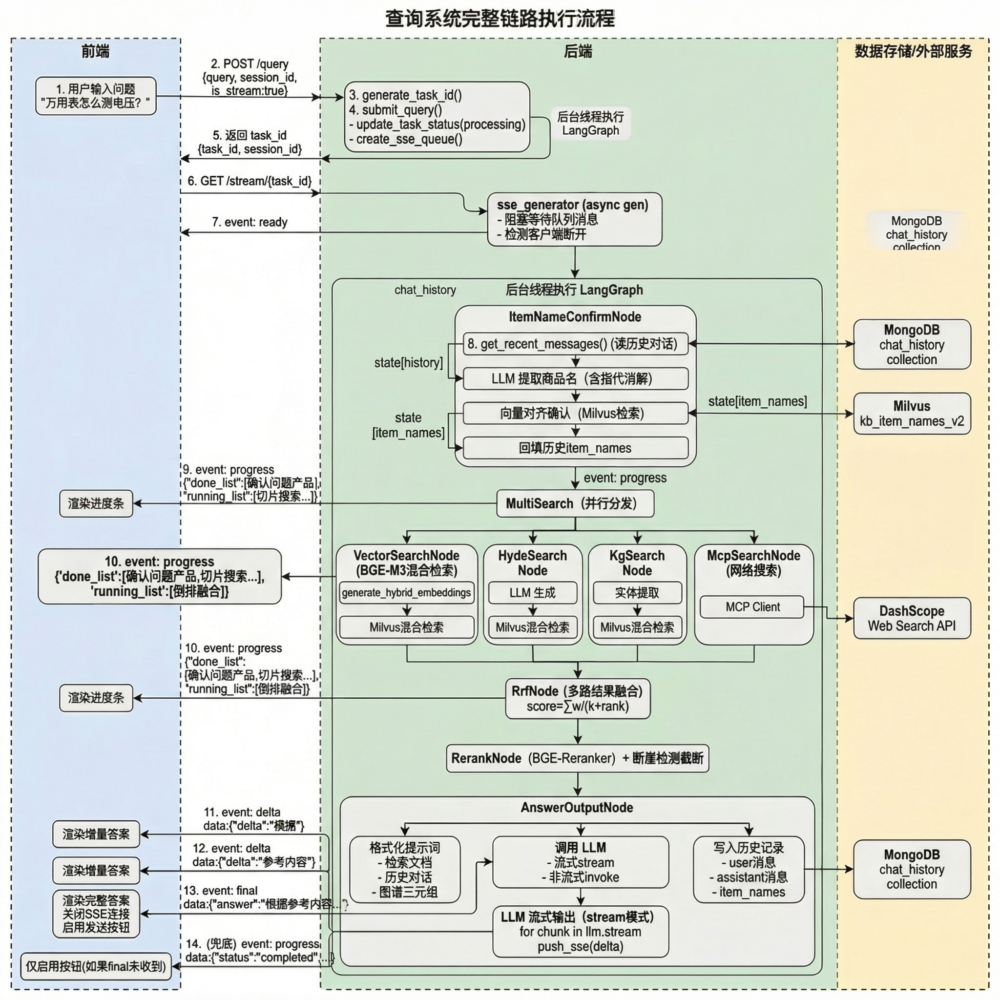

### 7.2 关键数据流转

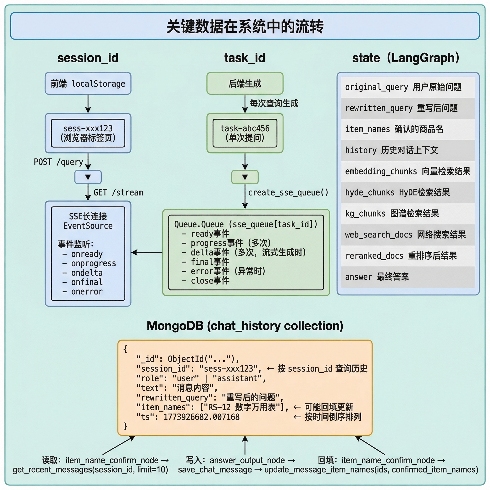

### 7.3 时序图（用户单次查询）

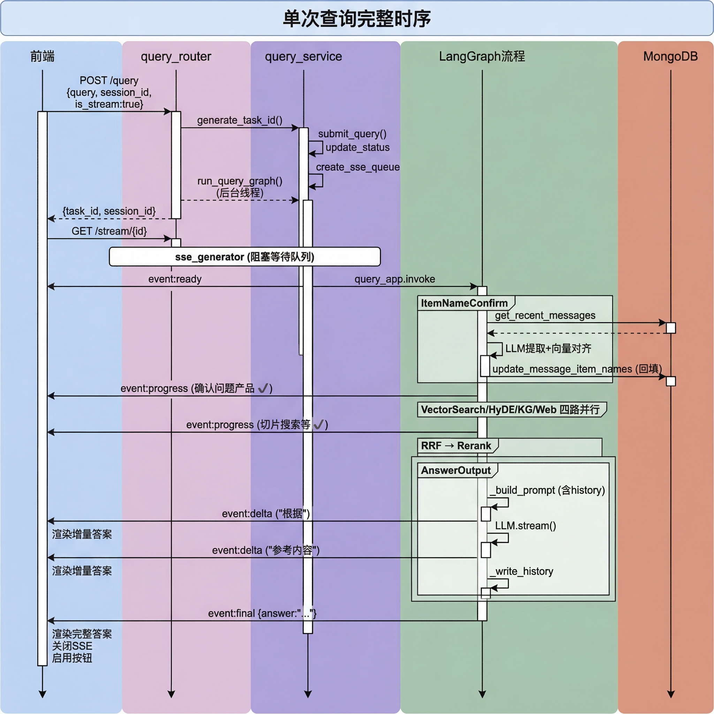

### 7.4 模块职责边界

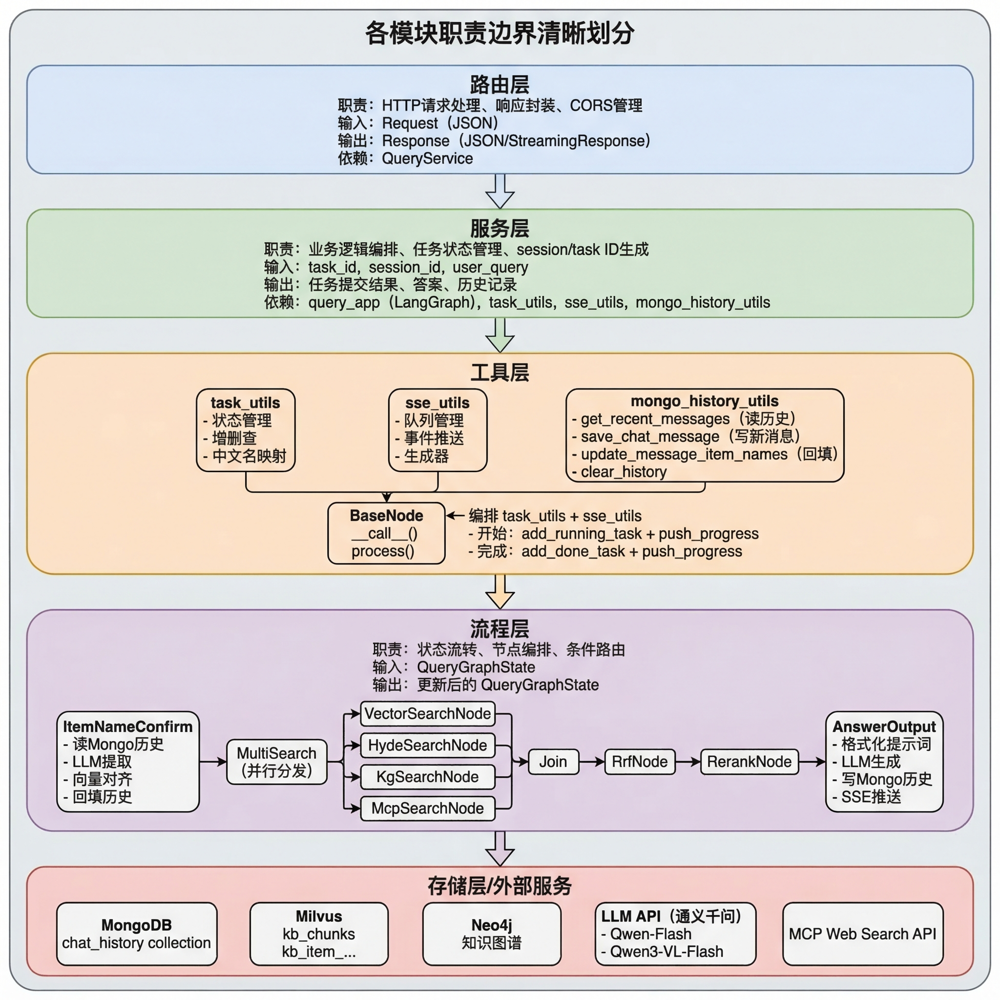

### 7.5 SSE 事件生命周期

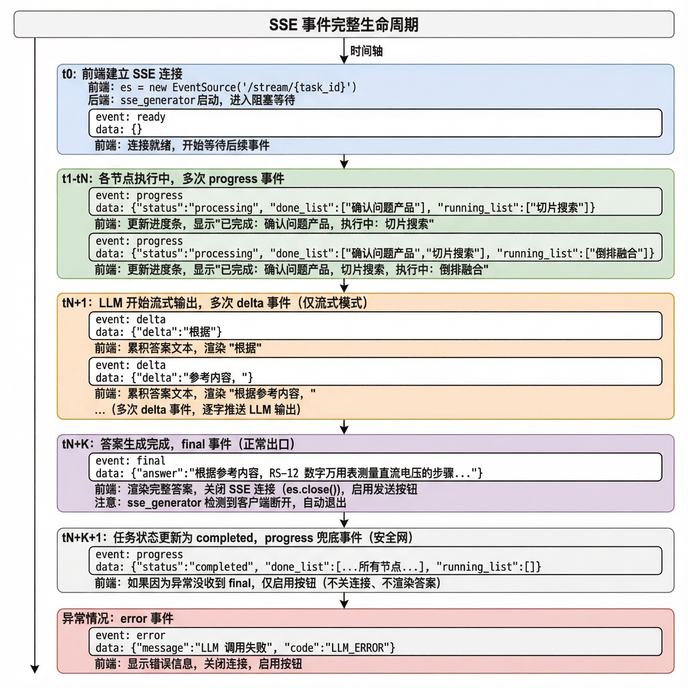


### 7.6 历史对话回填机制详解

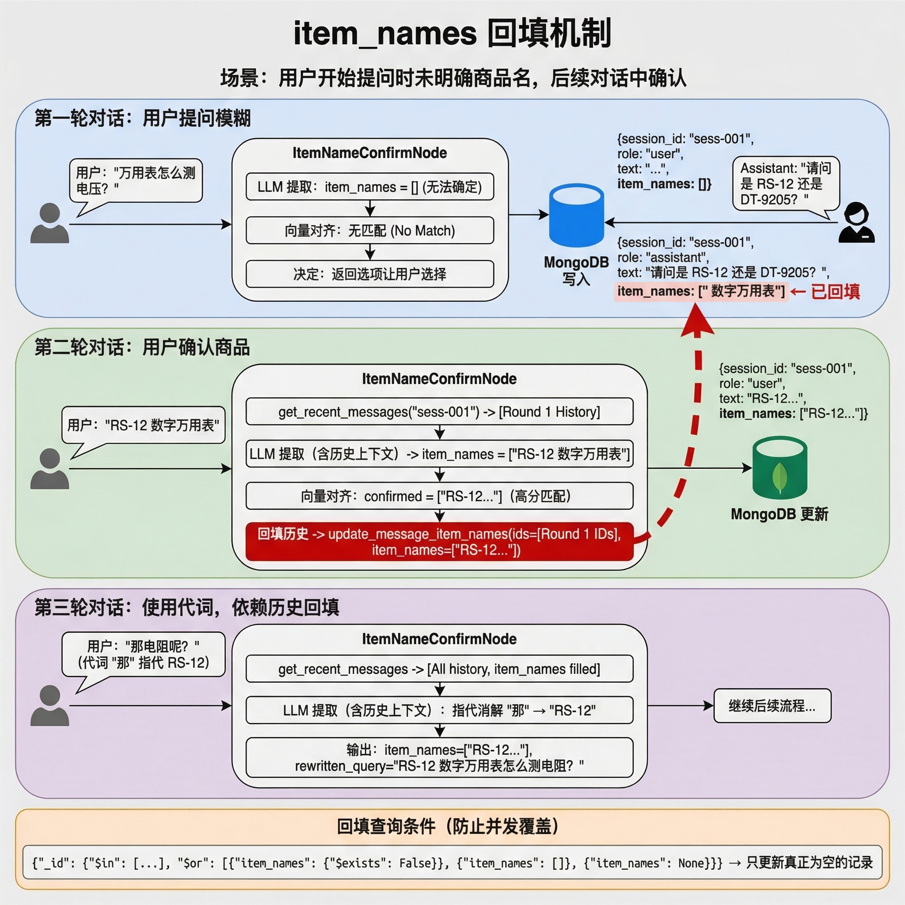