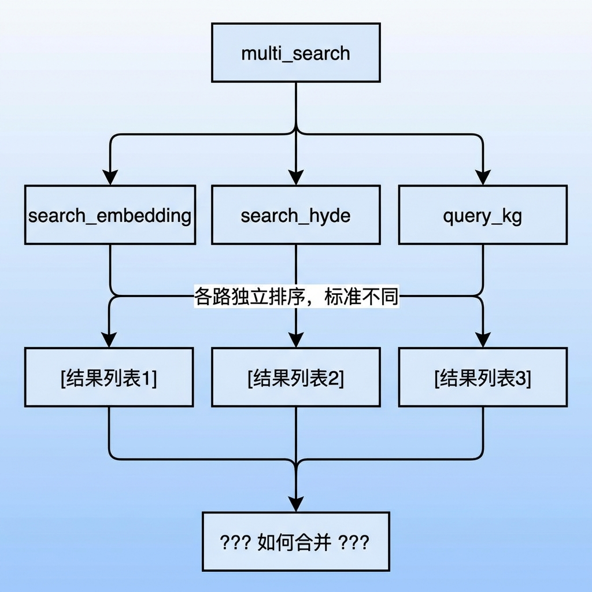
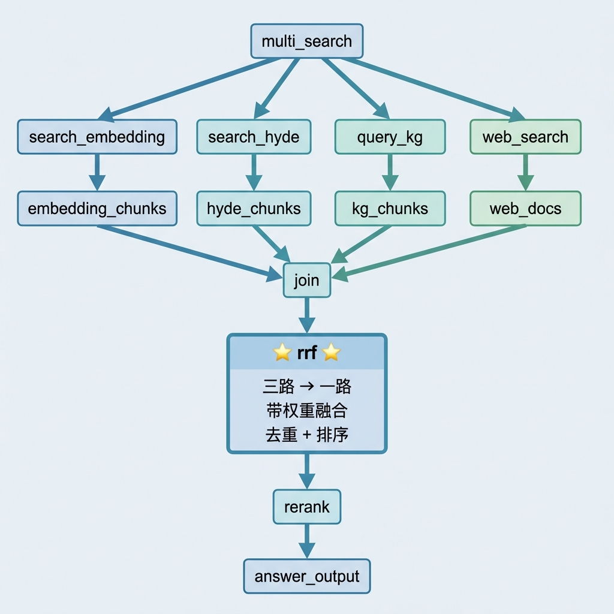
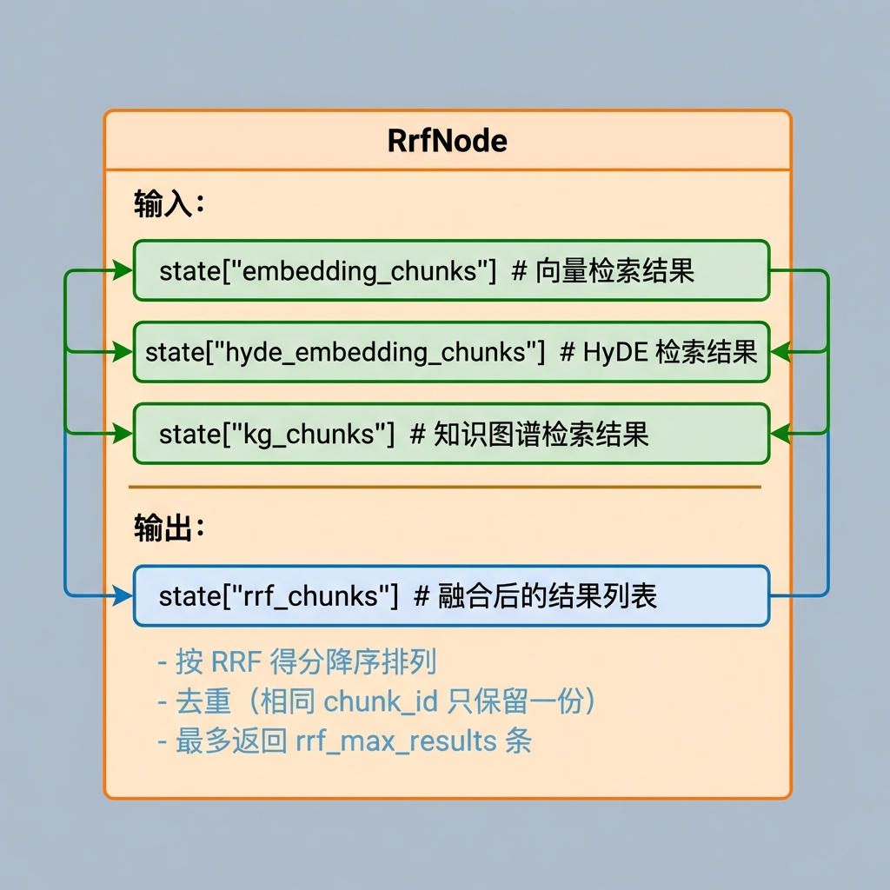
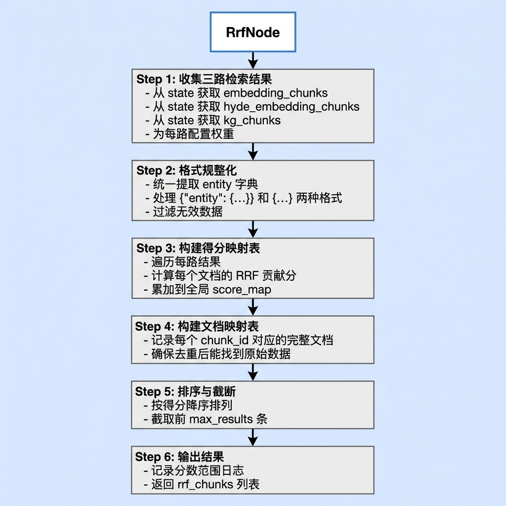

# 知识库查询 —— RRF 融合节点

## 1. 任务目标

本节课将实现知识库查询流程中的 **RRF 融合节点**（`rrf`）。

该节点负责将多路检索结果（向量检索、HyDE 检索、知识图谱检索）通过 **Reciprocal Rank Fusion（倒数排名融合）** 算法进行融合，生成统一的排序结果。

**学完本节你将掌握：**
- 传统融合方式的痛点与 RRF 的过渡思路
- RRF 算法的数学原理与直觉理解
- 多路检索结果融合的工程实现
- 加权融合策略的设计思路
- chunk_id 去重与合并的处理技巧

---

## 2. 核心概念扫盲

### 2.1 为什么需要融合排序？

在 multi_search 阶段，我们并行执行了多路检索：



**问题：** 不同检索方法的评分标准不同，无法直接比较：
- 向量检索：返回余弦相似度，分数范围 0~1
- HyDE 检索：也是余弦相似度，但基于假设文档的 embedding，分数范围 0~1
- 知识图谱：返回加权得分，分数可能是 1.0、2.0、3.0 这种整数级别

### 2.2 传统方式的痛点

#### 2.2.1 方式一：直接按分数排序

最直觉的方式是把三路结果的分数直接拿来比较，按分数从高到低合并：

```python
def naive_merge(sources):
    """把所有结果扔到一起，按分数降序排，同 chunk_id 取最高分"""
    score_map = {}
    chunk_map = {}
    for source in sources:
        for item in source:
            chunk_id = item["chunk_id"]
            score = item["score"]
            if chunk_id not in score_map or score > score_map[chunk_id]:
                score_map[chunk_id] = score
                chunk_map[chunk_id] = item
    return sorted(chunk_map.values(), key=lambda x: x["score"], reverse=True)
```

**问题暴露**：假设三路返回的结果如下：

```
向量检索:  chunk_1=0.92, chunk_2=0.85, chunk_3=0.78
HyDE检索:  chunk_2=0.88, chunk_4=0.82, chunk_1=0.75
知识图谱:  chunk_5=3.0,  chunk_1=2.0,  chunk_6=1.0
```

直接按分数排序的结果：

```
chunk_5  分数=3.0   ← 仅图谱一路命中，但霸占第一
chunk_1  分数=2.0   ← 三路都命中，只排第二
chunk_6  分数=1.0   ← 仅图谱一路命中
chunk_2  分数=0.88  ← 两路命中，排到第四
```

**图谱的分数 3.0 和向量的 0.92 根本不是一个量纲**，直接比较就像拿厘米和公斤比大小。

#### 2.2.2 方式二：按 chunk_id 分组累加

把三路中相同 chunk_id 的分数累加，再排序：

```
chunk_1: 0.92 + 0.75 + 2.0 = 3.67  ← 三路命中
chunk_5: 3.0               = 3.0   ← 仅图谱一路
chunk_2: 0.85 + 0.88       = 1.73  ← 两路命中
chunk_6: 1.0               = 1.0   ← 仅图谱一路
```

比方式一好了，但 chunk_5 只被一路命中分数就有 3.0，而 chunk_2 被两路认可才 1.73。**量纲差异没有消除，图谱一条就能碾压向量两条。**

#### 2.2.3 过渡到 RRF

既然分数不可比，那就**放弃分数，只看排名**。每路检索内部的排名是可信的——第 1 名一定比第 2 名更相关，不管具体分数是多少。

RRF 的核心思想：**多路共识 > 单路高分**。一个 Chunk 被三路检索都认可，比只被一路排第一更可信。

### 2.3 RRF 算法原理

**Reciprocal Rank Fusion（倒数排名融合）** 是一种经典的排名融合算法。

#### 核心公式

$$
RRF\_score(d) = \sum_{i=1}^{n} \frac{weight_i}{k + rank_i(d)}
$$

**参数说明：**
- d：待评分的文档
- n：检索路数
- weight_i：第 $i$ 路的权重
- rank_i(d)：文档 $d$ 在第 $i$ 路中的排名位置（从 1 开始）
- k：平滑常数（通常取 60）

#### 理解

```
假设有文档 A，在三路检索中的排名为：

路径           排名      贡献分数 (k=60)
─────────────────────────────────────────
向量检索        1        1/(60+1) = 0.0164
HyDE 检索       3        1/(60+3) = 0.0159
知识图谱        2        0.7/(60+2) = 0.0113  (权重 0.7)
─────────────────────────────────────────
                         总分 = 0.0436
```

**RRF 的优势：**

| 特点 | 说明 |
|------|------|
| 无需标准化 | 只看排名，不看原始分数，彻底消除量纲差异 |
| 抗噪声 | 平滑常数 k 防止头部排名过度主导 |
| 鼓励共识 | 多路命中的文档得分更高 |
| 惩罚离散 | 只在少数路径命中的文档得分较低 |

### 2.4 常数 k 的作用

k 值决定了排名差异对得分的影响程度：

```
排名位置对得分的影响（k=60）：

排名 1:  1/(60+1)  = 0.0164
排名 2:  1/(60+2)  = 0.0161  (仅下降 1.8%)
排名 10: 1/(60+10) = 0.0143  (下降 13%)
排名 50: 1/(60+50) = 0.0091  (下降 45%)
```

**k 值选择：**
- k 较小（如 10）：头部排名差异影响大，适合高精度场景
- k 较大（如 60）：排名差异影响平滑，适合多路融合
- 实践中 k=60 是经过验证的经典选择

### 2.5 加权 RRF 的意义

不同检索路径的可靠性可能不同，通过权重调节：

```python
search_resource = {
    "embedding_search_resource": (docs, 1.0),   # 向量检索，权重 1.0
    "hyde_search_resource":      (docs, 1.0),   # HyDE 检索，权重 1.0
    "kg_search_resource":        (docs, 0.7),   # 知识图谱，权重 0.7
}
```

**为什么知识图谱权重较低（0.7）？**

向量检索和 HyDE 检索直接用语义相似度匹配切片，命中精度高。而图谱这路从实体出发沿关系边走到切片，中间经过 LLM 抽取 → Milvus 对齐 → Neo4j 查询 → 一跳扩展 → chunk 反查，链路更长，每一步都可能引入噪声。所以图谱定位是**辅助召回**——帮向量检索补充结构化关系，但不喧宾夺主。

**什么时候适合调高图谱权重：**

- 图谱质量很高，实体抽取和关系构建非常准确
- 用户问题主要是结构化关系类的（"X需要什么工具"、"X的步骤是什么"）
- 向量检索效果不好（文档切片太短导致语义信息不足）

**什么时候适合调低图谱权重：**

- 图谱质量一般，实体抽取有噪声
- 用户问题主要是描述性的（"什么是XX"、"XX怎么用"）
- 向量检索已经足够好，图谱只是锦上添花

---

## 3. RRF 融合业务处理流程（总）

### 3.1 节点在流程中的位置



### 3.2 节点输入输出



---

## 4. RRF 融合业务处理流程（分）

### 4.1 目标

实现一个 RRF 融合节点，将三路检索结果合并为统一的排序列表，为后续重排序提供候选集。

### 4.2 需求分析

| 需求项 | 说明 |
|--------|------|
| 多源输入 | 支持向量、HyDE、知识图谱三路输入 |
| 格式兼容 | 兼容不同上游节点的输出格式（统一提取 entity） |
| 加权融合 | 支持为不同路径配置不同权重 |
| 去重合并 | 相同 chunk_id 的文档合并得分 |
| 可配置 | k 值、权重、最大结果数可配置 |
| 容错 | 某路为空时不影响整体流程 |

### 4.3 实现流程

#### 4.3.1 实现流程图



#### 4.3.2 具体实现步骤

##### Step 1: 收集三路检索结果

从状态中获取各路检索结果，格式统一化后配置对应权重：

```python
# 1. 获取三路结果
embedding_chunks = state.get('embedding_chunks') or []
hyde_embedding_chunks = state.get('hyde_embedding_chunks') or []
kg_chunks = state.get('kg_chunks') or []

# 2. 汇总成总的检索源（格式统一化 + 配权重）
search_resource = {
    "embedding_search_resource": (self._normalize_chunk(embedding_chunks), 1.0),
    "hyde_search_resource": (self._normalize_chunk(hyde_embedding_chunks), 1.0),
    "kg_search_resource": (self._normalize_chunk(kg_chunks), self.config.rrf_kg_weight)
}
```

##### Step 2: 格式规整化

上游三路节点输出格式统一为 `{"id": ..., "distance": ..., "entity": {"chunk_id": ..., "content": ...}}`，`_normalize_chunk` 负责提取 `entity` 部分：

```python
def _normalize_chunk(self, raw_chunks: List[Dict[str, Any]]) -> List[Dict[str, Any]]:
    """统一格式化不同来源的chunk"""
    normalize_chunks = []
    for raw_chunk in raw_chunks:
        if not raw_chunk:
            continue
        chunk_entity = raw_chunk.get('entity')
        if not chunk_entity:
            continue
        normalize_chunks.append(chunk_entity)
    return normalize_chunks
```

**格式转换示例：**

```
输入（三路统一格式）:
{"id": 123, "distance": 0.92, "entity": {"chunk_id": "c1", "content": "..."}}
                    ↓
输出: {"chunk_id": "c1", "content": "..."}
```

> **为什么三路格式能统一？** 在知识图谱节点的 `back_fill` 方法中，回填后的数据已经包回了 `{"id": None, "distance": ..., "entity": {...}}` 结构，与向量检索和 HyDE 检索的返回格式一致。

##### Step 3: 执行 RRF 融合

核心算法实现，遍历每路结果用排名（不是分数）计算 RRF 得分：

```python
def _rrf_merge(self, rrf_inputs, smoothing_factor, top_n):
    chunk_scores = {}  # 每个chunk的累计 RRF 得分
    chunk_data = {}    # 每个chunk原始数据

    # 遍历所有路
    for rrf_input, weight in rrf_inputs:
        # 遍历某一路的文档（pos 从 1 开始，表示排名）
        for pos, doc in enumerate(rrf_input, 1):
            chunk_id = doc.get('chunk_id')
            if not chunk_id:
                continue
            # RRF 公式: score += weight / (k + rank)
            chunk_scores[chunk_id] = chunk_scores.get(chunk_id, 0) + weight / (smoothing_factor + pos)
            # 保留第一次遇到的文档版本
            chunk_data.setdefault(chunk_id, doc)

    # 按得分降序排序，截取前 top_n 条
    sorted_results = sorted(
        [(chunk_data[cid], score) for cid, score in chunk_scores.items()],
        key=lambda x: x[1], reverse=True
    )
    return sorted_results[:top_n] if top_n else sorted_results
```

**计算过程示例（k=60, kg_weight=0.7）：**

```
向量检索（权重1.0）：
  chunk_1 排第1: 1.0/(60+1) = 0.01639
  chunk_2 排第2: 1.0/(60+2) = 0.01613
  chunk_3 排第3: 1.0/(60+3) = 0.01587

HyDE检索（权重1.0）：
  chunk_2 排第1: +1.0/(60+1) = +0.01639
  chunk_1 排第2: +1.0/(60+2) = +0.01613
  chunk_4 排第3: 1.0/(60+3)  = 0.01587

知识图谱（权重0.7）：
  chunk_5 排第1: 0.7/(60+1)  = 0.01148
  chunk_1 排第2: +0.7/(60+2) = +0.01129

累加结果：
  chunk_1: 0.01639 + 0.01613 + 0.01129 = 0.04381  ← 三路命中，最高
  chunk_2: 0.01613 + 0.01639           = 0.03252  ← 两路命中
  chunk_3: 0.01587                     = 0.01587  ← 仅一路
  chunk_4: 0.01587                     = 0.01587  ← 仅一路
  chunk_5: 0.01148                     = 0.01148  ← 仅一路，且权重低
```

> **关键洞察**：chunk_5 在图谱里原始分数是 3.0（远超向量的 0.92），但在 RRF 里它只是"图谱那路的第1名"，一票的力量远不如 chunk_1 的三票。**多路共识 > 单路高分**。

> **`chunk_data.setdefault(chunk_id, doc)` 的作用**：同一文档在多路中出现时，只保留第一次遇到的版本，保持结果一致性。

##### Step 4: 输出结果

提取文档列表（不含得分），记录日志并更新 state：

```python
# 获取 rrf_chunks（只取文档，不要分数）
rrf_chunks = [doc for doc, _ in rrf_merge_results]

# 记录分数范围（便于调试）
if rrf_merge_results:
    scores = [s for _, s in rrf_merge_results]
    self.logger.info(f"分数范围: [{min(scores):.6f}, {max(scores):.6f}]")

# 更新 state
state['rrf_chunks'] = rrf_chunks
```

> **为什么 state 里存的是 `rrf_chunks`（字典列表）而不是 `rrf_merge_results`（元组列表）？** 因为下游 Rerank 节点遍历 `rrf_chunks` 时用 `doc.get("content")` 取内容，期望的是字典。如果传入 `(dict, float)` 元组，`doc` 拿到的就是元组而非字典，所有数据都会被跳过。

### 4.4 代码实现

完整的节点实现代码：

```python
from typing import List, Tuple, Dict, Any

from knowledge.processor.query_process.state import QueryGraphState
from knowledge.processor.query_process.base import BaseNode, T


class RrfNode(BaseNode):
    name = "rrf_node"

    def process(self, state: QueryGraphState) -> QueryGraphState:

        # 1. 获取三路结果
        embedding_chunks = state.get('embedding_chunks') or []
        hyde_embedding_chunks = state.get('hyde_embedding_chunks') or []
        kg_chunks = state.get('kg_chunks') or []

        # 2. 汇总成总的检索源
        search_resource = {
            "embedding_search_resource": (self._normalize_chunk(embedding_chunks), 1.0),
            "hyde_search_resource": (self._normalize_chunk(hyde_embedding_chunks), 1.0),
            "kg_search_resource": (self._normalize_chunk(kg_chunks), self.config.rrf_kg_weight)
        }
        self.logger.info(
            f"RRF 输入: "
            f"向量检索={len(search_resource['embedding_search_resource'][0])}条, "
            f"HyDE检索={len(search_resource['hyde_search_resource'][0])}条, "
            f"知识图谱={len(search_resource['kg_search_resource'][0])}条"
            f"(权重{search_resource['kg_search_resource'][1]})"
        )

        # 3. 提取三路的结果和权重
        rrf_inputs = list(search_resource.values())

        # 4. 执行RRF（合并多路结果）
        rrf_merge_results = self._rrf_merge(
            rrf_inputs,
            smoothing_factor=self.config.rrf_k,
            top_n=self.config.rrf_max_results
        )

        # 5. 获取rrf_chunks（只取文档，不要分数）
        rrf_chunks = [doc for doc, _ in rrf_merge_results]
        self.logger.info(f"RRF 融合完成，返回 {len(rrf_chunks)} 条结果")

        # 6. 记录分数范围（便于调试）
        if rrf_merge_results:
            scores = [s for _, s in rrf_merge_results]
            self.logger.info(f"分数范围: [{min(scores):.6f}, {max(scores):.6f}]")

        # 7. 更新state
        state['rrf_chunks'] = rrf_chunks

        # 8. 返回state
        return state

    def _normalize_chunk(self, raw_chunks: List[Dict[str, Any]]) -> List[Dict[str, Any]]:
        """统一格式化不同来源的chunk"""
        normalize_chunks = []
        for raw_chunk in raw_chunks:
            if not raw_chunk:
                continue
            chunk_entity = raw_chunk.get('entity')
            if not chunk_entity:
                continue
            normalize_chunks.append(chunk_entity)
        return normalize_chunks

    def _rrf_merge(self, rrf_inputs, smoothing_factor, top_n):
        """带权重的 RRF 融合

        公式: score(d) = Σ weight_i / (k + rank_i(d))
        """
        chunk_scores = {}  # 每个chunk的累计RRF得分
        chunk_data = {}    # 每个chunk原始数据

        for rrf_input, weight in rrf_inputs:
            for pos, doc in enumerate(rrf_input, 1):
                chunk_id = doc.get('chunk_id')
                if not chunk_id:
                    continue
                chunk_scores[chunk_id] = chunk_scores.get(chunk_id, 0) + weight / (smoothing_factor + pos)
                chunk_data.setdefault(chunk_id, doc)

        sorted_results = sorted(
            [(chunk_data[cid], score) for cid, score in chunk_scores.items()],
            key=lambda x: x[1], reverse=True
        )
        return sorted_results[:top_n] if top_n else sorted_results
```

---

## 5. 测试运行

### 5.1 运行 RRF 融合节点测试

```bash
python -m knowledge.processor.query_process.nodes.rrf_node
```

### 5.2 测试代码

```python
if __name__ == "__main__":
    print("=" * 60)
    print("开始测试: RRF 融合节点")
    print("=" * 60)

    # 模拟三路检索结果
    # chunk_1 命中 3 路（预期最高分）
    # chunk_2 命中 2 路
    # chunk_3, chunk_4, chunk_5 各命中 1 路
    mock_state = {
        "embedding_chunks": [
            {"entity": {"chunk_id": "chunk_1", "content": "向量搜索结果#1"}},
            {"entity": {"chunk_id": "chunk_2", "content": "向量搜索结果#2"}},
            {"entity": {"chunk_id": "chunk_3", "content": "向量搜索结果#3"}},
        ],
        "hyde_embedding_chunks": [
            {"entity": {"chunk_id": "chunk_2", "content": "HyDE搜索结果#1"}},
            {"entity": {"chunk_id": "chunk_1", "content": "HyDE搜索结果#2"}},
            {"entity": {"chunk_id": "chunk_4", "content": "HyDE搜索结果#3"}},
        ],
        "kg_chunks": [
            {"id": None, "distance": 2.0, "entity": {"chunk_id": "chunk_5", "content": "知识图谱结果#1"}},
            {"id": None, "distance": 1.0, "entity": {"chunk_id": "chunk_1", "content": "知识图谱结果#2"}},
        ],
    }

    print("【输入状态】:")
    print(f"  embedding_chunks: {len(mock_state['embedding_chunks'])} 条")
    print(f"  hyde_embedding_chunks: {len(mock_state['hyde_embedding_chunks'])} 条")
    print(f"  kg_chunks: {len(mock_state['kg_chunks'])} 条")
    print("-" * 60)

    rrf_node = RrfNode()
    result = rrf_node.process(mock_state)

    print("\n【融合结果】:")
    for i, chunk in enumerate(result["rrf_chunks"], 1):
        print(f"[{i}] {chunk.get('chunk_id')} - {chunk.get('content')}")

    print("-" * 60)
    print("测试完成")
```

### 5.3 预期输出

```
============================================================
开始测试: RRF 融合节点
============================================================
【输入状态】:
  embedding_chunks: 3 条
  hyde_embedding_chunks: 3 条
  kg_chunks: 2 条
------------------------------------------------------------
RRF 输入: 向量检索=3条, HyDE检索=3条, 知识图谱=2条(权重0.7)
RRF 融合完成，返回 5 条结果
分数范围: [0.011290, 0.043867]

【融合结果】:
[1] chunk_1 - 向量搜索结果#1      ← 三路命中，最高分
[2] chunk_2 - 向量搜索结果#2      ← 两路命中
[3] chunk_3 - 向量搜索结果#3      ← 仅向量一路
[4] chunk_4 - HyDE搜索结果#3      ← 仅HyDE一路
[5] chunk_5 - 知识图谱结果#1      ← 仅图谱一路，权重低
------------------------------------------------------------
测试完成
```

**分数计算验证（k=60, kg_weight=0.7）：**

```
chunk_1: 命中 embedding(排名1), hyde(排名2), kg(排名2)
  = 1.0/(60+1) + 1.0/(60+2) + 0.7/(60+2)
  = 0.01639 + 0.01613 + 0.01129
  = 0.04381  ← 最高分（三路共识）

chunk_2: 命中 embedding(排名2), hyde(排名1)
  = 1.0/(60+2) + 1.0/(60+1)
  = 0.01613 + 0.01639
  = 0.03252

chunk_3: 仅命中 embedding(排名3)
  = 1.0/(60+3)
  = 0.01587

chunk_4: 仅命中 hyde(排名3)
  = 1.0/(60+3)
  = 0.01587

chunk_5: 仅命中 kg(排名1)
  = 0.7/(60+1)
  = 0.01148  ← 最低分（虽然排名第1，但权重低且仅单路命中）
```

### 5.4 处理前后对比

| 对比项 | 处理前 | 处理后 |
|--------|--------|--------|
| `embedding_chunks` | 3 条结果 | 不变 |
| `hyde_embedding_chunks` | 3 条结果 | 不变 |
| `kg_chunks` | 2 条结果 | 不变 |
| `rrf_chunks` | 不存在 | 5 条去重融合结果（按 RRF 得分降序） |

---

## 6. 总结

### 6.1 节点功能概览


### 6.2 节点设计要点

#### 要点 1：为什么用 RRF 而不是直接比分数

| 方式 | 问题 |
|------|------|
| 直接按分数排序 | 不同检索路的分数量纲不同，图谱 3.0 碾压向量 0.92 |
| 按 chunk_id 累加分数 | 量纲差异没消除，图谱一条顶向量两条 |
| **RRF（当前方案）** | 放弃分数只看排名，多路共识 > 单路高分 |

#### 要点 2：RRF 核心公式

```python
# 公式: score(d) = Σ weight_i / (k + rank_i(d))
chunk_scores[chunk_id] = chunk_scores.get(chunk_id, 0) + weight / (smoothing_factor + pos)
```

关键细节：
- `pos` 从 1 开始（不是 0），符合排名语义
- 使用 `get(..., 0)` 实现累加
- k 取 60 是经过验证的经典值

#### 要点 3：格式统一化

```python
def _normalize_chunk(self, raw_chunks):
    for raw_chunk in raw_chunks:
        chunk_entity = raw_chunk.get('entity')
        if chunk_entity:
            normalize_chunks.append(chunk_entity)
```

设计考量：
- 三路上游输出已统一为 `{"id": ..., "distance": ..., "entity": {...}}` 格式
- 知识图谱的 `back_fill` 返回时已包回 entity 结构
- `_normalize_chunk` 只需提取 entity 即可

#### 要点 4：去重策略

```python
# 使用 setdefault 保留首次遇到的文档版本
chunk_data.setdefault(chunk_id, doc)
```

同一文档在多路中出现时，只保留第一次遇到的版本，保持结果一致性。

#### 要点 5：加权策略

```python
search_resource = {
    "embedding_search_resource": (docs, 1.0),
    "hyde_search_resource":      (docs, 1.0),
    "kg_search_resource":        (docs, config.rrf_kg_weight),  # 默认 0.7
}
```

图谱权重低于向量检索的理由：链路长、噪声多、定位为辅助召回。权重从配置中心读取，支持动态调整。

#### 要点 6：输出格式注意

```python
# 正确：传字典列表给下游
state['rrf_chunks'] = [doc for doc, _ in rrf_merge_results]

# 错误：传元组列表，下游 Rerank 无法用 doc.get("content") 取值
state['rrf_chunks'] = rrf_merge_results
```
