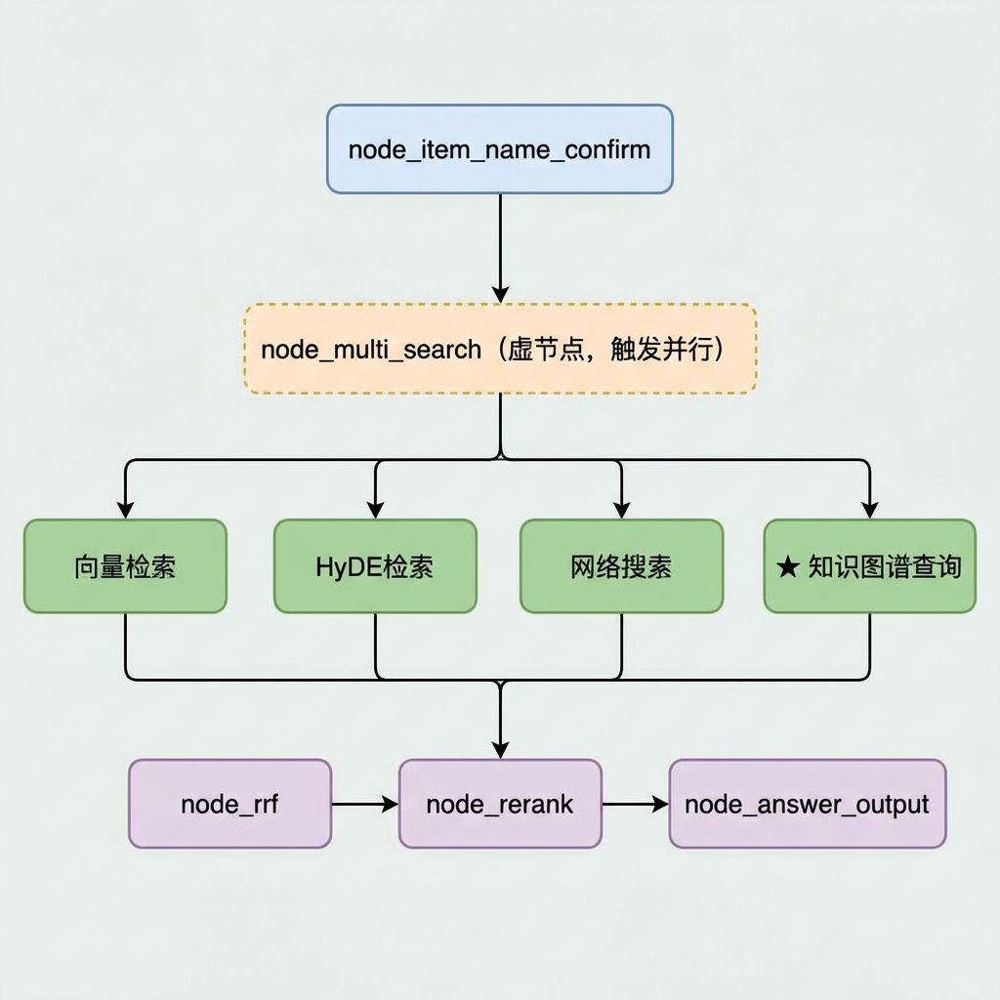
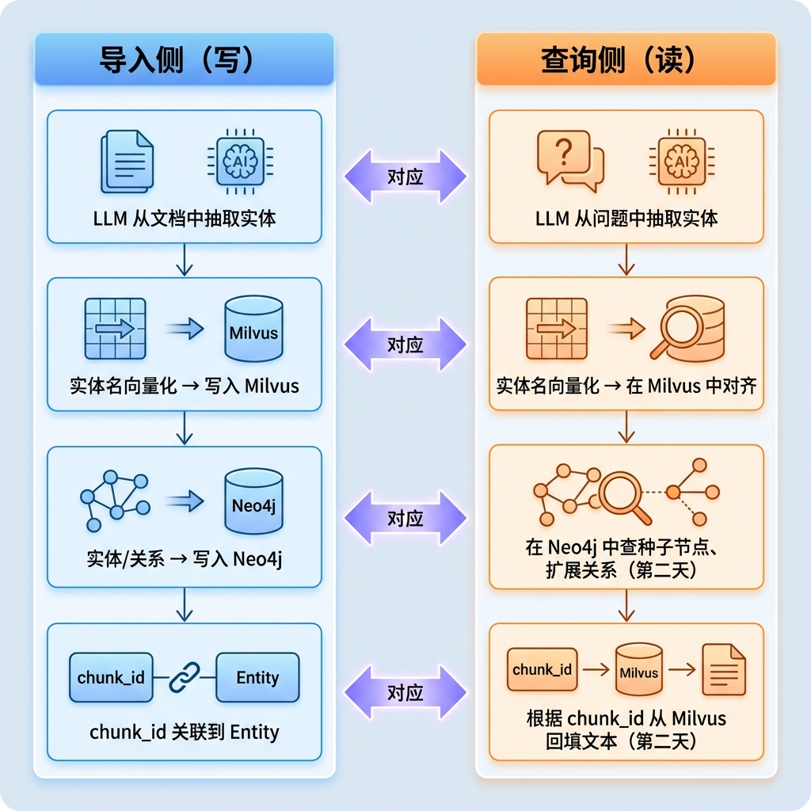
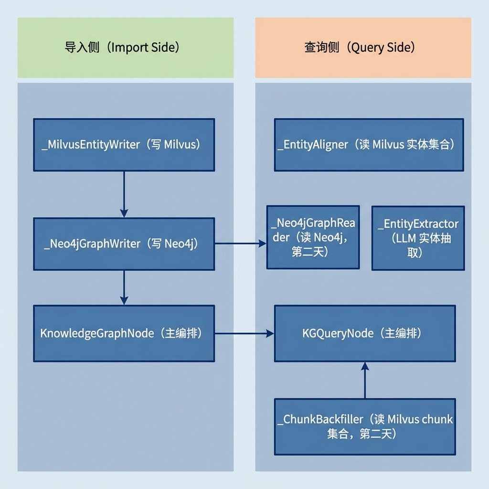

# 知识图谱查询节点（第一天）

> 本文档详细介绍知识库查询流程中的知识图谱查询节点（KGQueryNode），该节点负责从用户问题中抽取实体、与已入库实体做向量对齐，是查询流程中与导入侧"读写对称"的关键节点。Neo4j 子图检索与 Milvus chunk 回填部分将在第二天讲解。

---

## 1. 任务目标

### 1.1 本章目标

通过本章学习，你将掌握：

1. **查询侧知识图谱的整体作用**：理解为什么查询时也需要走知识图谱路径
2. **LLM 实体抽取**：学会用 Prompt 工程从用户问题中提取可查询的实体关键词
3. **读写一致性设计**：理解查询侧 Prompt / 截断规则如何与导入侧保持对齐
4. **Milvus 实体对齐**：掌握将 LLM 抽取的实体与已入库实体做向量对齐的完整流程

> **注意**：Neo4j 种子节点查询、一跳关系扩展、chunk_id 反查以及 Milvus chunk 回填将在第二天讲解，本章暂不涉及。

### 1.2 涉及文件

```
knowledge/
├── processor/query_process/nodes/
│   └── kg_query_node.py              # 知识图谱查询节点（本章重点）
│
└── utils/
    ├── llm_client_util.py            # LLM 客户端封装
    ├── bge_m3_embedding_util.py      # BGE-M3 混合嵌入工具
    ├── milvus_util.py                # Milvus 连接与检索工具
    └── neo4j_util.py                 # Neo4j 连接管理（第二天使用）
```

### 1.3 节点在流程中的位置

在查询流程的 LangGraph 图中，`node_query_kg` 是四路并行检索之一，与 `node_search_embedding`（向量检索）、`node_search_embedding_hyde`（HyDE 检索）、`node_web_search_mcp`（网络搜索）同时执行，最终结果汇入 RRF 融合节点：



---

## 2. 核心概念扫盲

### 2.1 为什么查询时还需要图谱

纯向量检索基于"文本相似度"召回切片，但对于**结构化关系**（如"电池安装需要什么工具"）召回效果有限。知识图谱路径提供了一条**从实体出发、沿关系边走到相关切片**的检索通路：

| 检索方式 | 原理 | 擅长的问题类型 |
|----------|------|---------------|
| 向量检索 | 问题文本 → embedding → 相似切片 | "什么是…"、"如何…" 等描述性问题 |
| 知识图谱检索 | 问题 → 实体 → 图谱关系 → 关联切片 | "X 需要什么工具"、"X 和 Y 的关系" 等结构化问题 |

两者互补，最终通过 RRF 融合取长补短。

### 2.2 读写两侧数据一致

导入侧写了什么，查询侧就要读什么

导入侧 `KnowledgeGraphNode` 做了两件事：

1. **Neo4j**：实体节点（Entity）+ 关系边 + Chunk 节点 + MENTIONED_IN 关联
2. **Milvus `ENTITY_NAME_COLLECTION`**：每个实体名称的稠密 + 稀疏双向量

查询侧的职责就是**反向利用**这些数据：

```
导入侧（写）                              查询侧（读）
─────────────────────                    ─────────────────────
LLM 从文档中抽取实体            ←对应→    LLM 从问题中抽取实体
实体名向量化 → 写入 Milvus      ←对应→    实体名向量化 → 在 Milvus 中对齐
实体/关系 → 写入 Neo4j         ←对应→    在 Neo4j 中查种子节点、扩展关系（第二天）
chunk_id 关联到 Entity         ←对应→    根据 chunk_id 从 Milvus 回填文本（第二天）
```



### 2.3 读写一致的重要性

**读写一致性为什么这么重要？**

导入侧对实体名做了以下处理：

- 名称截断至 **15 字符**（`MAX_ENTITY_NAME_LENGTH = 15`）
- 标签必须在白名单中（Device / Part / Operation / Step / Warning / Condition / Tool）

如果查询侧不做同样的约束，就会出现：

- LLM 抽出 20 字符的实体名 → 去 Milvus 对齐时与 15 字符的入库实体匹配不上
- LLM 抽出"电池安装方法和注意事项"（非实体类型的长短语）→ 在图谱中根本没有对应节点

因此查询侧的 Prompt 和解析逻辑必须与导入侧对齐。

---

## 3. 知识图谱查询业务处理流程（总）

知识图谱查询节点的完整 pipeline 包含 7 步，今天讲解其中 3步（标 ★），其余 4 步在第二天讲解：


> **关键设计**：每一步失败都做降级而非中断。例如 LLM 抽取失败返回空列表，对齐失败返回原始实体名，回填找不到的 chunk_id 直接跳过。这样即使某个环节出问题，下游仍能拿到部分结果。

---

## 4. 知识图谱查询业务处理流程（分）

今天讲解的代码逻辑可以拆分为以下 3 个子流程，我们逐一分析。

---

### 4.1 主流程编排

#### 4.1.1 目标

组装各服务组件，按 pipeline 顺序编排调用，汇总结果返回给 LangGraph state。

#### 4.1.2 需求分析

主编排器需要解决以下问题：

- **组件组装**：创建 `_EntityExtractor`、`_EntityAligner`、`_Neo4jGraphReader` 、`_ChunkBackfiller` 四个服务实例
- **pipeline 串联**：按"抽取 → 对齐 → Neo4j 子图 → 回填"顺序调用
- **异常兜底**：整个 pipeline 被 try/finally 包裹
- **降级策略**：任何一步失败，返回空结果字典而非抛异常

#### 4.1.3 实现流程

##### 4.1.3.1 类结构总览

查询侧的类结构与导入侧对称：



##### 4.1.3.2 具体实现步骤

###### Step1：输入解析

从 state 中提取 `rewritten_query`（改写后的问题）和 `item_names`（已确认的商品名列表）。

注意这里会从问题中移除商品名。原因是：导入侧的文档切片中通常不包含设备主语（比如说明书正文不会每句都写"万用表的…"），如果保留商品名，LLM 实体抽取会把它也抽成一个实体，但图谱中真正有价值的节点是"电池安装"、"螺丝刀"这些操作/部件级别的词。商品维度的过滤已经通过 `item_name` 参数在 Milvus 和 Neo4j 查询中做了，不需要从问题文本中重复提取。


举个具体例子说明。假设用户问"RS-12数字万用表怎么测电阻"，LLM 实体抽取会从这个问题中抽实体，如果保留"RS-12数字万用表"这几个字，LLM 很可能把它也抽成一个实体，然后拿去 Neo4j 里找节点。但问题是导入侧已经通过 `item_name` 字段做了商品维度的隔离——所有节点都挂在 `item_name="RS-12数字万用表"` 下面，图谱里真正有价值的实体节点是"测电阻"、"电阻档"、"表笔"这些操作/部件级别的词。设备名本身作为实体去图谱里查，要么查不到（因为导入时就没把商品名本身存为 Entity 节点），要么查到的是一些跟品牌/型号相关的泛化关系，对回答问题没帮助。

而且 `item_name` 的过滤已经在后续的 Milvus `expr` 和 Neo4j `WHERE n.item_name IN $item_names` 中生效了，等于说"我要在这个商品的范围内搜索"这个约束已经通过参数传递了，不需要再从问题文本里重复提取一遍商品名。

所以这段代码的作用是：**让 LLM 实体抽取聚焦在真正需要查图谱的操作/部件/工具等实体上，不要被问题中的商品名干扰。**

```python
@staticmethod
def _parse_input(state: Dict[str, Any]) -> Tuple[str, List[str]]:
    question = state.get("rewritten_query")
    item_names = state.get("item_names")
    for name in item_names:
        question = question.replace(name, "")
    return question.strip(), item_names
```

###### Step2：pipeline 编排

`_execute_pipeline` 方法按顺序组装组件并调用。每个组件的输出是下一个组件的输入：

```python
def _execute_pipeline(self, state: Dict[str, Any]) -> Dict[str, Any]:
    """核心 pipeline 编排。"""

    # --- 1. 解析输入 ---
    question, item_names = self._parse_input(state)

    # --- 2. 组装组件 ---
    llm_extractor = _EntityExtractor(get_llm_client(json_mode=True))
    milvus_aligner = _EntityAligner()
    neo4j_reader = _Neo4jGraphReader(get_neo4j_driver())       # 第二天讲解
    # chunk_back_filler = _ChunkBackfiller()                   # 第二天讲解

    # --- 3. Pipeline ---
    entities = llm_extractor.extract(question)
    align_result = milvus_aligner.align(entities, item_names)
    aligned = align_result.get("aligned_entities") or entities

    seed_nodes = neo4j_reader.find_seed_nodes(aligned, item_names)   # 第二天讲解
    triples = neo4j_reader.expand_triples(seed_nodes)                # 第二天讲解
    chunk_hits = neo4j_reader.find_chunk_ids(seed_nodes, triples)    # 第二天讲解

    # kg_chunks = chunk_back_filler.backfill(chunk_hits)              # 第二天讲解
    triples_docs = _triples_to_texts(triples)

    # --- 4. 汇总 ---
    return {
        "kg_chunks": kg_chunks,
        "kg_triples": triples_docs,
        "kg_seed_nodes": seed_nodes,
        "kg_triples_raw": triples,
        "kg_entities": entities,
        "kg_aligned_entities": aligned,
        "kg_alignments": align_result.get("alignments", []),
    }
```


---

### 4.2 LLM 实体抽取

#### 4.2.1 目标

调用大语言模型，从用户问题中抽取可能对应图谱节点的实体关键词列表。

#### 4.2.2 需求分析

- **Prompt 与导入侧对齐**：必须告知 LLM 图谱中存在哪些实体类型、名称长度约束，否则抽出的实体在图谱中查不到
- **JSON 解析容错**：LLM 可能返回 markdown 围栏包裹的 JSON，需要清洗
- **截断对齐**：解析后的实体名需做 15 字符截断，与导入侧 `_clean_entities` 一致
- **降级策略**：LLM 调用或解析失败时返回空列表，不阻断流程

#### 4.2.3 实现流程

##### 4.2.3.1 具体实现步骤

###### Step1：Prompt 设计

Promp与导入侧 schema 对齐，这是查询侧最关键的设计。Prompt 中必须包含导入侧定义的实体类型白名单和名称长度约束：

```python
MAX_ENTITY_NAME_LENGTH: int = 15

ALLOWED_ENTITY_LABELS_CN: str = (
    "设备(Device)、部件(Part)、操作(Operation)、步骤(Step)、"
    "警告(Warning)、条件(Condition)、工具(Tool)"
)

_ENTITY_EXTRACT_SYSTEM_PROMPT = f"""
你是一个知识图谱问答系统的"实体识别"模块。
请从用户问题中抽取用于查询图数据库(Neo4j)的实体名称。

【图谱中存在的实体类型】
{ALLOWED_ENTITY_LABELS_CN}

【约束】
1) 优先抽取上述类型的名词短语（设备名、部件名、操作名、工具名、步骤名、条件、警告等）
2) 每个实体名称不超过 {MAX_ENTITY_NAME_LENGTH} 个字符，超过请截取核心部分
3) 不要输出完整句子，只输出实体关键词
4) 输出必须是严格 JSON，只含一个字段 entities（字符串数组）

【输出示例】
{{"entities": ["电池安装", "螺丝刀", "表笔"]}}
"""
```

> **与导入侧的对比**：导入侧的 Prompt 让 LLM 从文档中抽取实体 + 关系（输出包含 entities 和 relations）。查询侧只需要抽取实体名（输出只有 entities），因为关系是从 Neo4j 中查出来的，不需要 LLM 再生成。

###### Step2：调用 LLM

`_EntityExtractor` 类封装了 LLM 调用逻辑。构造时注入 LLM 客户端实例，`extract` 方法执行调用并返回解析后的实体列表：

```python
class _EntityExtractor:

    def __init__(self, llm_client):
        self._llm = llm_client
        self._logger = logging.getLogger(self.__class__.__name__)

    def extract(self, question: str) -> List[str]:
        """抽取实体。失败降级返回空列表，不阻断流程。"""
        if not question.strip():
            return []
        try:
            resp = self._llm.invoke(
                [
                    SystemMessage(content=_ENTITY_EXTRACT_SYSTEM_PROMPT),
                    HumanMessage(content=f"用户问题：{question}"),
                ]
            )
            raw = (resp.content or "").strip()
            entities = _parse_entity_json(raw)
            self._logger.info("实体抽取完成: %d 个 %s", len(entities), entities)
            return entities
        except Exception as e:
            self._logger.error("LLM 实体抽取失败: %s", e, exc_info=True)
            return []
```

###### Step3：JSON 解析与截断

`_parse_entity_json` 是一个纯函数，负责：清洗 markdown 围栏 → JSON 反序列化 → 实体名截断至 15 字符 → 去重。

```python
def _parse_entity_json(llm_response: str) -> List[str]:
    # 1. 空值检查
    if not llm_response:
        return []
    text = llm_response.strip()

    # 2. 清洗 markdown 代码围栏
    text = re.sub(r"^```(?:json)?\s*", "", text)
    text = re.sub(r"\s*```$", "", text)

    # 3. JSON 反序列化
    try:
        data = json.loads(text)
    except json.JSONDecodeError as e:
        logger.error("实体 JSON 解析失败: %s | 片段: %.80s", e, text)
        return []

    # 4. 获取实体列表
    raw = data.get("entities", [])
    if not isinstance(raw, list):
        return []

    # 5. 截断 + 去重
    seen: Set[str] = set()
    result: List[str] = []
    for item in raw:
        if not isinstance(item, str):
            continue
        name = _truncate_entity_name(item)  # 截断至 15 字符
        if name and name not in seen:
            seen.add(name)
            result.append(name)
    return result
```

> **与导入侧的对比**：导入侧的 `_clean_entities` 对实体做 4 层清洗（空值过滤 → 截断 → 白名单校验 → 去重）。查询侧只需要截断 + 去重，因为白名单校验已经通过 Prompt 约束在完成了，不需要硬过滤。

---

### 4.3 Milvus 实体对齐

#### 4.3.1 目标

将 LLM 抽取的实体名称（如"电池安装"）与 Milvus `ENTITY_NAME_COLLECTION` 中已入库的标准实体名做向量对齐，得到图谱中实际存在的实体名称。

#### 4.3.2 为什么需要对齐？

LLM 抽取的实体名和导入时入库的实体名往往不完全一致：

| 用户问题 | LLM 抽取 | 入库实体名 |
|----------|----------|-----------|
| "电池怎么装" | "电池安装" | "电池安装" ✅ 刚好一致 |
| "怎么换电池" | "换电池" | "电池安装" ❌ 不一致 |
| "测电阻的方法" | "测电阻" | "电阻测量" ❌ 不一致 |

通过向量对齐，"换电池"和"电池安装"在语义空间中足够接近，可以匹配上。

#### 4.3.3 需求分析

- **向量检索而非精确匹配**：使用 BGE-M3 混合检索（稠密 + 稀疏）做语义对齐
- **item_name 过滤**：只在当前商品范围内对齐，避免跨商品的同名实体混淆
- **阈值过滤**：可配置最低分数阈值（`KG_ENTITY_ALIGN_MIN_SCORE`），低于阈值视为未命中
- **降级策略**：Milvus 不可用或 embedding 失败时，直接使用 LLM 抽取的原始实体名

#### 4.3.4 实现流程

##### 4.3.4.1 具体实现步骤

###### Step1：_EntityAligner 类设计

对外暴露 `align` 方法，内部用 `_align_one` 处理单个实体：

```python
class _EntityAligner:

    def __init__(self):
        self._logger = logging.getLogger(self.__class__.__name__)

    def align(self, entities: List[str], item_names: List[str]) -> Dict[str, Any]:
        """
        Returns:
            {"aligned_entities": [...], "alignments": [...]}
        """
```

###### Step2：批量向量化

将所有待对齐的实体名一次性向量化（与导入侧使用同一个 BGE-M3 模型），得到 dense + sparse 双向量：

```python
embeddings = generate_hybrid_embeddings(embedding_model, entities)
dense_list = embeddings.get("dense") or []
sparse_list = embeddings.get("sparse") or []
```

> **读写一致性关键点**：这里的 `generate_hybrid_embeddings` 必须与导入侧写入 `ENTITY_NAME_COLLECTION` 时使用的 embedding 函数一致（同一个 BGE-M3 模型、同样的向量维度），否则向量空间不对齐，对齐分数会偏低。

###### Step3：逐个混合检索

对每个实体，构建混合检索请求（稠密 COSINE + 稀疏 IP），在 `ENTITY_NAME_COLLECTION` 中检索 top-K 最相似的已入库实体：

```python
def _align_one(self, entity, idx, dense_list, sparse_list,
               collection_name, expr, min_score) -> Dict[str, Any]:
    dense = dense_list[idx]
    sparse = sparse_list[idx]

    if not dense or sparse is None:
        return {"original": entity, "aligned": None, "reason": "embedding_empty"}

    reqs = create_hybrid_search_requests(
        dense_vector=dense, sparse_vector=sparse,
        dense_params={"metric_type": "COSINE"},
        sparse_params={"metric_type": "IP"},
        expr=expr, limit=ENTITY_ALIGN_TOP_K,
    )
    res = execute_hybrid_search_query(
        milvus_client, collection_name=collection_name, reqs=reqs,
        ranker_weights=(0.5, 0.5), norm_score=True,
        limit=ENTITY_ALIGN_TOP_K,
        output_fields=["entity_name", "source_chunk_id", "item_name", "context"],
    )
```

> **`expr` 参数的作用**：通过 `_build_milvus_item_filter(item_names)` 生成形如 `item_name in ["万用表"]` 的过滤表达式，确保只在当前商品范围内对齐。这与导入侧的 item_name 字段设计一一对应。

###### Step4：选取最佳匹配

`_pick_best` 从混合检索结果中取 top1（结果已按分数降序排列），并检查是否超过最低分数阈值：

```python
@staticmethod
def _pick_best(hits: List[Dict], min_score: Optional[float]) -> Optional[Dict]:
    if not hits:
        return None
    best = hits[0]
    score = best.get("distance")
    if score is None:
        return None
    if min_score is not None and float(score) < float(min_score):
        return None
    return best
```

> **关于 `hits[0]` 为什么就是最高分**：`execute_hybrid_search_query` 内部使用了 `WeightedRanker` 加 `norm_score=True`，返回结果已经按归一化后的融合分数降序排列，所以 `hits[0]` 就是最佳匹配。

---

---

## 5. 单元测试

### 5.1 测试代码说明

在 `kg_query_node.py` 文件末尾包含集成测试代码，覆盖完整的 pipeline 流程：

```python
def test_query_kg_process():
    """集成测试：要求 Neo4j / Milvus / LLM 均已配置。"""
    print("=== 开始测试 ===")
    required = ["OPENAI_API_KEY", "OPENAI_API_BASE", "NEO4J_URI",
                "NEO4J_USERNAME", "NEO4J_PASSWORD", "MILVUS_URL"]
    missing = [k for k in required if not os.environ.get(k)]
    if missing:
        print(f"跳过: 缺少 {missing}")
        return

    result = node_query_kg({
        "session_id": "test_kg",
        "original_query": "电池装配需要用到什么工具？",
        "rewritten_query": "电池装配需要用到什么工具？",
        "item_names": ["万用表"],
    })

    print(f"chunks={len(result.get('kg_chunks', []))}")
    print(f"triples={len(result.get('kg_triples', []))}")
    for t in result.get("kg_triples", [])[:10]:
        print(f"  {t}")
    print("=== 结束 ===")
```

### 5.2 测试执行

```bash
# 进入项目目录
cd D:\develop\develop\workspace\pycharm\usage\shopkeeper_brain_v260213

# 执行测试
python -m knowledge.processor.query_process.nodes.kg_query_node
```

### 5.3 预期输出

```
=== 开始测试 ===
INFO:_EntityExtractor:实体抽取完成: 2 个 ['电池装配', '工具']
INFO:_EntityAligner:对齐结果: ['电池安装', '螺丝刀']
INFO:_Neo4jGraphReader:种子节点: 2 个        （第二天讲解后可看到）
INFO:_Neo4jGraphReader:一跳关系: 8 条        （第二天讲解后可看到）
INFO:_Neo4jGraphReader:chunk 反查: 3 条      （第二天讲解后可看到）
chunks=3
triples=8
  [万用表] 电池安装 -(USES_TOOL)-> 螺丝刀
  [万用表] 电池安装 -(HAS_WARNING)-> 防触电警告
  ...
=== 结束 ===
```

---

## 6. 总结

### 6.1 节点功能概览（第一天）

| 功能模块 | 说明 |
|----------|------|
| **主流程编排** | KGQueryNode 组装组件，按 pipeline 串联调用 |
| **LLM 实体抽取** | Prompt 与导入侧 schema 对齐（实体类型 + 名称长度），解析兼容 markdown 围栏 |
| **Milvus 实体对齐** | BGE-M3 混合检索做语义对齐，item_name 过滤避免跨商品混淆 |

### 6.2 设计要点

1. **读写一致性是核心**
   - 查询侧的 Prompt 必须包含导入侧的实体类型白名单
   - 实体名截断长度必须与导入侧一致（15 字符）
   - Embedding 模型必须与导入侧相同

2. **降级优于中断**
   - LLM 失败 → 空实体列表 → 对齐跳过 → Neo4j 查不到 → 回填为空 → 下游拿到空结果
   - 全链路不抛异常，每一步都有明确的降级返回值

3. **职责分离（与导入侧对称）**
   - `_EntityExtractor` 封装 LLM 调用
   - `_EntityAligner` 封装 Milvus 实体集合检索
   - `_Neo4jGraphReader` 封装 Neo4j 读操作（第二天）
   - `_ChunkBackfiller` 封装 Milvus chunk 集合查询（第二天）
   - `KGQueryNode` 只做编排，不做业务逻辑


> **下一节预告**：第二天我们将讲解 `_Neo4jGraphReader` 的三个核心方法——种子节点查询（精确 + 模糊）、一跳关系扩展（双向，过滤 MENTIONED_IN）、chunk_id 反查（加权节点 UNWIND 查询），以及 `_ChunkBackfiller` 的批量回填机制（含 chunk_id 类型兼容和 None 守卫修复）。
