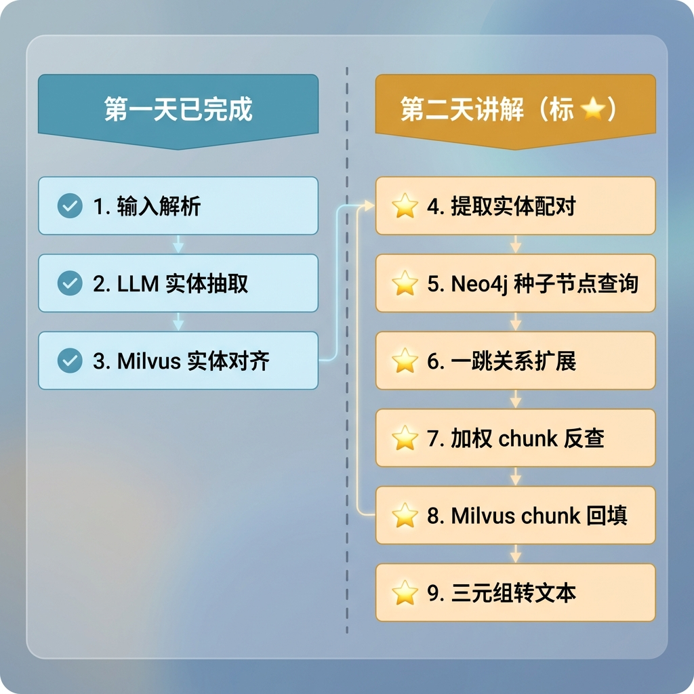

# 知识图谱查询节点（第二天）

> 本文档是第一天课件的延续，详细讲解知识图谱查询节点中剩余的四个核心环节：实体对齐结果提取配对、Neo4j 种子节点查询、一跳关系扩展、加权 chunk 反查，以及 Milvus chunk 回填机制。

---

## 1. 任务目标

### 1.1 本章目标

通过本章学习，你将掌握：

1. **实体配对提取**：理解为什么要从对齐结果中提取 (商品名, 实体名) 配对，以及如何避免跨商品误匹配
2. **Neo4j 种子节点查询**：掌握精确匹配 + 模糊匹配的降级策略
3. **一跳关系扩展**：理解无向匹配 + startNode(r) 保留真实方向的 Cypher 设计，以及跨种子节点去重的本质
4. **加权 chunk 反查**：理解种子/邻居节点分层加权、UNWIND 聚合打分的完整流程
5. **Milvus chunk 回填**：掌握按原始得分顺序回填切片文本的机制

### 1.2 涉及文件

```
knowledge/
├── processor/query_process/nodes/
│   └── kg_query_node.py              # 知识图谱查询节点（本章重点）	
│
└── utils/
    ├── milvus_util.py                # Milvus 连接与检索工具
    └── neo4j_util.py                 # Neo4j 连接管理
```

---

## 2. 核心概念扫盲

### 2.1 从对齐到查图谱：为什么需要配对

第一天讲了实体对齐：LLM 抽取的实体名（如"换电池"）通过 Milvus 向量检索对齐到入库的标准实体名（如"电池安装"）。但对齐结果中不仅包含实体名，还包含该实体属于哪个商品（`item_name`）。

为什么这个信息很重要？因为 Neo4j 中的节点是按 `(name, item_name)` 唯一标识的。同一个实体名"电池安装"在商品A和商品B下是两个不同的节点，关联的关系和 Chunk 也不同。如果不带上 `item_name` 去查 Neo4j，就可能跨商品查到错误的节点。

### 2.2 一跳关系的本质

从种子节点出发，沿着关系边走一步能到达的所有邻居节点和关系，就是"一跳关系"。在产品说明书的知识图谱中，典型的一跳关系如：

```
电池安装 -(USES_TOOL)-> 螺丝刀
电池安装 -(HAS_WARNING)-> 防触电警告
电池安装 -(HAS_STEP)-> 步骤1:断开表笔
步骤2:电池安装 -(AFFECTED)-> 电池
```

这些关系为大模型提供了**结构化的上下文**，比纯文本检索更精准地回答"需要什么工具"、"有什么注意事项"这类问题。

### 2.3 为什么要加权反查 Chunk

找到关系和邻居节点后，最终目的是拿到切片文本（Chunk）喂给大模型。但不是所有节点关联的 Chunk 都同等重要：

- **种子节点**（用户直接问到的实体）关联的 Chunk 更重要 → 权重 2.0
- **邻居节点**（一跳扩展出来的）关联的 Chunk 次要 → 权重 1.0

通过加权打分，**被越多、越重要的节点同时提到的 Chunk 排名越靠前**，最终传给大模型的切片质量更高。

---

## 3. 知识图谱查询业务处理流程（第二天部分）

第一天讲了 pipeline 的前 3 步（输入解析 → LLM 实体抽取 → Milvus 实体对齐），今天讲解剩余的步骤：



---

## 4. 知识图谱查询业务处理流程（分）

---

### 4.1 提取实体配对

#### 4.1.1 目标

从 Milvus 对齐结果中提取 `(商品名, 实体名)` 配对列表，作为 Neo4j 查询的精确输入。

#### 4.1.2 需求分析

第一天的 `_align_one` 方法按 `item_name` 分组，每个商品下各取一个 best hit。这意味着一个 LLM 抽取的实体（如"电池安装"）可能产生多条对齐结果（商品A下的"电池安装"和商品B下的"电池安装"）。

提取配对需要解决两个问题：

- **去重**：不同的 LLM 抽取实体（如"电池安装"和"安装电池"）可能对齐到同一个 `(entity_name, item_name)`，传入 Neo4j 前需去重，避免重复查询
- **精确传递 item_name**：每个配对已经明确了属于哪个商品，下游 Neo4j 查询用精确的 `item_name = $item_name` 而非 `item_name IN $item_names`，避免跨商品误匹配

#### 4.1.3 实现流程

```python
def _extract_entity_item_pairs(self, aligned_entities_elements: List[Dict[str, Any]]):
    seen = set()
    pairs: List[EntityItemPair] = []
    for aligned_entity_elements in aligned_entities_elements:
        aligned_entity_name = aligned_entity_elements.get('aligned', "").strip()
        item_name = aligned_entity_elements.get('item_name').strip()

        if not aligned_entity_name or not item_name:
            continue

        # 同一个商品名下实体名不允许重复，不同商品名下实体名允许重复
        key = (item_name, aligned_entity_name)
        if key not in seen:
            seen.add(key)
            pairs.append({"item_name": item_name, "entity_name": aligned_entity_name})
    return pairs
```

> **去重 key 的设计**：`(item_name, entity_name)` 是一个二元组。`("商品A", "电池安装")` 和 `("商品B", "电池安装")` 是不同的 key，都会保留；但两个 `("商品A", "电池安装")` 会被去重为一个。

---

### 4.2 Neo4j 种子节点查询

#### 4.2.1 目标

根据每个 `(商品名, 实体名)` 配对，在 Neo4j 中查找对应的 Entity 节点作为"种子节点"。

#### 4.2.2 需求分析

- **精确匹配优先**：导入侧用 `MERGE (name, item_name)` 写入，该组合事实上唯一，精确匹配最多返回一条
- **模糊匹配降级**：精确匹配找不到时，用 `CONTAINS` 模糊匹配兜底（如对齐结果是"电池"，图谱中有"电池安装"、"电池更换"等）
- **总量上限控制**：种子节点总数不超过配置上限，防止后续一跳查询开销过大

#### 4.2.3 实现流程

##### 4.2.3.1 Cypher 语句设计

精确匹配（不需要 LIMIT，因为 `(name, item_name)` 唯一）：

```cypher
_CYPHER_EXTRACT_SEEDS = """
    MATCH (n:Entity)
    WHERE n.item_name = $item_name AND n.name = $entity_name
    RETURN n.name AS name, n.item_name AS item_name
"""
```

模糊匹配（保留 LIMIT，因为 CONTAINS 可能命中多条）：

```cypher
_CYPHER_FUZZY_EXTRACT_SEEDS = """
    MATCH (n:Entity)
    WHERE toLower(n.name) CONTAINS toLower($entity_name)
      AND n.item_name = $item_name
    RETURN n.name AS name, n.item_name AS item_name
    LIMIT $limit
"""
```

> **为什么用 `toLower`**：做大小写不敏感匹配。产品型号中经常有英文字母（如"9V"、"DT-9205A"），LLM 抽取时可能输出"9v"，不加 `toLower` 就匹配不上。

> **为什么精确匹配不需要 LIMIT**：导入侧用 `MERGE (n:Entity {name: $name, item_name: $item_name})` 写入，`MERGE` 的匹配键是 `(name, item_name)`，保证了该组合在 Neo4j 中事实上唯一，精确匹配最多返回一条。

##### 4.2.3.2 查询逻辑

```python
def _execute_seek_nodes_query(self, session, item_name: str, entity_name: str) -> List[EntityNode]:
    # 1. 精确匹配：(name, item_name) 唯一，无需 limit
    exact_rows = session.execute_read(lambda tx: tx.run(
        _CYPHER_EXTRACT_SEEDS, item_name=item_name, entity_name=entity_name
    ).data())
    founded_seeks = _clean_neo4j_seed_rows(exact_rows)

    if founded_seeks:
        return founded_seeks

    # 2. 降级：模糊匹配兜底
    fuzzy_rows = session.execute_read(lambda tx: tx.run(
        _CYPHER_FUZZY_EXTRACT_SEEDS, item_name=item_name, entity_name=entity_name,
        limit=self._max_seed_per_node
    ).data())

    return _clean_neo4j_seed_rows(fuzzy_rows)
```

> **`_clean_neo4j_seed_rows` 的作用**：Neo4j 返回的原始字典字段名是 `name`（与 Cypher RETURN 中的别名一致），但下游代码统一使用 `entity_name`，所以需要做一次字段映射和空值过滤。

##### 4.2.3.3 外层循环与截断

```python
def find_seek_nodes(self, entity_item_pairs: List[EntityItemPair]) -> List[EntityNode]:
    founded_seed_node_result = []
    try:
        with self._session() as session:
            for item_entity_pair in entity_item_pairs:
                item_name = item_entity_pair.get('item_name')
                entity_name = item_entity_pair.get('entity_name')
                if not item_name or not entity_name:
                    continue

                founded_seek_nodes = self._execute_seek_nodes_query(session, item_name, entity_name)
                founded_seed_node_result.extend(founded_seek_nodes)

                # 总量上限截断，防止种子节点过多导致后续一跳查询开销过大
                if len(founded_seed_node_result) >= self._total_seed_node:
                    founded_seed_node_result = founded_seed_node_result[:self._total_seed_node]
                    break
    except Exception as e:
        self._logger.error("种子节点查询异常: %s", e, exc_info=True)

    return founded_seed_node_result
```

---

### 4.3 一跳关系扩展

#### 4.3.1 目标

从种子节点出发，查询一跳范围内两个方向的邻居节点和关系，过滤 `MENTIONED_IN`，保留真实方向。

#### 4.3.2 需求分析

- **双向查询**：种子节点可能是关系的起点，也可能是终点，两个方向都要查到
- **保留真实方向**：输出的 `head → tail` 必须与图谱中存储的箭头方向一致
- **过滤 MENTIONED_IN**：这是 Entity 到 Chunk 的关联关系，不是实体间的业务关系
- **跨种子去重**：A 和 B 都是种子节点，图里只存了一条 `A→B`，以 A 查到一次、以 B 又查到一次，同一条边只保留一次

#### 4.3.3 实现流程

##### 4.3.3.1 Cypher 语句设计

```cypher
_CYPHER_ONE_HOP_RELATIONS = """
    MATCH (seed:Entity {item_name: $item_name, name: $entity_name})-[r]-(nbr:Entity)
    WHERE type(r) <> 'MENTIONED_IN' AND nbr.item_name = $item_name
    RETURN
        CASE WHEN startNode(r) = seed THEN seed.name ELSE nbr.name END AS head,
        type(r) AS rel,
        CASE WHEN startNode(r) = seed THEN nbr.name ELSE seed.name END AS tail
    LIMIT $limit
"""
```

这条 Cypher 有三个关键设计：

**1. `-[r]-` 无向匹配**

不带箭头，表示不管关系方向都能命中。等价于"种子连接别人"和"别人连接种子"都查出来，一条语句覆盖两个方向。

**2. `startNode(r)` 还原真实方向**

`startNode(r)` 是 Neo4j 内置函数，返回关系 `r` 在图里存储时的起始节点。不管从哪头查到这条边，都能还原出真实方向。

举个例子，图里存储的是 `(步骤2:电池安装)-[:AFFECTED]->(电池)`：

- 以"电池"为 seed 查询时：`seed=电池`，`nbr=步骤2:电池安装`，`startNode(r)=步骤2:电池安装 ≠ seed` → 走 ELSE → `head=nbr.name=步骤2:电池安装`，`tail=seed.name=电池`
- 输出：`步骤2:电池安装 -(AFFECTED)-> 电池`，方向正确

**3. `nbr.item_name = $item_name` 防止跨商品**

确保只在同一个商品范围内展开，不会跨商品查到不相关的节点。

##### 4.3.3.2 跨种子节点去重

```python
def find_one_hop_relations(self, seed_nodes: List[EntityNode]) -> List[Neo4jTriple]:
    triples_result: List[Neo4jTriple] = []
    seen = set()
    try:
        with self._session() as session:
            for seed_node in seed_nodes:
                item_name = seed_node.get('item_name')
                entity_name = seed_node.get('entity_name')
                if not item_name or not entity_name:
                    continue

                one_hop_triples = session.execute_read(
                    self._execute_one_hop_query, item_name, entity_name, self._max_triples_per_seed
                )

                # 去重：同一条边不能查两次
                for one_hop_triple in one_hop_triples:
                    key = (one_hop_triple["item_name"], one_hop_triple["head"],
                           one_hop_triple["rel"], one_hop_triple["tail"])
                    if key not in seen:
                        seen.add(key)
                        triples_result.append(one_hop_triple)

                # 总量上限截断，防止三元组过多导致下游 prompt 超长
                if len(triples_result) >= self.max_total_triples:
                    triples_result = triples_result[:self.max_total_triples]
                    break
    except Exception as e:
        self._logger.error("查找关系异常: %s", e, exc_info=True)

    return triples_result
```

> **去重的本质**：图谱存储的节点和节点之间是什么关系，全部都要，但不允许有重复的。同一条边只保留一次，不管从哪个种子节点查到的。
>
> 注意：`A→B` 和 `B→A` 是两条不同的边（head/tail 不同），key 不同，都会保留。去重解决的是 A 和 B 都是种子节点时，同一条 `A→B` 被查了两次的问题。

---

### 4.4 加权 chunk 反查

#### 4.4.1 目标

根据种子节点和一跳三元组中的所有节点，通过 `MENTIONED_IN` 关系反查关联的 Chunk，按加权得分排序。

#### 4.4.2 需求分析

需要解决两个问题：

- **节点收集与加权**：种子节点权重 2.0，邻居节点权重 1.0，种子优先，邻居不覆盖
- **Chunk 打分排序**：被越多、越重要的节点同时提到的 Chunk 排名越靠前

#### 4.4.3 实现流程

##### 4.4.3.1 收集节点并赋权

```python
def _collect_nodes_with_weight(seeds: List[EntityNode], one_hop_triples: List[Neo4jTriple]) -> List[Dict[str, Any]]:
    weight_map: Dict[Tuple[str, str], float] = {}

    # 种子节点：权重 2.0，先写入
    for seed in seeds or []:
        item_name = seed.get('item_name', '')
        entity_name = seed.get('entity_name', '')
        if item_name and entity_name:
            weight_map[(item_name, entity_name)] = WEIGHT_SEED

    # 邻居节点：权重 1.0，已有种子权重的不覆盖
    for one_hop_triple in one_hop_triples:
        item_name = one_hop_triple.get('item_name', '')
        if not item_name:
            continue
        head = one_hop_triple.get('head', '')
        tail = one_hop_triple.get('tail', '')
        if head and (item_name, head) not in weight_map:
            weight_map[(item_name, head)] = WEIGHT_NEIGHBOR
        if tail and (item_name, tail) not in weight_map:
            weight_map[(item_name, tail)] = WEIGHT_NEIGHBOR

    return [{"item_name": it, "entity_name": en, "weight": w}
            for (it, en), w in weight_map.items()]
```

> **为什么 head 和 tail 都要收集？** 一条三元组 `电池 -REQUIRED-> 9V` 中，head 是"电池"（可能是种子），tail 是"9V"（邻居）。如果只收集 head，"9V"关联的 Chunk 就丢了。反过来，`步骤2:电池安装 -AFFECTED-> 电池` 中 tail 是种子、head 是邻居，只收集 head 也不行。所以两边都要处理。

> **种子先写入、邻居 `not in` 跳过**：确保种子节点的权重 2.0 不会被邻居的 1.0 覆盖。比如"电池"既是种子又出现在三元组的 tail 中，第一步已经以 2.0 写入了，第二步 `not in weight_map` 为 False，跳过。


 **权重策略：固定赋值 vs 累加**

当前实现采用的是**固定赋值**策略：节点的重要性只看它的身份（种子还是邻居），不看它出现的次数。种子节点就是 2.0，邻居节点就是 1.0，不管这个节点在多少条关系里出现过。

另一种可选方案是**累加策略**：如果一个节点既是种子又是邻居，或者在多条关系中反复出现，权重可以叠加。例如"电池"既是种子(2.0)又在三元组中作为 head 出现一次(+1.0)、作为 tail 出现一次(+1.0)，最终权重就是 4.0。

两种策略的对比：

| 策略                 | 优点                                              | 风险                                                         |
| -------------------- | ------------------------------------------------- | ------------------------------------------------------------ |
| **固定赋值（当前）** | 简单可控，不用担心某个节点因为关系多就权重爆炸    | 高频出现的核心节点不会获得额外加分                           |
| **累加**             | 关联度越高的节点权重越大，关联的 Chunk 排名更靠前 | "超级节点"（与很多节点都有关系的节点）权重可能过高，垄断 Chunk 排名 |

> **当前选择固定赋值的理由**：在产品说明书场景下，用户问"电池安装需要什么工具"，"电池安装"拿 2.0、"螺丝刀"拿 1.0、"防触电警告"拿 1.0，Chunk 排名主要由种子节点决定，逻辑清晰。且单个种子节点的一跳关系已有 `kg_max_triples_per_seed` 上限控制，超级节点的风险本身可控。如果后续发现高频核心节点需要更高排名，可以切换为累加策略。


```python
# 种子节点：权重 2.0
for seed_node in seed_nodes:
    item_name = seed_node.get('item_name')
    seed_name = seed_node.get('entity_name')
    if item_name and seed_name:
        key = (item_name, seed_name)
        weight_map[key] = weight_map.get(key, 0.0) + SEED_NODE_WEIGHT

# 邻居节点：权重 1.0，累加
for one_hop_relation in one_hop_relations:
    item_name = one_hop_relation.get('item_name')
    if not item_name:
        continue
    head = one_hop_relation.get('head')
    tail = one_hop_relation.get('tail')
    if head:
        weight_map[(item_name, head)] = weight_map.get((item_name, head), 0.0) + NER_NODE_WEIGHT
    if tail:
        weight_map[(item_name, tail)] = weight_map.get((item_name, tail), 0.0) + NER_NODE_WEIGHT
```


##### 4.4.3.2 Cypher UNWIND 聚合打分

```cypher
_CYPHER_LOOKUP_CHUNK = """
    UNWIND $nodes_with_weight AS n
    MATCH (e:Entity {name: n.entity_name, item_name: n.item_name})
          -[:MENTIONED_IN]->(c:Chunk {item_name: n.item_name})
    WITH c, sum(n.weight) AS score, count(e) AS cnt
    RETURN c.id AS chunk_id, c.item_name AS item_name, score, cnt
    ORDER BY score DESC, cnt DESC, chunk_id ASC
    LIMIT $limit
"""
```

逐步拆解这条 Cypher：

**Step 1：`UNWIND $nodes_with_weight AS n`**

把带权重的节点列表展开成一行一行：

```
n = {"item_name": "商品A", "entity_name": "电池",          "weight": 2.0}
n = {"item_name": "商品A", "entity_name": "9V",            "weight": 1.0}
n = {"item_name": "商品A", "entity_name": "步骤2:电池安装", "weight": 1.0}
```

**Step 2：`MATCH ... -[:MENTIONED_IN]->(c:Chunk)`**

对每一行 n，找到对应的 Entity 节点，再沿 `MENTIONED_IN` 找到关联的 Chunk。假设"电池"和"9V"都提到了 Chunk_001：

| n.weight | e（Entity） | c（Chunk） |
|----------|------------|-----------|
| 2.0 | 电池 | Chunk_001 |
| 2.0 | 电池 | Chunk_002 |
| 1.0 | 9V | Chunk_001 |
| 1.0 | 9V | Chunk_003 |
| 1.0 | 步骤2:电池安装 | Chunk_002 |

**Step 3：`WITH c, sum(n.weight) AS score, count(e) AS cnt`**

按 Chunk 分组聚合：

- **Chunk_001**：被"电池"(2.0) + "9V"(1.0) 提到 → score=3.0，cnt=2
- **Chunk_002**：被"电池"(2.0) + "步骤2:电池安装"(1.0) 提到 → score=3.0，cnt=2
- **Chunk_003**：只被"9V"(1.0) 提到 → score=1.0，cnt=1

**Step 4：排序输出**

按 score 降序、cnt 降序、chunk_id 升序排列，高分 Chunk 排在前面。

##### 4.4.3.3 结果格式化

```python
# 处理结果，格式兼容下游 RRF 节点
for chunk_row in chunk_rows:
    chunk_id = chunk_row.get('chunk_id', "").strip()
    item_name = chunk_row.get('item_name', "").strip()
    score = chunk_row.get('score')

    if chunk_id and item_name:
        hits.append({
            "id": None,
            "distance": float(score or 0.0),
            "entity": {"chunk_id": str(chunk_id), "item_name": str(item_name)}
        })
```

> **为什么保持 `{"id": None, "distance": ..., "entity": {...}}` 这个结构？** 因为下游 RRF 节点的 `_as_entity_list` 方法期望的输入结构是 `{"entity": {...}, ...}`，它会从中提取 `entity` 字典。向量检索（embedding_chunks）和 HyDE 检索（hyde_embedding_chunks）从 Milvus hybrid_search 返回的结构也是这样的。保持三路来源格式统一，RRF 节点不需要做特殊处理就能直接消费。`id` 设为 None 是因为 kg 这路不经过 Milvus 搜索没有主键。

---

### 4.5 Milvus chunk 回填

#### 4.5.1 目标

根据上一步反查到的 chunk_id 列表，从 Milvus `CHUNKS_COLLECTION` 批量回填切片文本内容。

#### 4.5.2 需求分析

- **批量查询**：一次性将所有 chunk_id 传给 Milvus，而非逐个查询
- **保持顺序**：Milvus 批量返回的结果顺序不确定，需要按原始加权得分的降序重排，高分 Chunk 在前
- **容错**：找不到的 chunk_id 跳过，不影响其他切片的回填

#### 4.5.3 实现流程

##### 4.5.3.1 提取 chunk_id

```python
def _extract_chunk_id(self, nodes_chunk_id: List[Dict[str, Any]]) -> List[Union[str, int]]:
    chunk_ids = []
    for node_chunk_id in nodes_chunk_id:
        entity = node_chunk_id.get('entity')
        if not entity:
            continue
        chunk_id = entity.get('chunk_id')
        if not chunk_id:
            continue
        cid_str = str(chunk_id)
        try:
            chunk_ids.append(int(cid_str))
        except (ValueError, TypeError):
            chunk_ids.append(cid_str)
    return chunk_ids
```

> **`int` 转换的原因**：Milvus 主键可能是 int 类型，chunk_id 从 Neo4j 拿到的是字符串，需要转成 int 才能匹配。转换失败时（如主键确实是字符串格式）则保留字符串。

##### 4.5.3.2 批量查询与按序回填

```python
    def back_fill(self, nodes_chunk_id: List[Dict[str, Any]]) -> List[Dict[str, Any]]:
        """
         根据图谱节点关联的 chunk_id，从 Milvus 向量库中回填完整的切片文本内容。
            1. 从 nodes_chunk_id 中提取所有 chunk_id 并去重
            2. 批量查询 Milvus CHUNKS_COLLECTION，获取 content/title/item_name 等字段
            3. 按原始顺序将文本内容合并回 chunk 记录中
        Args:
            nodes_chunk_id:

        Returns:

        """
        from knowledge.utils.milvus_util import fetch_chunks_by_chunk_ids

        # 1. 判断是否存在
        if not nodes_chunk_id:
            return []

        # 2. 提取chunk_id
        chunk_ids = List[Union[str, int]] = self._extract_chunk_id(nodes_chunk_id)

        # 3. 根据chunk_id查询chunk列表
        chunks = List[Dict[str, Any]] = fetch_chunks_by_chunk_ids(collection_name=self._collection_name,
                                                                  chunk_ids=chunk_ids,
                                                                  output_fields=["chunk_id", "content", "title",
                                                                                 "content"],
                                                                  batch_size=100
                                                                  )

        if not chunks:
            return []

        # 4. 构建chunk_id和实体的映射表
        chunk_id_entity_map = {str(chunk.get('chunk_id')): chunk for chunk in chunks if
                               chunk.get('chunk_id') is not None}

        # 5. 返回
        # chunk_ids 保持了上游 score DESC 的顺序，且无重复
        return [chunk_id_entity_map[str(cid)] for cid in chunk_ids if str(cid) in chunk_id_entity_map]
```

> **为什么不直接返回 `fetch_chunks_by_chunk_ids` 的结果？** 因为 Milvus 批量查回的结果顺序是不确定的。而 `nodes_chunk_id` 是按加权得分降序排列的，分数高的 Chunk 排在前面。如果直接返回 Milvus 结果，顺序就乱了。所以先建 `chunk_id_map`，再按原始顺序遍历取值。

---

### 4.6 三元组转文本

#### 4.6.1 目标

将一跳三元组转为大模型易理解的文本描述，供下游组装 prompt 使用。

#### 4.6.2 实现

```python
def _one_hop_triples_to_texts(triples: List[Neo4jTriple]) -> List[str]:
    if not triples:
        return []
    docs: List[str] = []
    for tr in triples:
        it = (tr.get("item_name") or "").strip()
        h = (tr.get("head") or "").strip()
        r = (tr.get("rel") or "").strip()
        t = (tr.get("tail") or "").strip()
        if not (h and r and t):
            continue
        docs.append(f"[{it}] {h} -({r})-> {t}" if it else f"{h} -({r})-> {t}")
    return docs
```

输出示例：

```
[RS-12 数字万用表] 电池安装 -(USES_TOOL)-> 螺丝刀
[RS-12 数字万用表] 电池安装 -(HAS_WARNING)-> 防触电警告
[RS-12 数字万用表] 步骤2:电池安装 -(AFFECTED)-> 电池
```

> **上游 `find_one_hop_relations` 已去重**，此处无需再判断，直接转文本即可。

---

## 5. pipeline 完整编排

将第一天和第二天的所有步骤串联起来：

```python
def _run_pipeline(self, validated_query: str, validated_item_names: List[str]):
    # 1. 初始化组件
    entity_extractor = _EntityExtractor()
    entity_aligner = _EntityAligner(collection_name=self.config.entity_name_collection)
    neo4j_graph_reader = _Neo4jGraphReader(...)
    chunk_back_filler = _ChunkBackFiller(collection_name=self.config.chunks_collection)

    # 2. LLM 实体抽取（第一天）
    entities_name = entity_extractor.extract(user_query=validated_query)

    # 3. Milvus 实体对齐（第一天）
    aligned_entities_details = entity_aligner.align(entities_name, item_names=validated_item_names)
    aligned_entities_name = aligned_entities_details.get("entities_aligned_name") or entities_name
    aligned_entities_elements = aligned_entities_details.get("entities_aligned_elements")

    # 4. 提取配对（第二天 ★）
    entity_item_pairs = entity_aligner._extract_entity_item_pairs(aligned_entities_elements)

    # 5. Neo4j 种子节点查询（第二天 ★）
    seed_nodes = neo4j_graph_reader.find_seek_nodes(entity_item_pairs)

    # 6. 一跳关系扩展（第二天 ★）
    one_hop_triples = neo4j_graph_reader.find_one_hop_relations(seed_nodes)

    # 7. 加权 chunk 反查（第二天 ★）
    nodes_chunk_id = neo4j_graph_reader.find_nodes_chunk_id(seed_nodes, one_hop_triples)

    # 8. Milvus chunk 回填（第二天 ★）
    kg_chunks = chunk_back_filler.back_fill(nodes_chunk_id)

    # 9. 三元组转文本（第二天 ★）
    triples_docs = _one_hop_triples_to_texts(one_hop_triples)

    # 10. 汇总返回
    return {
        "kg_chunks": kg_chunks,           # 回填后的切片文本 → 送入 RRF
        "kg_triples": triples_docs,       # 关系文本描述 → 送入答案生成 prompt
        "kg_seed_nodes": seed_nodes,
        "kg_triples_raw": one_hop_triples,
        "kg_entities": entities_name,
        "kg_aligned_entities": aligned_entities_name,
        "kg_alignments": aligned_entities_elements,
    }
```

---

## 6. 知识图谱查询完整代码

```python
"""
node_query_kg — 知识图谱查询节点。

类结构（与导入侧 kg_graph_node.py 的 Writer 模式对称）:
─────────────────────────────────────────────────────────
  _EntityExtractor    LLM 实体抽取 + JSON 解析
  _EntityAligner      Milvus ENTITY_NAME_COLLECTION 实体对齐
  _Neo4jGraphReader   Neo4j 种子节点 / 一跳关系 / chunk 反查
  _ChunkBackfiller    Milvus CHUNKS_COLLECTION chunk 回填
  KGQueryNode         主编排器（组装上述四个组件，执行 pipeline）
─────────────────────────────────────────────────────────
  node_query_kg()     LangGraph 节点入口函数（薄包装）
"""
import logging, re, json

logging.basicConfig(level=logging.INFO)
logger = logging.getLogger(__name__)
from json import JSONDecodeError
from typing import List, Dict, Any, Tuple, Union
from pymilvus import MilvusClient
from langchain_core.messages import SystemMessage, HumanMessage
from knowledge.processor.query_process.state import QueryGraphState
from knowledge.processor.query_process.base import BaseNode, T
from knowledge.processor.query_process.exceptions import StateFieldError
from knowledge.utils.llm_client_util import get_llm_client
from knowledge.utils.bge_m3_embedding_util import get_beg_m3_embedding_model, generate_hybrid_embeddings
from knowledge.utils.milvus_util import get_milvus_client, create_hybrid_search_requests, execute_hybrid_search_quest, \
    fetch_chunks_by_chunk_ids
from knowledge.prompts.query.query_prompt import ENTITY_EXTRACT_SYSTEM_PROMPT
from knowledge.utils.neo4j_util import get_neo4j_driver

# -------------------------------------------------
# 常量
# -------------------------------------------------
# _ALLOWED_ENTITY_LABELS_CN: str = (
#     "设备(Device)、部件(Part)、操作(Operation)、步骤(Step)、"
#     "警告(Warning)、条件(Condition)、工具(Tool)"
# )

_ENTITY_NAME_MAX_LENGTH = 15
_DEFAULT_ENTITY_NAME_ALIGN = 0.5

WEIGHT_SEED: float = 2.0
WEIGHT_NEIGHBOR: float = 1.0

EntityNode = Dict[str, str]
Neo4jTriple = Dict[str, str]
EntityItemPair = Dict[str, str]  # {"name": "...", "item_name": "..."}

# Cypher
_CYPHER_EXTRACT_SEEDS = """
 MATCH (n:Entity)
 WHERE n.item_name=$item_name AND n.name=$entity_name 
 RETURN n.name AS name, n.item_name AS item_name
"""

_CYPHER_FUZZY_EXTRACT_SEEDS = """
MATCH (n:Entity)
WHERE toLower(n.name) CONTAINS toLower($entity_name)
AND n.item_name = $item_name
RETURN n.name as name,n.item_name as item_name
LIMIT $limit
"""

_CYPHER_ONE_HOP_RELATIONS = """

MATCH (seed:Entity {item_name:$item_name,name:$entity_name})-[r]-(nbr:Entity)

WHERE type(r)<> 'MENTIONED_IN'  AND nbr.item_name=$item_name

RETURN 
  
  CASE WHEN startNode(r)= seed THEN seed.name ELSE nbr.name END AS head,
  type(r) as rel,
  CASE WHEN startNode(r)= seed THEN nbr.name  ELSE seed.name END AS tail

LIMIT $limit
"""

_CYPHER_LOOKUP_CHUNK = """

UNWIND  $nodes_with_weight as n

MATCH (e:Entity {name:n.entity_name,item_name:n.item_name})
-[:MENTIONED_IN]->(c:Chunk{item_name:n.item_name})

WITH c,sum(n.weight) as score,count(e) as cnt

RETURN c.id as chunk_id,c.item_name as item_name,score,cnt
ORDER BY score DESC,cnt DESC,chunk_id ASC

limit $limit


"""


# -------------------------------------------------
# 工具函数 （服务各个组件、不会污染组件）
# -------------------------------------------------

def _clean_parse_llm_content(llm_response_content: str) -> List[str]:
    """
     职责：清洗以及解析LLM输出
    Args:
        llm_response_content:

    Returns:
        List[str]:清洗后的实体名

    """
    # 1. 判断LLM输出内容是否为空
    if not llm_response_content:
        return []

    # 2. 清洗json代码围栏
    text = re.sub(r"^```(?:json)?\s*", "", llm_response_content)
    re_sub = re.sub(r"\s*```$", "", text)

    # 3. 反序列解析
    try:
        deserialized_result: Dict[str, Any] = json.loads(re_sub)
    except JSONDecodeError as e:
        logging.error(f"JSON 反序列失败，原因: {str(e)}")
        return []

    # 4. 获取提取的实体名
    entities_name = deserialized_result.get('entities', [])

    # 4.1 提取实体名的校验（为空）
    if not entities_name:
        return []
    # 4.2 提取实体名的校验（有效类型）
    if not isinstance(entities_name, list):
        return []

    # 4.3 遍历所有实体名
    seen = set()  # 集合
    entities_name_result = []

    for entity_name in entities_name:
        # 1. 判断是否为空
        if not entity_name:
            continue
        # 2. 判断是否有效类型
        if not isinstance(entity_name, str):
            continue

        # 3. 实体名是否过长
        truncated_entity_name = truncate_entity_name_length(entity_name)

        # 4. 去重保序【顺序：防御性】
        if truncated_entity_name not in seen:
            seen.add(truncated_entity_name)
            entities_name_result.append(truncated_entity_name)

    return entities_name_result


def truncate_entity_name_length(entity_name: str) -> str:
    name = entity_name.strip()
    return name[:_ENTITY_NAME_MAX_LENGTH] if len(name) > _ENTITY_NAME_MAX_LENGTH else name


def _item_name_filter_expr(item_names: List[str]) -> str:
    quoted = ", ".join(f"'{item_name}'" for item_name in item_names)
    return f"item_name in [{quoted}]"


def _clean_neo4j_seed_rows(rows: List[Dict[str, Any]]) -> List[EntityNode]:
    """
    清洗Neo4J查询种子记录行
    Args:
        rows:

    Returns:

    """
    cleaned_rows = []
    for item_entity in rows:
        item_name = item_entity.get('item_name', '').strip()
        entity_name = item_entity.get('name', '').strip()

        if item_name and entity_name:
            cleaned_rows.append({
                "item_name": item_name,
                "entity_name": entity_name
            })

    return cleaned_rows


def _collect_nodes_with_weight(seeds: List[EntityNode], one_hop_triples: List[Neo4jTriple]) -> List[Dict[str, Any]]:
    """
    收集种子节点和一跳三元组中的所有节点，赋予不同权重。
    种子节点权重 2.0，邻居节点权重 1.0，种子优先写入，邻居不覆盖。
    供下游 _CYPHER_CHUNK_LOOKUP 按权重加和对 Chunk 打分排序。
    Args:
        seeds: 种子节点列表
        one_hop_triples: 一跳三元组列表

    Returns:
        带权重的节点列表，每条包含 item_name/name/w

    """

    # 1. 遍历所有种子节点
    weight_map: Dict[Tuple[str, str], float] = {}
    for seed in seeds or []:

        # 1. 获取item_name
        item_name = seed.get('item_name', '')
        # 2. 获取entity_name
        entity_name = seed.get('entity_name', '')

        if item_name and entity_name:
            weight_map[(item_name, entity_name)] = WEIGHT_SEED

    # 2. 遍历所有三元组
    for one_hop_triple in one_hop_triples:

        # 1. 获取item_name
        item_name = one_hop_triple.get('item_name', '')

        if not item_name:
            continue

        # 2. 获取head
        head = one_hop_triple.get('head', '')
        tail = one_hop_triple.get('tail', '')

        if head and (item_name, head) not in weight_map:
            weight_map[(item_name, head)] = WEIGHT_NEIGHBOR

        if tail and (item_name, tail) not in weight_map:
            weight_map[(item_name, tail)] = WEIGHT_NEIGHBOR

    return [{"item_name": item_name, "entity_name": entity_name, "weight": weight} for (item_name, entity_name), weight
            in weight_map.items()]

def  _one_hop_triples_to_texts(triples: List[Neo4jTriple]) -> List[str]:
    """
       将一跳三元组转为大模型易理解的文本描述。
       上游 find_one_hop_relations 已去重，此处直接转文本。
       格式示例：[商品A] 电池 -(REQUIRED)-> 9V

       Args:
           triples: 去重后的一跳三元组列表，每条包含 head/rel/tail/item_name

       Returns:
           关系文本描述列表，供下游组装 prompt 使用
       """
    if not triples:
        return []
    docs: List[str] = []
    for tr in triples:
        it = (tr.get("item_name") or "").strip()
        h = (tr.get("head") or "").strip()
        r = (tr.get("rel") or "").strip()
        t = (tr.get("tail") or "").strip()
        if not (h and r and t):
            continue
        docs.append(f"[{it}] {h} -({r})-> {t}" if it else f"{h} -({r})-> {t}")
    return docs

class _EntityExtractor:
    """
    实体提取器：
    责任： 利用LLM从查询问题中提取实体
    prompt:设计
    """

    def __init__(self):
        self._logger = logging.getLogger(self.__class__.__name__)

    def extract(self, user_query: str) -> List[str]:
        """
         根据用户问题提取当前问题下的实体名
        Args:
            user_query:  用户问题

        Returns:
            List[str]: 提取后的实体名

        """

        # 1. 获取llm客户端
        llm_client = get_llm_client(response_format=True)

        # 2. 判断
        if llm_client is None:
            return []

        # 3. 获取提示词
        # 3.1 系统提示词
        entities_name_extract_system_prompt = ENTITY_EXTRACT_SYSTEM_PROMPT.format(
            MAX_ENTITY_NAME_LENGTH=_ENTITY_NAME_MAX_LENGTH)

        # 4. 调用LLM
        try:
            # 4.1 发送请求
            llm_response = llm_client.invoke([
                SystemMessage(content=entities_name_extract_system_prompt),
                HumanMessage(content=f"用户问题:{user_query}")
            ])

            # 4.2 获取模型的结果
            llm_response_content = getattr(llm_response, 'content', "").strip()

            # 4.3 清洗&解析
            entities_name = _clean_parse_llm_content(llm_response_content)
            return entities_name
        except Exception as e:
            self._logger.error(f"LLM 调用失败:{str(e)}")
            return []


class _EntityAligner:
    """
     实体对齐器：
     责任： 根据LLM提取到的实体名 查询Milvus，获取真正的实体名（对齐后的实体名、能够查询neo4j(查询节点使用)）
    """

    def __init__(self, collection_name: str):
        self._logger = logging.getLogger(self.__class__.__name__)
        self._collection_name = collection_name

    def align(self, entity_names: List[str], item_names: List[str]) -> Dict[str, Any]:
        """

        Args:
            entity_names:  LLM提取的实体名
            item_names: 商品名

        Returns:
         Dict[str,Any]:该字典准备封装两个key.
         第一个key:entities_aligned:[] 所有对齐后的实体名
         第二key:entity_elements[]: 所有对齐后的实体信息[source_id ,distance,origin,aligned,content]

        """

        fallback_result = {"entities_aligned": [], "entity_elements": []}
        # 1. 判断实体名是否有
        if not entity_names:
            return fallback_result

        # 2. 获取嵌入模型
        embedding_model = get_beg_m3_embedding_model()
        if embedding_model is None:
            self._logger.error("嵌入模型不存在")
            return fallback_result

        # 3. 获取milvus客户端
        milvus_client = get_milvus_client()
        if milvus_client is None:
            self._logger.error("Milvus客户端不存在")
            return fallback_result

        # 4. 向量化实体名
        embedding_result = generate_hybrid_embeddings(embedding_model=embedding_model, embedding_documents=entity_names)

        # 5. 检验嵌入结果
        if embedding_result is None:
            self._logger.error("嵌入结果无法获取")
            return fallback_result
        # 5.1 获取嵌入后的稠密向量对象（二维数组）
        embedding_result_dense = embedding_result['dense']
        # 5.2 获取嵌入后的稀疏向量对象（二维数组）
        embedding_result_sparse = embedding_result['sparse']

        # 6. 获取item_name的表达式
        item_name_filtered_expr = _item_name_filter_expr(item_names)

        # 7. 遍历所有的实体名字
        aligned_entities_name: List[str] = []  # 存放所有实体的名字
        aligned_entity_elements: List[Dict[str, Any]] = []  # 存放所有实体的详细信息
        seen = set()

        for index, entity_name in enumerate(entity_names):

            # 7.1 对齐商品下的实体名 同一个实体名在多个商品下都存在时，只对齐到了一个商品，另一个就丢了。
            align_result = self._align_one(milvus_client,
                                           self._collection_name,
                                           item_name_filtered_expr,
                                           embedding_result_dense,
                                           embedding_result_sparse,
                                           index,
                                           entity_name)

            # 7.2 将商品对齐结果存储到最终结果中
            aligned_entity_elements.extend(align_result)

            # 7.3 遍历商品下的对齐结果
            for detail in align_result:
                # a) 获取对齐后的实体名
                aligned_name = detail.get("aligned")

                # b) 获取商品名
                item_name = detail.get("item_name")

                # c) 判断对齐名是否有
                if aligned_name:

                    # 去重 同名实体在不同商品下都保留
                    key = (aligned_name, item_name)
                    if key not in seen:
                        seen.add(key)
                        aligned_entities_name.append(aligned_name)

        self._logger.info(f"对齐后的实体个数 {len(aligned_entities_name)} 实体的名字：{aligned_entities_name}")
        return {
            "entities_aligned_name": aligned_entities_name,
            "entities_aligned_elements": aligned_entity_elements
        }

    def _align_one(self, milvus_client: MilvusClient,
                   _collection_name: str,
                   item_name_filtered_expr: str,
                   embedding_result_dense: List,
                   embedding_result_sparse: List,
                   index: int,
                   entity_name: str) -> List[Dict[str, Any]]:

        """
        对齐指定实体名
        Args:
            milvus_client:
            _collection_name:
            item_name_filtered_expr:
            embedding_result_dense:
            embedding_result_sparse:
            index:

        Returns:

        """
        dense_vector = embedding_result_dense[index]
        sparse_vector = embedding_result_sparse[index]

        # 1. 判断实体名的稠密和稀释向量
        if not dense_vector or not sparse_vector:
            return [{"original": entity_name, "aligned": "", "context": "", "reason": "vector values is not exist "}]

        # 2. 创建混合搜索请求
        hybrid_search_requests = create_hybrid_search_requests(dense_vector=dense_vector,
                                                               sparse_vector=sparse_vector,
                                                               expr=item_name_filtered_expr, limit=5)
        # 3. 执行混合搜索请求
        reps = execute_hybrid_search_quest(milvus_client=milvus_client,
                                           collection_name=_collection_name,
                                           search_requests=hybrid_search_requests,
                                           ranker_weights=(0.4, 0.6),
                                           norm_score=True,
                                           limit=5,
                                           output_fields=["source_chunk_id", "item_name", "context", "entity_name"],
                                           )

        # 4. 解析结果
        hits = reps[0] if reps else []
        if not hits:
            return [{"original": entity_name, "aligned": "", "score": "", "reason": "no_hit"}]

        # 4.1  按 item_name 分组，每组取最高分
        best_by_item: Dict[str, Dict] = {}
        for hit in hits:
            # a) 获取实体
            entity = hit.get("entity")

            # b) 从实体中获取
            item_name = entity.get("item_name").strip()

            # c) 只保留每个 item_name 下的第一个（即最高分）
            if item_name not in best_by_item:
                best_by_item[item_name] = hit

        # 4.2 是否有最好的item_name
        if not best_by_item:
            return [{"original": entity_name, "aligned": "", "score": None, "reason": "no_valid_item_name"}]

        # 4.3  item_name 分组输出结果，过滤低于阈值的
        results: List[Dict[str, Any]] = []
        for item, best in best_by_item.items():
            # a) 获取最好的那一个分数
            score = best.get("distance")

            # b) 判断分数值
            if float(score) < float(_DEFAULT_ENTITY_NAME_ALIGN):
                continue

            # c) 获取实体信息
            ent = best.get("entity")

            # d) 将不同商品下最好的实体名添加到结果集中
            results.append({
                "original": entity_name,
                "aligned": ent.get("entity_name"),
                "score": score,
                "item_name": item,
                "source_chunk_id": ent.get("source_chunk_id"),
                "reason": "top1_per_item",
            })

        # 4.4 全部低于阈值时返回未命中
        if not results:
            return [{"original": entity_name, "aligned": "", "score": None, "reason": "all_below_threshold"}]

        return results

    def _extract_entity_item_pairs(self, aligned_entities_elements: List[Dict[str, Any]]):
        """
        提取实体名和商品名对
        Args:
            aligned_entities_elements:

        Returns:

        """
        seen = set()
        pairs: List[EntityItemPair] = []
        # 1. 遍历对齐后实体详情
        for aligned_entity_elements in aligned_entities_elements:
            # 1.1 获取实体名字
            aligned_entity_name = aligned_entity_elements.get('aligned', "").strip()
            # 1.2 获取商品名
            item_name = aligned_entity_elements.get('item_name').strip()

            # 1.3 判断对齐后的实体名字或者item_name是否存在
            if not aligned_entity_name or not item_name:
                continue

            # 1.4 同一个商品名下实体名不允许重复 不同商品名下实体名允许重复
            key = (item_name, aligned_entity_name)

            if key not in seen:
                seen.add(key)
                entity_item_pair = {
                    "item_name": item_name,
                    "entity_name": aligned_entity_name
                }
                pairs.append(entity_item_pair)
        # 2. 返回
        return pairs


class _Neo4jGraphReader:
    """
     职责：
        1. 负责根据每一个商品下对齐的实体名pair（商品名 实体名）作为条件 查询满足条件的所有实体（Entity）节点 （精确匹配优先，回退模糊匹配）
        2. 接着根据满足条件的所有实体（Entity）节点 作为种子查询一跳范围内两个方向的邻居节点和关系
        3. 将查询到的所有种子节点以及所有邻居节点设置不同权重 （种子 2.0，邻居 1.0）
        4. 然后通过 MENTIONED_IN 反查关联的 Chunk， 按权重加和打分排序，被越多、越重要的节点同时提到的 Chunk 排名越靠前

     所有 Cypher 语句集中在常量区  不散落到方法中
    """

    def __init__(self, database: str, max_seed_per_node: int, max_total_seed_node: int, max_triples_per_seed: int,
                 max_total_triples: int, max_total_chunks: int):
        self._database = database
        self._max_seed_per_node = max_seed_per_node
        self._total_seed_node = max_total_seed_node
        self._max_triples_per_seed = max_triples_per_seed
        self.max_total_triples = max_total_triples
        self._max_total_chunks = max_total_chunks
        self._logger = logging.getLogger(self.__class__.__name__)

    def _session(self):
        neo4j_driver = get_neo4j_driver()
        if neo4j_driver is None:
            raise RuntimeError("Neo4j 驱动获取失败，请检查连接配置")
        return neo4j_driver.session(database=self._database)

    def find_seek_nodes(self, entity_item_pairs: List[EntityItemPair]) -> List[EntityNode]:
        """
         根据对齐后的 (商品名, 实体名) 配对列表，逐对查询种子节点。
         上游 _extract_entity_item_pairs 已保证配对不重复
        Args:
            entity_item_pairs: 对齐后的 (商品名, 实体名) 配对列表

        Returns:
            所有商品下匹配到的实体节点列表，总数不超过 total_seed_node

        """

        # 1. 判断商品名+实体名pair对
        if not entity_item_pairs:
            return []

        # 2. 通过session执行cypher语句 进行查询
        founded_seed_node_result = []
        try:
            with self._session() as session:

                for item_entity_pair in entity_item_pairs:
                    # 2.1 获取商品名
                    item_name = item_entity_pair.get('item_name')
                    # 2.2 获取实体名
                    entity_name = item_entity_pair.get('entity_name')
                    # 2.3 判断商品名和实体名
                    if not item_name or not entity_name:
                        continue

                    # 2.4 查找种子节点
                    founded_seek_nodes = self._execute_seek_nodes_query(session, item_name, entity_name)
                    founded_seed_node_result.extend(founded_seek_nodes)

                    # 2.4 总量上限截断，防止种子节点过多导致后续一跳查询开销过大
                    if len(founded_seed_node_result) >= self._total_seed_node:
                        founded_seed_node_result = founded_seed_node_result[:self._total_seed_node]
                        break


        except Exception as e:
            self._logger.error("种子节点查询异常: %s", e, exc_info=True)

        self._logger.info(f"种子节点: {len(founded_seed_node_result)} 个")

        # 3. 返回所有种子节点
        return founded_seed_node_result

    def _execute_seek_nodes_query(self, session, item_name: str, entity_name: str) -> List[EntityNode]:
        """
        查找单个商品下单个实体名对应的种子节点。
        精确匹配优先，无结果时降级为模糊匹配兜底
        Args:
            session: Neo4J的session对象
            item_name: 商品名
            entity_name: 实体名

        Returns:

        """
        # 1. Cypher语句执行结果(精确匹配)
        exact_rows = session.execute_read(lambda tx: tx.run(
            _CYPHER_EXTRACT_SEEDS, item_name=item_name, entity_name=entity_name
        ).data())
        founded_seeks = _clean_neo4j_seed_rows(exact_rows)

        # 1.1 如果精确查询没找到
        if founded_seeks:
            return founded_seeks

        # 2. Cypher语句模糊匹配(降级模糊查询兜底)
        fuzzy_rows = session.execute_read(lambda tx: tx.run(
            _CYPHER_FUZZY_EXTRACT_SEEDS, item_name=item_name, entity_name=entity_name, limit=self._max_seed_per_node
        ).data())

        return _clean_neo4j_seed_rows(fuzzy_rows)

    def find_one_hop_relations(self, seed_nodes: List[EntityNode]) -> List[Neo4jTriple]:
        """
           从种子节点出发，查询一跳范围内两个方向的邻居节点和关系。
           过滤 MENTIONED_IN 关系，保留真实方向。
           不同种子节点查到同一条关系时去重，总数不超过 max_total_triples。
           本质：同一条边不能查询两次
           Args:
               seed_nodes: 种子节点列表，由 find_seed_nodes 返回
           Returns:
               去重后的三元组列表，每条包含 head/rel/tail/item_name
           """

        # 1. 判断是否有种子节点
        if not seed_nodes:
            return []

        # 2. 通过session执行cypher语句
        triples_result: List[Neo4jTriple] = []
        seen = set()
        try:
            with self._session() as session:

                # 3. 遍历所有的种子节点
                for seed_node in seed_nodes:
                    # 3.1 获取商品名
                    item_name = seed_node.get('item_name')
                    # 3.2 获取种子节点名
                    entity_name = seed_node.get('entity_name')

                    # 3.3 判断商品名和实体名
                    if not item_name or not entity_name:
                        continue

                    # 3.4 执行一跳查询
                    one_hop_triples = session.execute_read(
                        self._execute_one_hop_query, item_name, entity_name, self._max_triples_per_seed
                    )

                    # 3.4 去重（同一条边不能查询两次）
                    for one_hop_triple in one_hop_triples:
                        # a） 获取去重key
                        key = (one_hop_triple["item_name"], one_hop_triple["head"], one_hop_triple["rel"],
                               one_hop_triple["tail"])
                        # b) 判断是否有重复
                        if key not in seen:
                            seen.add(key)
                            triples_result.append(one_hop_triple)
                    # 3.5 总量上限截断，防止三元组过多导致下游 prompt 超长
                    if len(triples_result) >= self.max_total_triples:
                        triples_result = triples_result[:self.max_total_triples]
                        break
        except Exception as e:
            self._logger.error(f"查找关系异常: {e}", exc_info=True)
        self._logger.info("一跳关系: %d 条", len(triples_result))
        return triples_result

    def _execute_one_hop_query(self, tx, item_name: str, entity_name: str, limit: int) -> List[Neo4jTriple]:
        """
            执行单个种子节点的一跳关系查询。
            无向匹配两个方向，过滤 MENTIONED_IN，通过 startNode(r) 保留真实方向。

            Args:
                tx: Neo4j 事务对象
                item_name: 商品名
                entity_name: 种子节点的实体名
                limit: 每个种子节点最多留下的关系

            Returns:
                该种子节点的一跳三元组列表，每条包含 head/rel/tail/item_name
            """

        # 1. 执行cypher语句
        one_hop_triples_rows = tx.run(
            _CYPHER_ONE_HOP_RELATIONS, item_name=item_name, entity_name=entity_name, limit=limit
        ).data()

        one_hop_triples_result: List[Neo4jTriple] = []

        # 2. 处理一跳三元组
        for one_hop_triples_row in one_hop_triples_rows:
            # 2.1 获取head
            head = one_hop_triples_row.get('head').strip()
            # 2.2 获取关系
            rel = one_hop_triples_row.get('rel').strip()
            # 2.3 获tail
            tail = one_hop_triples_row.get('tail').strip()

            if head and rel and tail:
                one_hop_triples_result.append({
                    "head": str(head),
                    "rel": str(rel),
                    "tail": str(tail),
                    "item_name": item_name,
                })

        return one_hop_triples_result

    def find_nodes_chunk_id(self, seed_nodes: List[EntityNode], one_hop_triples: List[Neo4jTriple]) -> List[
        Dict[str, Any]]:
        """
        根据种子节点和一跳三元组中的所有节点，通过 MENTIONED_IN 关系反查关联的 Chunk。
        种子节点权重 2.0，邻居节点权重 1.0，按权重加和打分排序，
        被越多、越重要的节点同时提到的 Chunk 排名越靠前。
        Args:
            seed_nodes: 种子节点列表，由 find_seed_nodes 返回
            one_hop_triples:  一跳三元组列表，由 find_one_hop_relations 返回

        Returns:
            Chunk 命中列表，按加权得分降序排列，
            每条包含 chunk_id/item_name/score，总数不超过 max_total_chunks

        """

        # 1. 收集所有节点的权重
        nodes_with_weight: List[Dict[str, Any]] = _collect_nodes_with_weight(seed_nodes, one_hop_triples)

        if not nodes_with_weight:
            return []

        # 2. 执行Cypher语句
        try:
            with self._session() as session:
                chunk_rows = session.execute_read(
                    lambda tx: tx.run(
                        _CYPHER_LOOKUP_CHUNK, nodes_with_weight=nodes_with_weight, limit=self._max_total_chunks,
                    ).data()
                )
        except Exception as e:
            self._logger.error("chunk 反查异常: %s", e, exc_info=True)
            return []

        hits: List[Dict[str, Any]] = []

        # 3. 处理结果
        for chunk_row in chunk_rows:
            # 1. 获取chunk_id
            chunk_id = chunk_row.get('chunk_id', "").strip()
            # 2. 获取item_name
            item_name = chunk_row.get('item_name', "").strip()
            # 3. 获取score
            score = chunk_row.get('score')

            if  chunk_id and  item_name:
                hits.append({
                    "id": None,
                    "distance": float(score or 0.0),
                    "entity": {"chunk_id": str(chunk_id), "item_name": str(item_name)}
                })

        self._logger.info("chunk 反查: %d 条", len(hits))
        return hits


class _ChunkBackFiller:

    def __init__(self, collection_name: str):
        self._collection_name = collection_name
        self._logger = logging.getLogger(self.__class__.__name__)

    def back_fill(self, nodes_chunk_id: List[Dict[str, Any]]) -> List[Dict[str, Any]]:
        """
        根据 chunk_id 从 Milvus CHUNKS_COLLECTION 批量回填切片文本内容。
        找不到的 chunk_id 跳过，不影响其他切片的回填。
        Args:
             nodes_chunk_id: find_chunk_ids 返回的 Chunk 命中列表，
             每条包含 chunk_id/item_name/score

        Returns:

        """
        # 1. 判断nodes_chunk_id是否存在
        if not nodes_chunk_id:
            return []

        # 2. 提取chunk_id
        chunk_ids = self._extract_chunk_id(nodes_chunk_id)

        # 3. 判断是否有chunk_id
        if not chunk_ids:
            return []

        try:
            chunk_rows = fetch_chunks_by_chunk_ids(
                collection_name=self._collection_name,
                chunk_ids=chunk_ids,
                output_fields=["chunk_id", "content", "title", "item_name"],
            )

        except Exception as e:
            self._logger.error("Milvus 回填异常: %s", e, exc_info=True)
            chunk_rows = []

        # 4. 构建chunk_id和内容的map
        chunk_id_map = {str(chunk_row.get('chunk_id')): chunk_row for chunk_row in (chunk_rows or []) if
                        chunk_row.get('chunk_id') is not None}

        # 5. 按原始得分排序遍历，保持高分在前
        chunk_result: List[Dict[str, Any]] = []
        for node_chunk_id in nodes_chunk_id:

            # 5.1 获取实体
            entity = node_chunk_id.get("entity")
            if not entity:
                continue
            # 5.2 获取chunk_id
            cid = entity.get("chunk_id")

            # 5.3 获取chunk
            chunk = chunk_id_map.get(str(cid))

            if chunk is None:
                self._logger.debug("chunk_id=%s 未找到，跳过", cid)
                continue

            chunk_result.append(chunk)

        self._logger.info("回填完成: %d / %d", len(chunk_result), len(nodes_chunk_id))

        return chunk_result

    def _extract_chunk_id(self, nodes_chunk_id: List[Dict[str, Any]]) -> List[Union[str, int]]:

        chunk_ids = []
        for node_chunk_id in nodes_chunk_id:

            entity = node_chunk_id.get('entity')

            if not entity:
                continue

            chunk_id = entity.get('chunk_id')
            if not chunk_id:
                continue

            cid_str = str(chunk_id)
            try:
                chunk_ids.append(int(cid_str))
            except (ValueError, TypeError):
                chunk_ids.append(cid_str)

        return chunk_ids


class KnowledgeGraphSearchNode(BaseNode):
    """
      知识图谱查询主编排器。

      职责：
      - 组装四个服务组件（Extractor / Aligner / GraphReader / Backfiller）
      - 按 pipeline 顺序编排调用

      Pipeline:
      ┌──────────┐   ┌──────────┐   ┌────────────┐   ┌──────────┐
         抽取实体  ──▶   对齐实体   ──▶    Neo4j查询   ──▶ 回填chunk
      └──────────┘   └──────────┘   └────────────┘   └──────────┘
      """

    def process(self, state: QueryGraphState) -> QueryGraphState:
        # 1. 参数校验
        validated_query, validated_item_names = self._validate_inputs(state)

        # 2. 执行流水线
        result = self._run_pipeline(validated_query, validated_item_names)

        # 3. 更新state
        state["kg_chunks"]=result.get("kg_chunks")
        state["kg_triples"]=result.get("kg_triples")

        # 4. 返回state
        return state

    def _validate_inputs(self, state: QueryGraphState) -> Tuple[str, List[str]]:
        # 1. 获取参数
        rewritten_query = state.get('rewritten_query', "")
        item_names = state.get('item_names', "")

        # 2. 校验
        if not rewritten_query or not isinstance(rewritten_query, str):
            raise StateFieldError(node_name=self.name, field_name="rewritten_query", expected_type=str)

        if not item_names or not isinstance(item_names, list):
            raise StateFieldError(node_name=self.name, field_name="item_names", expected_type=list)

        # 3. 从重写的问题中踢掉商品名(降噪以及无异议的查询)选择
        pattern = "|".join(re.escape(name) for name in item_names)
        user_query = re.sub(pattern, "", rewritten_query).strip()
        # 4. 返回
        return user_query, item_names

    def _run_pipeline(self, validated_query: str, validated_item_names: List[str]):

        # 1. 初始化组件
        entity_extractor = _EntityExtractor()
        entity_aligner = _EntityAligner(collection_name=self.config.entity_name_collection)
        neo4j_graph_reader = _Neo4jGraphReader(database=self.config.neo4j_database,
                                               max_seed_per_node=self.config.kg_max_seed_candidates,
                                               max_total_seed_node=self.config.kg_max_total_seeds,
                                               max_triples_per_seed=self.config.kg_max_triples_per_seed,
                                               max_total_triples=self.config.kg_max_total_triples,
                                               max_total_chunks=self.config.kg_max_total_chunks
                                               )
        chunk_back_filler = _ChunkBackFiller(collection_name=self.config.chunks_collection)

        # 2. 利用提取器提取实体(核心的实体名字留下，就可以通过该实体节点找和该节点有关系的节点)
        entities_name = entity_extractor.extract(user_query=validated_query)

        # 3. 实体对齐
        aligned_entities_details: Dict[str, Any] = entity_aligner.align(entities_name, item_names=validated_item_names)
        # 3.1 获取对齐后的实体名
        aligned_entities_name = aligned_entities_details.get("entities_aligned_name") or entities_name
        # 3.2 获取对齐后的实体名信息
        aligned_entities_elements = aligned_entities_details.get("entities_aligned_elements")
        # 3.3 获取对齐后的商品名和实体对
        entity_item_pairs = entity_aligner._extract_entity_item_pairs(aligned_entities_elements)

        # 4. Neo4J操作
        # 4.1 查询所有种子节点
        seed_nodes: List[EntityNode] = neo4j_graph_reader.find_seek_nodes(entity_item_pairs)
        # 4.2 根据所有种子节点查询一跳范围内两个方向的邻居节点和关系
        one_hop_triples: List[Neo4jTriple] = neo4j_graph_reader.find_one_hop_relations(seed_nodes)
        # 4.3 查找所有节点关联的chunk_id
        nodes_chunk_id: List[Dict[str, Any]] = neo4j_graph_reader.find_nodes_chunk_id(seed_nodes, one_hop_triples)

        # 4.4 回填切片文本
        kg_chunks=chunk_back_filler.back_fill(nodes_chunk_id)
        # 4.5 获取三元组
        triples_docs = _one_hop_triples_to_texts(one_hop_triples)

        # 5. 汇总
        return {
            "kg_chunks": kg_chunks,
            "kg_triples": triples_docs,
            "kg_seed_nodes": seed_nodes,
            "kg_triples_raw": one_hop_triples,
            "kg_entities": entities_name,
            "kg_aligned_entities": aligned_entities_name,
            "kg_alignments": aligned_entities_elements,
        }


```


## 7. 单元测试

### 7.1 测试执行

```bash
cd D:\develop\develop\workspace\pycharm\usage\shopkeeper_brain_v260213

python -m knowledge.processor.query_process.nodes.kg_query_node
```

### 7.2 预期输出

```
INFO:_EntityExtractor:实体抽取完成: 2 个 ['更换电池', '注意']
INFO:_EntityAligner:对齐后的实体个数 2 实体的名字：['电池安装', '防触电警告']
INFO:_Neo4jGraphReader:种子节点: 2 个
INFO:_Neo4jGraphReader:一跳关系: 8 条
INFO:_Neo4jGraphReader:chunk 反查: 3 条
INFO:_ChunkBackFiller:回填完成: 3 / 3
```

---

## 8. 总结

### 8.1 第二天功能概览

| 功能模块 | 说明 |
|----------|------|
| **提取配对** | 从对齐结果中提取 (商品名, 实体名) 配对，去重后作为 Neo4j 查询的精确输入 |
| **种子节点查询** | 精确匹配优先，模糊匹配降级，总量上限控制 |
| **一跳关系扩展** | 无向匹配 + startNode(r) 保留真实方向，跨种子去重（同一条边不查两次） |
| **加权 chunk 反查** | 种子 2.0 / 邻居 1.0 分层加权，UNWIND 聚合打分，高分 Chunk 排前 |
| **chunk 回填** | 批量查询 Milvus，按原始得分顺序回填，找不到的跳过 |
| **三元组转文本** | 格式化为 `[商品名] head -(rel)-> tail`，供大模型理解 |

### 8.2 两天设计要点汇总

1. **读写一致性贯穿始终**
   - Prompt 对齐（实体类型白名单 + 名称长度约束）
   - Embedding 模型对齐（同一个 BGE-M3）
   - 字段名对齐（`item_name`、`name` 等字段在 Milvus / Neo4j / Python 三端一致）

2. **精确性逐步收窄**
   - Milvus 对齐阶段：`item_name IN ["商品A", "商品B"]`（宽，因为还不确定归属）
   - Neo4j 查询阶段：`item_name = "商品A"`（窄，已经确定归属了）

3. **降级优于中断**
   - LLM 失败 → 空实体列表
   - 对齐失败 → 用原始实体名
   - Neo4j 驱动获取失败 → 抛异常被外层 try/except 捕获 → 返回空结果
   - chunk 回填找不到 → 跳过该 chunk

4. **去重策略明确**
   - 实体配对：`(item_name, entity_name)` 去重，不同商品下同名实体都保留
   - 一跳关系：`(item_name, head, rel, tail)` 去重，同一条边不查两次
   - `A→B` 和 `B→A` 是不同的边，都保留

5. **职责分离（与导入侧对称）**
   - `_EntityExtractor` 封装 LLM 调用
   - `_EntityAligner` 封装 Milvus 实体集合检索 + 配对提取
   - `_Neo4jGraphReader` 封装 Neo4j 读操作（种子查询 + 一跳扩展 + chunk 反查）
   - `_ChunkBackFiller` 封装 Milvus chunk 集合查询
   - `KnowledgeGraphSearchNode` 只做编排，不做业务逻辑
