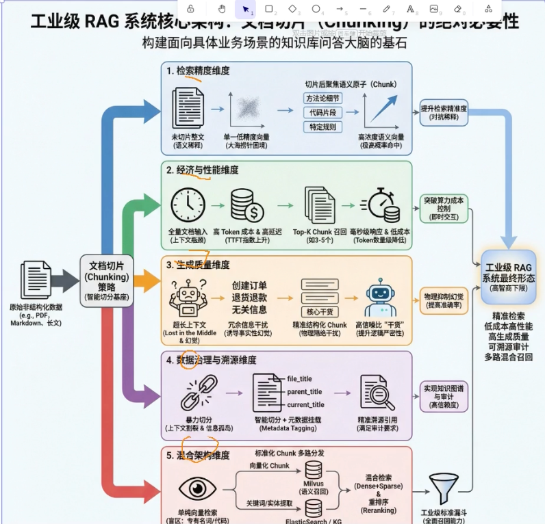

# 稠密向量（Dense Embedding） VS 稀疏向量（Sparse）

在信息检索和文本嵌入（Text Embedding）领域，传统的稠密向量（Dense Embedding）虽然能很好地捕捉深层语义，但也存在明显的局限性。BGE-M3 模型的核心优势在于它打破了单一检索模式的限制，能够**同时生成稠密向量、稀疏向量（Sparse）和多向量（Multi-vector）**。

将 BGE-M3 的稀疏向量与稠密向量结合使用，主要有以下几个显著的好处：

### 1. 优势互补，兼顾“语义理解”与“精确匹配”
*   **稠密向量的作用**：擅长捕捉深层的语义关联，能够处理同义词、同义改写（Paraphrase）等场景，即使查询词和文档中的词不完全一样，也能通过语义推理找到相关内容。
*   **稀疏向量的作用**：类似于传统的 BM25 算法，擅长保留精确的词汇匹配（Exact token matching）。此外，BGE-M3 生成的稀疏向量还能通过语义推理，为文本中未直接出现的相关术语赋予权重（例如输入“iPhone 新品”，模型能自动关联并提升“苹果公司”、“智能手机”等术语的权重）。
*   **结合的好处**：将两者结合（即混合检索），既不会丢失深层语义，又保留了关键术语的精确匹配能力，从而大幅提升检索的准确率和泛化能力。

### 2. 一次推理，零额外开销
传统的混合检索通常需要分别调用两个模型（例如一个模型生成稠密向量，另一个 BM25 算法生成稀疏向量），这会增加计算成本和系统复杂度。而 BGE-M3 具有“多功能（Multi-Functionality）”特性，**只需一次模型推理，就可以同时输出稠密向量和稀疏向量**，无需额外的推理开销，极大地提高了工程落地的效率。

### 3. 显著提升长文档与跨语言检索效果
*   **长文档检索**：在处理长达 8192 tokens 的长文档时，关键词信息显得尤为重要。实验表明，在长文档检索中，稀疏检索的效果显著高于单纯的稠密检索，两者结合能带来极大的效果增益。
*   **多语言与跨语言检索**：在跨语言场景下，由于不同语言之间的词汇重合度很小，单纯依赖稀疏检索收益有限。此时，将稠密向量与稀疏向量搭配使用，能够充分发挥模型在多语言对齐上的优势，获得最优的跨语言检索结果。

**总结建议**：
在实际的 RAG（检索增强生成）或搜索系统中，业界非常推荐采用 **“BGE-M3 混合检索（Dense + Sparse） + 重排序（Re-ranking）”** 的流水线。这种组合能够最大化地发挥 BGE-M3 的多功能优势，为您提供最精准的检索结果。

我们通过一个**“安全规范条款检索”**的真实场景，来看看 BGE-M3 的“稠密+稀疏”混合检索是如何大显身手的。

假设安全员在系统中输入了一个查询（Query）：
> 🔍 **查询：**“电梯井口防护门高度”

此时，知识库中有两条相关的文档：
*   **文档 A：**“洞口作业应按规定设置防护设施，确保施工人员安全。”（泛泛而谈，没有提及具体高度和电梯井）
*   **文档 B：**“JGJ80 规范第 4.2.2 条：电梯井口应设置防护门，其高度不应小于 1.5m。”（精确的条款规定）

### 1. 纯稠密向量检索（Dense）的盲区
如果系统**只使用稠密向量**，模型会去理解“电梯井口防护门高度”的整体语义。
*   因为文档 A 讲的是“洞口防护”，在语义上与查询非常接近，所以文档 A 可能会获得很高的相似度分数，甚至排在前面。
*   **痛点：** 安全员需要的是具体的“1.5m”这个精确数值，纯语义检索无法保证精确命中这个关键术语和条款号。

### 2. BGE-M3 混合检索（Dense + Sparse）的破局
BGE-M3 在一次推理中，会同时为文本生成稠密向量和稀疏向量（词级权重），此时系统会进行两路并行检索：

*   **稠密向量（Dense）兜底语义：** 它依然能理解查询的整体意图，确保召回的内容与“洞口防护”相关，避免漏掉重要信息。
*   **稀疏向量（Sparse）精确命中：** BGE-M3 会自动提取查询中的关键术语，并赋予高权重。例如，它会生成类似 `{"电梯井": 0.85, "防护门": 0.72, "高度": 0.68}` 这样的稀疏表示。在检索时，只有真正包含这些词汇的文档才会获得高分。

### 3. 最终融合效果
当系统将两路结果融合时，**文档 B** 因为同时满足了“语义相关”和“关键词精确命中（电梯井、防护门、高度）”，其综合得分会大幅跃升，稳稳排在第一位。而**文档 A** 虽然语义相关，但因为稀疏向量匹配不到任何关键词，综合得分会被拉低。

**总结来说：**
在这个例子中，**稠密向量保证了“找得全”（语义泛化），而稀疏向量保证了“找得准”（术语精确）**。这就是 BGE-M3 混合检索相比单一检索模式最核心的优势。

